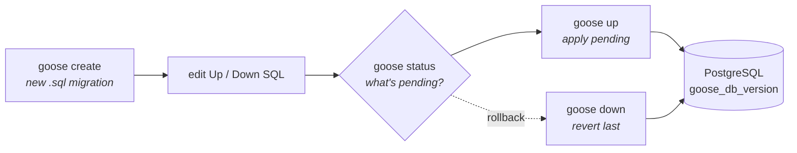

# db

Documentation for the database.

This folder lives inside the module because `go:embed` cannot read files
outside the module root — the migrations in [`migrations/`](migrations/) are
embedded into the binary.

## Migration lifecycle

Schema changes are managed with [`goose`](https://github.com/pressly/goose).
Each migration is a timestamped SQL file with an `Up` and a `Down` block; the
`goose_db_version` table tracks which have been applied.



## How to use goose

Install goose:

```bash
go install github.com/pressly/goose/v3/cmd/goose@latest
```

Export the database connection string:

```bash
export DATABASE_DSN="host=localhost port=5432 user=username password=password dbname=go-rest-api-service-template sslmode=disable TimeZone=UTC"
```

Create a new migration:

```bash
goose -dir database/migrations create create_user_table sql
```

Check which migrations are applied / pending:

```bash
goose -dir database/migrations postgres "$DATABASE_DSN" status
```

Apply all pending migrations:

```bash
goose -dir database/migrations postgres "$DATABASE_DSN" up
```

Roll back the most recent migration:

```bash
goose -dir database/migrations postgres "$DATABASE_DSN" down
```
