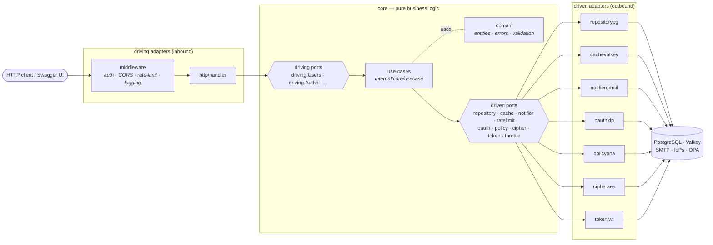
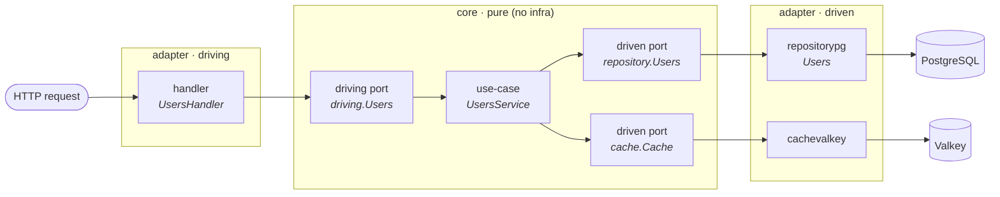
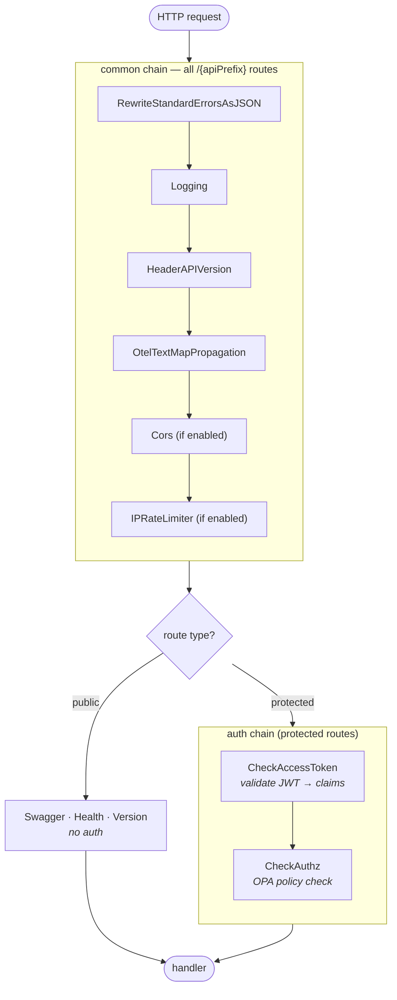
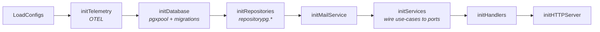

# Architecture

`go-rest-api-service-template` is built around the **Hexagonal (Ports & Adapters)**
pattern. The defining rule is short:

> **Nothing under `internal/core/` may import infrastructure.**

The `TestCoreHasNoInfraImports` test in
[`internal/core/arch_test.go`](../../internal/core/arch_test.go) runs as part
of every `go test ./...` run and as a dedicated `make arch-test` step in
[`.github/workflows/pr.yaml`](../../.github/workflows/pr.yaml). Any new
import of `net/http`, a database driver, a cache backend, a third-party
SDK, or anything under `internal/adapter/` from inside `internal/core/`
breaks the build.

If you genuinely need to reach for infrastructure from a use-case, **add
a port + adapter pair** ([recipe](./adding-an-adapter.md)) — never relax
the test.

## Ports & adapters at a glance

The **driving** side (left) turns the outside world into calls on the core; the
**driven** side (right) is how the core reaches back out. The core in the middle
knows only the port interfaces (the hexagon edges) — never the adapters.



## Layout

```text
internal/
├── adapter/              ── infrastructure
│   ├── driven/           ── outbound dependencies (cache, mail, cipher,
│   │   │                    policy, persistence, OAuth, JWT signer,
│   │   │                    rate limiters, login throttle)
│   │   ├── cachevalkey/         (wraps github.com/slashdevops/c3e + valkey-io)
│   │   ├── cipheraes/           (AES-GCM symmetric encryption)
│   │   ├── notifieremail/       (mailer + templates/ helper)
│   │   ├── oauthidp/            (golang.org/x/oauth2 + IDP UserInfo)
│   │   ├── policyopa/           (OPA Rego eval; embeds rego/ bundle)
│   │   ├── ratelimitbreaker/    (circuit breaker in front of the shared store)
│   │   ├── ratelimitmemory/     (per-replica token/leaky bucket)
│   │   ├── ratelimitvalkey/     (shared fixed-window counter)
│   │   ├── repositorypg/        (pgx-backed concrete repositories)
│   │   ├── throttlememory/      (per-identity login throttle)
│   │   └── tokenjwt/            (golang-jwt sign/verify)
│   └── driving/          ── inbound transport
│       └── http/
│           ├── payload/          (request/response shapes — wire payloads)
│           ├── handler/          (route handlers; depend only on driving ports)
│           ├── jwtvalidator/     (incoming-token middleware helper)
│           ├── middleware/       (auth, CORS, rate limit, logging, ...)
│           ├── respond/          (JSON/error response helpers)
│           └── server/           (HTTP server lifecycle)
├── app/                  ── composition root: builds adapters, wires them
│                            into use-cases. The only place that imports
│                            both a port and its concrete adapter.
├── config/               ── flag/env loader
├── core/                 ── PURE: no infra imports allowed
│   ├── domain/                   (entities, errors, validation, helpers)
│   ├── port/
│   │   ├── driven/               (interfaces use-cases consume)
│   │   │   cache, cipher, notifier, oauth, policy, ratelimit,
│   │   │   repository, throttle, token
│   │   └── driving/              (interfaces driving adapters consume)
│   └── usecase/                  (the business logic)
├── o11y/                 ── OTEL setup + helpers (cross-cutting infra)
└── version/              ── build metadata
```

## The flow of a request



Every arrow crossing into `core` lands on an **interface**; every arrow leaving
`core` also leaves through one. The concrete adapters (`repositorypg`,
`cachevalkey`) are wired in only at the composition root.

1. The **HTTP handler** receives the request, parses it, calls the
   driving port (e.g. `driving.Users.Create`).
2. The **use-case** (`internal/core/usecase/users.go`) implements that
   port and orchestrates the work: validate, call the repository,
   maybe invalidate a cache key, return the result.
3. The **repository port** (`internal/core/port/driven/repository/users.go`)
   describes only the storage operations the use-case needs.
4. The **concrete repository**
   (`internal/adapter/driven/repositorypg/users.go`) implements
   that interface against PostgreSQL via `pgx`. The use-case never sees
   `pgx`.

Every dependency arrow points **into** `core/`. Nothing in `core/`
points outward.

## The middleware chain

Every request passes through a common chain (outermost first) before it reaches
a handler. Protected routes then layer an auth chain inside it. CORS and the
per-IP rate limiter are only present when enabled in config.

The chain cannot help before a request exists: a connection that never finishes
sending its headers reaches no middleware at all, so the per-IP rate limiter
never sees it. That is bounded by the server itself — see
[HTTP server timeouts](./http-server-timeouts.md).



The `/me` endpoint inserts `CheckUserExists` between the two auth steps; the
refresh and password-reset flows swap `CheckAccessToken` for
`CheckRefreshToken` / `CheckPasswordResetToken`.

## Startup: the composition root

`internal/app` builds the whole graph in a fixed, timed order — infrastructure
first, then repositories, then use-cases, then handlers, then the server. It is
the only package that imports both a port and its concrete adapter.



Service wiring inside `initServices` respects real dependencies — for example
`ResourcesLimits` and `Users` are built early because `Authn`, `Authz`, and the
catalog services consume them.

## Where new code goes

| Adding a... | Lives in |
| --- | --- |
| Domain entity, validation rule, business error | `internal/core/domain/<entity>.go` |
| New use-case method | `internal/core/usecase/<entity>.go` |
| New HTTP route | `internal/adapter/driving/http/handler/<entity>.go` (extend the matching `internal/core/port/driving/<entity>.go` interface) |
| New repository method | `internal/adapter/driven/repositorypg/<entity>.go` (and add to the `internal/core/port/driven/repository/<entity>.go` interface) |
| New outbound integration (SMS, S3, vector DB, ...) | Define a port in `internal/core/port/driven/<concept>/` and an adapter in `internal/adapter/driven/<concept>_<tech>/` |
| Database migration | `database/migrations/` (managed by `goose`) |
| Mock for an interface | Add a `//go:generate go tool mockgen` stanza to the file declaring the interface; output to `mocks/{service,handler}/<entity>.go` |

## Hard rules

1. **Use-cases never import adapters.** They depend on ports —
   `repository.Users`, `cache.Cache`, `oauth.Provider`, etc.
2. **Handlers never import use-cases directly.** They depend on driving
   ports — `driving.Authn`, `driving.Users`, etc.
3. **Domain types are pure.** They may carry struct tags (json,
   swagger), but they never import a transport, ORM, or SDK package.
4. **The composition root (`internal/app/`) is the only place** that
   imports both a port and the concrete adapter that satisfies it.
5. **UUIDs are V7.** Use `cmd/uuidgen` (`go run cmd/uuidgen/main.go -n
   1 -v 7`) for examples; production code uses `uuid.NewV7()`.

## Recipes

- [Adding a new entity](./adding-an-entity.md) — the full end-to-end
  flow when you introduce a new domain entity (e.g. a new resource the
  HTTP API exposes).
- [Adding a new outbound adapter](./adding-an-adapter.md) — when you
  need to talk to a new external system (a different mailer, an SMS
  gateway, an S3 bucket, an LLM provider, ...).

## The worked example

`products` is the entity to copy. It is a project-scoped CRUD resource that
touches every convention in this repo -- domain validation, both ports, a
use-case, a pgx repository with tenant scoping and keyset pagination, an HTTP
handler with swagger annotations, wire payloads, a generated mock, a migration,
a seeded resource limit, and an integration test. Nothing about it is special;
that is the point.

Read it alongside [Adding a new entity](./adding-an-entity.md).

## Reference

- [Resource limits](./resource-limits.md) — how the control plane caps what a
  deployment, user or project may create: the two tables, the three-priority
  resolution, why the signer is a callback, and the gaps that are still open.
- [HTTP server timeouts](./http-server-timeouts.md) — which bound covers which
  span of a request, why `ReadHeaderTimeout` is on by default, and why
  `ReadTimeout` / `WriteTimeout` are deliberately off.
- [Health endpoints and probes](./health-probes.md) — which of the three health
  endpoints is the liveness target, which is the readiness target, why pointing
  liveness at a dependency check turns an outage into a restart loop, and which
  components are genuinely probed rather than asserted at startup.
- [Rate limiting](./rate-limiting.md) — how a request is bounded: the rule model
  and its precedence ladder, why the limiter is two-stage and what happens when
  it is not, which scope and audience pair is charged in which stage, the two
  layers of enforcement and why a fixed shared window is acceptable in front of
  a token bucket, and what every failure mode does — including a rule that is
  loaded, matches, and enforces nothing
  quietly.
- [Caching](./caching.md) — what is cached, why a cache fault can never fail a
  request, and how a permission change reaches an already-cached authorization
  decision.
- [Authentication](./authentication.md) — the token classes and their
  lifetimes, the two limits on brute force, why a failed login says one thing,
  how revocation works and what is deliberately not revocable, why a refresh
  token is single-use and what a replayed one costs, the single verification
  routine and the claims it checks, how a signing key is rotated without
  downtime, and why no credential travels in a URL.
- [Database migrations](./database-migrations.md) — the 16-file set and why it
  is numbered contiguously, why editing
  an applied migration fails silently, the one shared system-row guard, the
  63-character identifier limit that has caused two bugs, and how to prove a
  migration change did not alter the schema.

## Background

- The four PRs that performed the migration: #280, #281, #282, #283.
- External references the pattern is based on:
  - Alistair Cockburn, "Hexagonal Architecture" — <https://alistair.cockburn.us/hexagonal-architecture/>
  - "Hexagonal architecture (software)" on Wikipedia — <https://en.wikipedia.org/wiki/Hexagonal_architecture_(software)>
  - AWS Prescriptive Guidance, "Hexagonal architecture pattern" — <https://docs.aws.amazon.com/prescriptive-guidance/latest/cloud-design-patterns/hexagonal-architecture.html>
