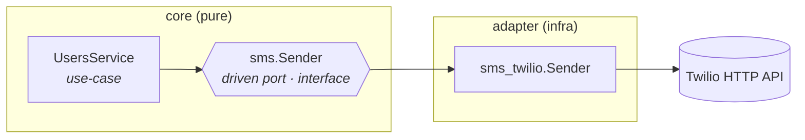

# Recipe: Adding a new outbound adapter (port + adapter pair)

When a use-case needs to talk to something the project doesn't already
abstract — a different mailer, an SMS gateway, an S3-compatible
object store, a new LLM provider, a metrics sink — you add a **port**
under `internal/core/port/driven/<concept>/` and a matching
**adapter** under `internal/adapter/driven/<concept>_<tech>/`.

This is the same pattern used for cache, notifier, ratelimit,
cipher, and policy, and Phase 5 used for oauth. Reading any of those
existing pairs is the fastest way to get a feel for what "good" looks
like.

We'll use a fictional **SMS** integration via Twilio throughout.
Substitute your concept and your tech.

---

## When to add an adapter

| Symptom | Action |
| --- | --- |
| `make arch-test` complains that `internal/core/` imports a forbidden package | The use-case is reaching into infrastructure. Wrap that infrastructure behind a port + adapter. |
| Use-case has an `*http.Client`, `*sql.DB`, third-party SDK type in its conf | Same — that field is the adapter's business, not the use-case's. |
| You're adding a brand-new outbound integration | Define the contract first as a port, then implement against the SDK in an adapter. |
| Two use-cases need the same external system | A single port + adapter, both use-cases depend on the port. |

If you find yourself writing `if provider == "twilio" { ... } else if
provider == "messagebird" { ... }` inside a use-case, **stop**. That's
the port begging to exist; the per-provider switching belongs in the
adapter (or in different adapters all satisfying the same port).

---

## Mental model



The use-case knows it can "send an SMS to a recipient". The port
captures that contract. The adapter knows how to talk to Twilio. The
composition root in `internal/app/` constructs the adapter and hands
it to the use-case as a `sms.Sender`.

You'll write code in **3 places** plus a wiring edit.

---

## 1 · Define the port

**File:** `internal/core/port/driven/sms/sms.go`

```go
// Package sms defines the driven port that use-cases consume to send
// SMS messages out-of-band. The implementation lives in
// internal/adapter/driven/sms_twilio (today) — swapping providers
// means a new adapter; use-cases stay unchanged.
package sms

import "context"

// Recipient is the human target of a message.
type Recipient struct {
	Name        string
	PhoneNumber string // E.164 format, e.g. "+15551234567"
}

// Sender is the driven port consumed by use-cases.
type Sender interface {
	// Send delivers `body` to `to`. The adapter handles transport,
	// authentication, retries, and provider-specific framing.
	Send(ctx context.Context, to Recipient, body string) error
}
```

**Rules**
- The port is **task-shaped**, not transport-shaped. `Send(ctx, to,
  body)` describes *what* the use-case wants done — not "build me a
  Twilio request".
- Inputs/outputs use plain Go types or `domain.*`. Never an SDK type
  (no `*twilio.MessageParams`, no `*http.Client`).
- One file per port, kept short and obvious.
- Add a `//go:generate go tool mockgen` stanza if any unit test will
  need to stub the port. Output to
  `mocks/service/sms.go` (3 levels up from a `port/driven/<name>/`
  file is `internal/`; full path is `../../../../../mocks/service/sms.go`).

> Existing examples to read: `cache/cache.go`, `notifier/notifier.go`,
> `cipher/cipher.go`, `oauth/oauth.go`. They're all small.

---

## 2 · Implement the adapter

**File:** `internal/adapter/driven/sms_twilio/adapter.go`

```go
// Package sms_twilio is the driven adapter that satisfies the
// sms.Sender port using Twilio's REST API. The adapter holds the
// account SID, auth token, and sender phone number once at
// construction; use-cases never see them.
package sms_twilio

import (
	"context"
	"fmt"

	"github.com/twilio/twilio-go" // hypothetical SDK import

	"github.com/slashdevops/go-rest-api-service-template/internal/core/domain"
	"github.com/slashdevops/go-rest-api-service-template/internal/core/port/driven/sms"
)

// Config wires the adapter to its infrastructure dependencies.
type Config struct {
	AccountSID string
	AuthToken  string
	FromNumber string
}

// Sender implements sms.Sender on top of Twilio.
type Sender struct {
	client     *twilio.RestClient
	fromNumber string
}

// New constructs a Sender from a Config. Validates that the
// credentials and sender number are present.
func New(cfg Config) (*Sender, error) {
	if cfg.AccountSID == "" || cfg.AuthToken == "" {
		return nil, &domain.InvalidSenderError{Message: "Twilio credentials are required"}
	}
	if cfg.FromNumber == "" {
		return nil, &domain.InvalidSenderError{Message: "Twilio FromNumber is required"}
	}
	return &Sender{
		client: twilio.NewRestClientWithParams(twilio.ClientParams{
			Username: cfg.AccountSID,
			Password: cfg.AuthToken,
		}),
		fromNumber: cfg.FromNumber,
	}, nil
}

// Send implements sms.Sender.
func (s *Sender) Send(ctx context.Context, to sms.Recipient, body string) error {
	// (Twilio's Go SDK doesn't take a context today; if it did, pass ctx through.)
	_ = ctx
	_, err := s.client.Api.CreateMessage(&twilio.CreateMessageParams{
		From: &s.fromNumber,
		To:   &to.PhoneNumber,
		Body: &body,
	})
	if err != nil {
		return fmt.Errorf("twilio CreateMessage: %w", err)
	}
	return nil
}
```

**Rules**
- The adapter is the **only** place that imports the SDK
  (`github.com/twilio/twilio-go`).
- Hold long-lived resources (HTTP clients, credentials, ...) on the
  adapter struct; build them once at construction.
- Validate config at `New` time. Don't defer config errors to the
  first `Send` call.
- Map SDK-specific errors to domain errors so callers don't have to
  pattern-match on a third-party error type. (Compare with how
  `tokenjwt.mapJWTError` translates `jwt.Err*` sentinels into
  `*domain.InvalidJWTError`.)

> Existing examples to read: `cachevalkey/adapter.go` (thin wrapper
> over a long-lived c3e cache manager), `notifieremail/adapter.go`
> (combines two libraries — mailer + templates — behind one port),
> `oauthidp/adapter.go` (per-provider switching is internal),
> `tokenjwt/adapter.go` (rich error mapping at the boundary).

---

## 3 · Tests

**File:** `internal/adapter/driven/sms_twilio/adapter_test.go`

Mirror the structure of `cipheraes/adapter_test.go` or
`tokenjwt/adapter_test.go`. Test:

- `New` rejects invalid configs (missing creds, missing FromNumber).
- The adapter satisfies the port interface (Go does this at compile
  time once the composition root wires it up — no test needed).
- Round-trip / error-mapping behavior for any non-trivial logic.

If the SDK doesn't have a clean stub story, test the adapter through
its public surface against a sandbox account, gated by an environment
variable (`TWILIO_TEST_*`) and a build tag.

---

## 4 · Wire it in the composition root

**File:** [`internal/app/services.go`](../../internal/app/services.go)

Construct the adapter once near the other driven adapters, then pass
the resulting `sms.Sender` into the use-case's conf:

```go
import (
    // ...
    "github.com/slashdevops/go-rest-api-service-template/internal/adapter/driven/sms_twilio"
    "github.com/slashdevops/go-rest-api-service-template/internal/core/port/driven/sms"
)

func (a *App) initServices(ctx context.Context) error {
    // ... existing adapter construction ...

    smsSender, err := sms_twilio.New(sms_twilio.Config{
        AccountSID: a.configs.SMS.AccountSID.Value,
        AuthToken:  a.configs.SMS.AuthToken.Value,
        FromNumber: a.configs.SMS.FromNumber.Value,
    })
    if err != nil {
        return fmt.Errorf("error creating sms adapter: %w", err)
    }

    // ...

    a.services.Users, err = usecase.NewUsersService(usecase.UsersServiceConf{
        // ... existing fields ...
        SMS: smsSender, // sms.Sender; use-case requires it as a port type
    })
    // ...
}
```

The use-case's `Conf` and struct gain an `SMS sms.Sender` field. The
constructor checks for nil and returns a domain error. Use-case
methods now call `ref.sms.Send(ctx, recipient, body)` wherever they
previously inlined HTTP/SDK calls.

If multiple use-cases need it, pass the same `smsSender` into each.

---

## 5 · Configuration

If the adapter needs runtime config (credentials, endpoints,
timeouts), add the fields to `internal/config/`. Mirror an existing
config block (e.g. `Mail` for SMTP, `Cache` for valkey).

Wire defaults, environment-variable names, and CLI flags. Restart
`air` so the new flags surface; sanity-check `./build/go-rest-api-service-template
--help`.

---

## 6 · Verify

```bash
go build ./...                  # compiles
go vet ./...                    # lints
go test -race ./internal/... ./pkg/...   # unit + arch invariant
make arch-test                  # explicit arch invariant
```

`make arch-test` should now allow the use-case that previously failed
on the SDK import — the SDK lives in `internal/adapter/`, the
use-case depends only on the port.

If you also added the SDK to `forbiddenInCore` in
`internal/core/arch_test.go` while developing (don't), remove it. The
broad `internal/adapter/` ban already catches anything that ends up
under `internal/adapter/`.

---

## Quick checklist

- [ ] `internal/core/port/driven/<concept>/<concept>.go` — interface, plain Go types, `//go:generate` if you'll need a mock
- [ ] `internal/adapter/driven/<concept>_<tech>/adapter.go` — implementation, holds long-lived state, validates config in `New`, maps SDK errors to domain errors
- [ ] `internal/adapter/driven/<concept>_<tech>/adapter_test.go` — round-trip + error-mapping tests
- [ ] `internal/app/services.go` (and `internal/config/...` if needed) — construct the adapter once, pass it as a port type into the use-case
- [ ] Use-case's Conf gains an `<X> <port>.<Type>` field; constructor nil-checks it
- [ ] `go build`, `go vet`, `go test`, `make arch-test` all green

That's the entire pattern. Every existing port + adapter pair under
`internal/core/port/driven/` and `internal/adapter/driven/` was
written this way; pick one as a template and copy its shape.
