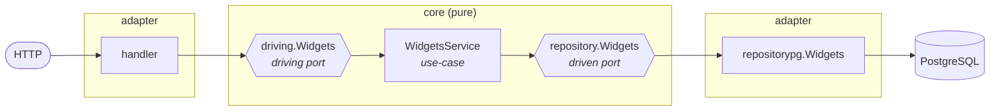
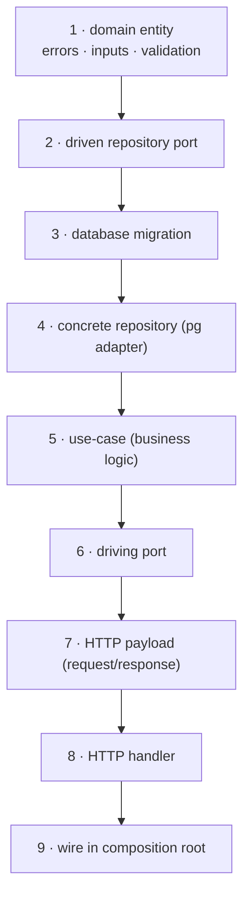

# Recipe: Adding a new entity

This walkthrough adds a brand-new entity to the service end-to-end —
domain model, persistence, business logic, HTTP API, and wiring.
We'll use a fictional `Widget` entity throughout. Substitute your real
name everywhere you see `Widget` / `widget` / `widgets`.

> **Read `products` alongside this.** It is the worked example in the
> repository and it does every step below for real: `domain/products.go`,
> both ports, `usecase/products.go`, `repositorypg/products.go` (tenant
> scoping and keyset pagination), `handler/products.go`,
> `payload/products.go`, a generated mock, `00009_products_tables.sql`, a
> seeded resource limit, and `tests/integration/api_products_test.go`.
> Copying it and renaming is usually faster than following the prose.

> **Naming**: use the singular for the type (`domain.Widget`,
> `repository.Widgets` — the *interface* is plural because the port is
> "the widgets store"), the plural for the package field/route
> (`a.services.Widgets`, `/widgets`), and snake_case for files
> (`widgets.go`).

## Mental model



You'll write code in **8 places**, top to bottom, plus a database
migration. Skip the optional steps if your entity doesn't need them. Each
numbered section below is one hop along this path:



---

## 1 · Domain entity, errors, and inputs

**File:** [`internal/core/domain/widgets.go`](../../internal/core/domain/)

```go
package domain

import (
	"time"

	"github.com/google/uuid"
)

// Widget represents a single widget owned by a project.
//
//	@Description	A widget.
type Widget struct {
	UpdatedAt   time.Time `json:"updated_at,omitzero"            example:"2026-01-01T00:00:00Z" format:"date-time"`
	CreatedAt   time.Time `json:"created_at,omitzero"            example:"2026-01-01T00:00:00Z" format:"date-time"`
	Name        string    `json:"name,omitempty"                 example:"My Widget"           format:"string"`
	Description string    `json:"description,omitempty"          example:"A blue widget"        format:"string"`
	SerialID    int64     `json:"-"`
	ID          uuid.UUID `json:"id,omitzero"                    example:"019b…d8e9"            format:"uuid"`
}

// Inputs for the use-case (and mirrored by repository methods)

type InsertWidgetInput struct {
	ID          uuid.UUID
	ProjectID   uuid.UUID
	Name        string
	Description string
}

type UpdateWidgetInput struct {
	ID          uuid.UUID
	Name        *string
	Description *string
}

type DeleteWidgetInput struct {
	ID uuid.UUID
}

type SelectWidgetsInput struct {
	Paginator Paginator
	Sort      string
	Filter    string
	Fields    string
}

type SelectWidgetsOutput struct {
	Items     []Widget
	Paginator Paginator
}

// Domain errors

type InvalidWidgetIDError struct {
	ID      uuid.UUID
	Message string
}

func (e *InvalidWidgetIDError) Error() string {
	return (&BaseInvalidFieldError{Field: "widget.id", Value: e.ID.String(), Reason: e.Message}).Error()
}

type WidgetNotFoundError struct{ ID uuid.UUID }

func (e *WidgetNotFoundError) Error() string {
	return "widget not found: " + e.ID.String()
}

// Validation methods (called by handlers and use-case constructors)

func (i *InsertWidgetInput) Validate() error {
	if !IsUUIDV7(i.ID) {
		return &InvalidWidgetIDError{ID: i.ID, Message: "must be a UUIDv7"}
	}
	if i.Name == "" {
		return &InvalidInputError{Message: "name is required"}
	}
	return nil
}
```

**Rules**
- Domain types may have `json` and swagger tags — those are
  cross-cutting hints, not transport coupling.
- All errors that callers might want to pattern-match (e.g.
  `errors.AsType[*domain.WidgetNotFoundError]`) live here.
- Inputs and Outputs use plain Go types and `domain.*`. **Never**
  `payload.*`, `pgx.*`, `*http.Request`, or anything from `internal/adapter/`.

---

## 2 · Driven repository port

**File:** [`internal/core/port/driven/repository/widgets.go`](../../internal/core/port/driven/repository/)

```go
package repository

import (
	"context"

	"github.com/google/uuid"

	"github.com/slashdevops/go-rest-api-service-template/internal/core/domain"
)

//go:generate go tool mockgen -package=mocks -destination=../../../../../mocks/service/widgets.go -source=widgets.go Widgets

// Widgets is the driven persistence port for widget entities.
type Widgets interface {
	Insert(ctx context.Context, input *domain.InsertWidgetInput) error
	UpdateByID(ctx context.Context, input *domain.UpdateWidgetInput) error
	DeleteByID(ctx context.Context, input *domain.DeleteWidgetInput) error
	SelectByID(ctx context.Context, id uuid.UUID) (*domain.Widget, error)
	Select(ctx context.Context, input *domain.SelectWidgetsInput) (*domain.SelectWidgetsOutput, error)
}
```

**Rules**
- Only the methods the use-case needs. No "future-proof" extras —
  Interface Segregation is the whole point of the port.
- Keep the file mechanical. The interface is the contract; the
  `//go:generate` line keeps the mock fresh.

---

## 3 · Database migration

**Files:** in [`database/migrations/`](../../database/migrations/) (managed by `goose`)

Add an `up`/`down` migration. Migration filenames follow the existing
numeric prefix convention; pick the next free number for your domain
group:

```sql
-- +goose Up
CREATE TABLE widgets (
    id          UUID PRIMARY KEY,
    projects_id UUID NOT NULL REFERENCES projects (id) ON DELETE CASCADE,
    name        VARCHAR(255) NOT NULL,
    description TEXT NOT NULL DEFAULT '',
    created_at  TIMESTAMPTZ NOT NULL DEFAULT now(),
    updated_at  TIMESTAMPTZ NOT NULL DEFAULT now(),
    serial_id   BIGSERIAL UNIQUE
);

CREATE INDEX widgets_projects_id_idx ON widgets (projects_id);

-- +goose Down
DROP TABLE widgets;
```

See [`database/README.md`](../../database/README.md) for the migration
toolchain and conventions.

---

## 4 · Concrete repository (PostgreSQL adapter)

**File:** [`internal/adapter/driven/repositorypg/widgets.go`](../../internal/adapter/driven/repositorypg/)

```go
package repositorypg

import (
	"context"
	"errors"
	"time"

	"github.com/google/uuid"
	"github.com/jackc/pgx/v5"
	"github.com/jackc/pgx/v5/pgxpool"
	"go.opentelemetry.io/otel/attribute"

	"github.com/slashdevops/go-rest-api-service-template/internal/core/domain"
	"github.com/slashdevops/go-rest-api-service-template/internal/o11y"
)

type WidgetsRepositoryConfig struct {
	DB             *pgxpool.Pool
	MaxQueryTimeout time.Duration
	OT             *o11y.OpenTelemetry
}

type WidgetsRepository struct {
	db              *pgxpool.Pool
	maxQueryTimeout time.Duration
	ot              *o11y.OpenTelemetry
	metrics         *o11y.LayerMetrics
	metricsMetadata o11y.Metadata
}

func NewWidgetsRepository(conf WidgetsRepositoryConfig) (*WidgetsRepository, error) {
	if conf.DB == nil {
		return nil, &domain.InvalidRepositoryError{Message: "DB is required"}
	}
	// ... (mirror the existing repos for OT setup; see e.g. products.go)
	return &WidgetsRepository{db: conf.DB, ot: conf.OT}, nil
}

func (r *WidgetsRepository) Insert(ctx context.Context, input *domain.InsertWidgetInput) error {
	ctx, span, _ := o11y.SetupTrace(ctx, r.ot.Traces.Tracer, r.metricsMetadata)
	defer span.End()
	span.SetAttributes(attribute.String("widget.id", input.ID.String()))

	_, err := r.db.Exec(ctx,
		`INSERT INTO widgets (id, projects_id, name, description) VALUES ($1, $2, $3, $4)`,
		input.ID, input.ProjectID, input.Name, input.Description,
	)
	if err != nil {
		return wrapPGError(err) // see helpers.go for the error-wrapping helpers
	}
	return nil
}

func (r *WidgetsRepository) SelectByID(ctx context.Context, id uuid.UUID) (*domain.Widget, error) {
	var w domain.Widget
	err := r.db.QueryRow(ctx,
		`SELECT id, name, description, created_at, updated_at, serial_id
		   FROM widgets WHERE id = $1`,
		id,
	).Scan(&w.ID, &w.Name, &w.Description, &w.CreatedAt, &w.UpdatedAt, &w.SerialID)
	if errors.Is(err, pgx.ErrNoRows) {
		return nil, &domain.WidgetNotFoundError{ID: id}
	}
	if err != nil {
		return nil, wrapPGError(err)
	}
	return &w, nil
}

// ... UpdateByID, DeleteByID, Select follow the same pattern
```

**Rules**
- The struct's exported name (`WidgetsRepository`) is fine to keep —
  the use-case never references it; only the `app/` composition root
  does.
- Use the helpers in `internal/adapter/driven/repositorypg/helpers.go`
  for SQL error mapping (unique-violation → domain conflict, etc.).
- Look at `products.go` for the worked example — it is the smallest repository
  that still does tenant scoping, keyset pagination and partial fields — and at
  `users.go` for the busiest one.

---

## 5 · Use-case (business logic)

**File:** [`internal/core/usecase/widgets.go`](../../internal/core/usecase/)

```go
package usecase

import (
	"context"
	"fmt"
	"strings"
	"time"

	"github.com/google/uuid"
	"go.opentelemetry.io/otel/attribute"
	"go.opentelemetry.io/otel/metric"

	"github.com/slashdevops/go-rest-api-service-template/internal/core/domain"
	"github.com/slashdevops/go-rest-api-service-template/internal/core/port/driven/cache"
	"github.com/slashdevops/go-rest-api-service-template/internal/core/port/driven/repository"
	"github.com/slashdevops/go-rest-api-service-template/internal/o11y"
)

type WidgetsServiceConf struct {
	Repository    repository.Widgets       // required
	CacheService  cache.Cache              // optional; nil disables caching
	OT            *o11y.OpenTelemetry      // required
	MetricsPrefix string
}

type WidgetsService struct {
	repository      repository.Widgets
	cacheService    cache.Cache
	ot              *o11y.OpenTelemetry
	metrics         *o11y.LayerMetrics
	metricsMetadata o11y.Metadata
	metricsPrefix   string
}

func NewWidgetsService(conf WidgetsServiceConf) (*WidgetsService, error) {
	if conf.Repository == nil {
		return nil, &domain.InvalidRepositoryError{Message: "Repository is required for WidgetsService"}
	}
	if conf.OT == nil {
		return nil, &domain.InvalidOTConfigurationError{Message: "OpenTelemetry is required for WidgetsService"}
	}

	ref := &WidgetsService{
		repository:   conf.Repository,
		cacheService: conf.CacheService,
		ot:           conf.OT,
		metricsMetadata: o11y.Metadata{
			Layer:  AppLayer,
			Domain: "Widgets",
			Action: "NewWidgetsService",
		},
	}
	if conf.MetricsPrefix != "" {
		ref.metricsPrefix = strings.ReplaceAll(conf.MetricsPrefix, "-", "_") + "_"
	}
	// ... metrics counter/histogram setup; mirror existing services
	return ref, nil
}

func (ref *WidgetsService) Create(ctx context.Context, input *domain.InsertWidgetInput) error {
	start := time.Now()
	ctx, span, attrs := o11y.SetupTrace(ctx, ref.ot.Traces.Tracer, ref.metricsMetadata, "Create")
	defer span.End()

	if err := input.Validate(); err != nil {
		return o11y.RecordError(ctx, span, start, err, ref.metrics, attrs)
	}
	if err := ref.repository.Insert(ctx, input); err != nil {
		return o11y.RecordError(ctx, span, start, err, ref.metrics, attrs)
	}
	o11y.RecordSuccess(ctx, span, start, ref.metrics, attrs, "widget created",
		attribute.String("widget.id", input.ID.String()))
	return nil
}

func (ref *WidgetsService) GetByID(ctx context.Context, id uuid.UUID) (*domain.Widget, error) {
	start := time.Now()
	ctx, span, attrs := o11y.SetupTrace(ctx, ref.ot.Traces.Tracer, ref.metricsMetadata, "GetByID")
	defer span.End()

	if !domain.IsUUIDV7(id) {
		return nil, o11y.RecordError(ctx, span, start,
			&domain.InvalidWidgetIDError{ID: id, Message: "must be a UUIDv7"},
			ref.metrics, attrs)
	}

	// Cache-aside via the cache port (skip if you don't need caching)
	if ref.cacheService != nil {
		key := cache.Identifier{Type: "widget", ID: id.String()}
		fetcher := func(ctx context.Context) (*domain.Widget, []cache.Identifier, error) {
			w, err := ref.repository.SelectByID(ctx, id)
			return w, nil, err
		}
		out, err := cache.GetTyped[*domain.Widget](ctx, ref.cacheService, key, fetcher)
		if err != nil {
			return nil, o11y.RecordError(ctx, span, start, err, ref.metrics, attrs)
		}
		o11y.RecordSuccess(ctx, span, start, ref.metrics, attrs, "widget found")
		return out, nil
	}

	out, err := ref.repository.SelectByID(ctx, id)
	if err != nil {
		return nil, o11y.RecordError(ctx, span, start, err, ref.metrics, attrs)
	}
	o11y.RecordSuccess(ctx, span, start, ref.metrics, attrs, "widget found")
	return out, nil
}

// ... UpdateByID, DeleteByID, List follow the same pattern
```

**Rules**
- Conf struct + constructor + struct fields, in that order.
- Validation is a domain concern: call `input.Validate()` first.
- All telemetry goes through `o11y.RecordError` / `o11y.RecordSuccess`.
- For caching, use the `cache` port's `GetTyped[T]` helper. **Never**
  reach for `github.com/slashdevops/c3e` directly.
- For other infra (mailer, cipher, jwt, opa, oauth), depend on
  the matching port from `internal/core/port/driven/`.

---

## 6 · Driving port

**File:** [`internal/core/port/driving/widgets.go`](../../internal/core/port/driving/)

```go
package driving

import (
	"context"

	"github.com/google/uuid"

	"github.com/slashdevops/go-rest-api-service-template/internal/core/domain"
)

// Widgets is the driving port consumed by the HTTP widgets handler.
type Widgets interface {
	Create(ctx context.Context, input *domain.InsertWidgetInput) error
	GetByID(ctx context.Context, id uuid.UUID) (*domain.Widget, error)
	UpdateByID(ctx context.Context, input *domain.UpdateWidgetInput) error
	DeleteByID(ctx context.Context, input *domain.DeleteWidgetInput) error
	List(ctx context.Context, input *domain.SelectWidgetsInput) (*domain.SelectWidgetsOutput, error)
}
```

**Rules**
- Same shape as the use-case's public methods — `WidgetsService`
  satisfies this interface via Go's structural typing.
- Inputs/outputs are domain types only.

---

## 7 · HTTP DTO (request/response)

**File:** [`internal/adapter/driving/http/payload/widgets.go`](../../internal/adapter/driving/http/payload/)

For straightforward CRUD, the response is the entity itself (per
decision D-011). The request types are plain structs with `json` tags
and validation:

```go
package payload

import "github.com/slashdevops/go-rest-api-service-template/internal/core/domain"

// WidgetResponse is the API representation of a widget. It IS the
// domain entity — domain.Widget already carries json + swagger tags.
type WidgetResponse = domain.Widget

// CreateWidgetRequest is the payload for POST /projects/{project_id}/widgets.
type CreateWidgetRequest struct {
	Name        string `json:"name"        example:"My Widget"`
	Description string `json:"description" example:"A blue widget"`
}

// Validate ...
```

If your entity needs HTTP-specific framing (envelopes, links, …),
declare a real struct here instead of a type alias.

---

## 8 · HTTP handler

**File:** [`internal/adapter/driving/http/handler/widgets.go`](../../internal/adapter/driving/http/handler/)

```go
package handler

import (
	"encoding/json"
	"errors"
	"fmt"
	"net/http"
	"strings"
	"time"

	"github.com/google/uuid"
	"go.opentelemetry.io/otel/attribute"
	"go.opentelemetry.io/otel/metric"

	"github.com/slashdevops/go-rest-api-service-template/internal/adapter/driving/http/payload"
	"github.com/slashdevops/go-rest-api-service-template/internal/adapter/driving/http/middleware"
	"github.com/slashdevops/go-rest-api-service-template/internal/adapter/driving/http/respond"
	"github.com/slashdevops/go-rest-api-service-template/internal/core/domain"
	"github.com/slashdevops/go-rest-api-service-template/internal/core/port/driving"
	"github.com/slashdevops/go-rest-api-service-template/internal/o11y"
)

type WidgetsHandlerConf struct {
	Service       driving.Widgets
	OT            *o11y.OpenTelemetry
	MetricsPrefix string
}

type WidgetsHandler struct {
	service         driving.Widgets
	ot              *o11y.OpenTelemetry
	metrics         *o11y.LayerMetrics
	metricsMetadata o11y.Metadata
	metricsPrefix   string
}

func NewWidgetsHandler(conf WidgetsHandlerConf) (*WidgetsHandler, error) {
	if conf.Service == nil {
		return nil, &domain.InvalidServiceError{Message: "driving.Widgets is required"}
	}
	// ... metrics setup; mirror an existing handler such as products.go
	return &WidgetsHandler{service: conf.Service, ot: conf.OT}, nil
}

func (ref *WidgetsHandler) RegisterRoutes(mux *http.ServeMux, middlewares ...middleware.Middleware) {
	mdw := middleware.Chain(middlewares...)
	mux.Handle("POST   /projects/{project_id}/widgets",                mdw.ThenFunc(ref.create))
	mux.Handle("GET    /projects/{project_id}/widgets",                mdw.ThenFunc(ref.list))
	mux.Handle("GET    /projects/{project_id}/widgets/{widget_id}",    mdw.ThenFunc(ref.getByID))
	mux.Handle("PATCH  /projects/{project_id}/widgets/{widget_id}",    mdw.ThenFunc(ref.update))
	mux.Handle("DELETE /projects/{project_id}/widgets/{widget_id}",    mdw.ThenFunc(ref.delete))
}

// create POST /projects/{project_id}/widgets
//
//	@Id				<run cmd/uuidgen to get a fresh v7 UUID>
//	@Summary		Create widget
//	@Description	...
//	@Tags			Widgets,Projects
//	@Accept			json
//	@Produce		json
//	@Param			project_id	path		string						true	"Project ID"	Format(uuid)
//	@Param			body		body		payload.CreateWidgetRequest		true	"Payload"
//	@Success		201			{object}	payload.HTTPMessage				"Created"
//	@Header			201			{string}	Location					"url"
//	@Failure		400			{object}	payload.HTTPMessage				"Validation error"
//	@Failure		401			{object}	payload.HTTPMessage				"Unauthenticated"
//	@Failure		403			{object}	payload.HTTPMessage				"Forbidden"
//	@Failure		409			{object}	payload.HTTPMessage				"Already exists"
//	@Failure		500			{object}	payload.HTTPMessage				"Internal error"
//	@Router			/projects/{project_id}/widgets [post]
//	@Security		AccessToken
func (ref *WidgetsHandler) create(w http.ResponseWriter, r *http.Request) {
	start := time.Now()
	ctx, span, attrs := o11y.SetupTraceHTTP(r, ref.ot.Traces.Tracer, ref.metricsMetadata, "create")
	defer span.End()

	projectID, err := parseUUIDQueryParams(r.PathValue("project_id"))
	if err != nil {
		e := o11y.RecordError(ctx, span, start, err, ref.metrics, attrs)
		respond.WriteJSONMessage(w, r, http.StatusBadRequest, e.Error())
		return
	}

	var req payload.CreateWidgetRequest
	if err := json.NewDecoder(r.Body).Decode(&req); err != nil {
		respond.WriteJSONMessage(w, r, http.StatusBadRequest, err.Error())
		return
	}

	id, err := uuid.NewV7()
	if err != nil {
		respond.WriteJSONMessage(w, r, http.StatusInternalServerError, err.Error())
		return
	}

	input := &domain.InsertWidgetInput{
		ID:          id,
		ProjectID:   projectID,
		Name:        req.Name,
		Description: req.Description,
	}

	if err := ref.service.Create(ctx, input); err != nil {
		// Map known domain errors to HTTP status codes
		if _, ok := errors.AsType[*domain.WidgetAlreadyExistsError](err); ok {
			respond.WriteJSONMessage(w, r, http.StatusConflict, err.Error())
			return
		}
		respond.WriteJSONMessage(w, r, http.StatusInternalServerError, err.Error())
		return
	}

	w.Header().Set("Location", fmt.Sprintf("%s/%s", r.RequestURI, id.String()))
	respond.WriteJSONMessage(w, r, http.StatusCreated, "widget created")
	o11y.RecordSuccess(ctx, span, start, ref.metrics, attrs, "widget created", attribute.String("widget.id", id.String()))
}

// ... list, getByID, update, delete follow the same shape
```

**Rules**
- The handler's only domain-side dependency is `driving.Widgets`. It
  never imports `usecase` or `repositorypg`.
- Every handler method has a swagger doc block. Generate the `@Id`
  with `go run cmd/uuidgen/main.go -n 1 -v 7`.
- Pattern-match on domain errors with `errors.AsType[*domain.XError]`
  and map to status codes.
- Use the helpers in [`handler/helpers.go`](../../internal/adapter/driving/http/handler/helpers.go) (`parseUUIDQueryParams`, …).

---

## 9 · Wire it in the composition root

**Files:** [`internal/app/dependencies.go`](../../internal/app/dependencies.go), [`internal/app/repositories.go`](../../internal/app/repositories.go), [`internal/app/services.go`](../../internal/app/services.go), [`internal/app/handlers.go`](../../internal/app/handlers.go), [`internal/app/server.go`](../../internal/app/server.go)

Four small edits:

**`dependencies.go`** — declare the slots:
```go
type Repositories struct {
    // ...
    Widgets *repositorypg.WidgetsRepository
}
type Services struct {
    // ...
    Widgets *usecase.WidgetsService
}
type Handlers struct {
    // ...
    Widgets *handler.WidgetsHandler
}
```

**`repositories.go`** — construct the repo:
```go
a.repositories.Widgets, err = repositorypg.NewWidgetsRepository(
    repositorypg.WidgetsRepositoryConfig{
        DB: a.dbPool,
        OT: a.telemetry,
    },
)
if err != nil { return fmt.Errorf("could not create widgets repository: %w", err) }
```

**`services.go`** — construct the use-case (passing the repo + any
ports it needs):
```go
a.services.Widgets, err = usecase.NewWidgetsService(usecase.WidgetsServiceConf{
    Repository:   a.repositories.Widgets,
    CacheService: cacheService, // optional
    OT:           a.telemetry,
})
if err != nil { return fmt.Errorf("error creating widgets service: %w", err) }
```

**`handlers.go`** — construct the handler (passing the use-case; it
satisfies `driving.Widgets` via duck typing):
```go
a.handlers.Widgets, err = handler.NewWidgetsHandler(handler.WidgetsHandlerConf{
    Service: a.services.Widgets,
    OT:      a.telemetry,
})
if err != nil { return fmt.Errorf("could not create widgets handler: %w", err) }
```

**`server.go`** — register the routes (the handler decides its own
paths in `RegisterRoutes`):
```go
a.handlers.Widgets.RegisterRoutes(mux, middlewares...)
```

**This is the step that gets skipped**, because nothing forces it: every other
step fails to compile when it is missing, while a handler that is never
constructed or never registered compiles cleanly and answers `404` on every
route. `products` shipped exactly like that. `TestEveryHandlerIsRegistered` in
`internal/app` now fails for any field of `Handlers` with no matching
`RegisterRoutes` call in `server.go`, so declaring the slot in
`dependencies.go` without finishing the wiring breaks `make test`.

---

## 10 · Generate mocks

```bash
go generate ./internal/core/port/driven/repository/widgets.go
```

This refreshes `mocks/service/widgets.go` so unit tests can stub the
repository.

> If you also want a mock for `driving.Widgets`, add a `//go:generate`
> stanza to `internal/core/port/driving/widgets.go` pointing at
> `mocks/handler/widgets.go`.

---

## 11 · Integration tests

**File:** [`tests/integration/api_widgets_test.go`](../../tests/integration/) (build tag `//go:build integration`)

Mirror an existing `api_X_test.go` (e.g. `api_languages_test.go` for a
read-only entity, `api_users_test.go` for a CRUD-heavy one). The
helpers in `helper_functions_test.go` cover signin, table seeding,
HTTP requests, and assertion shapes.

Run them with the dev env up and `air` running:

```bash
make start-dev-env
air                                                       # in another terminal
go test -race -tags=integration -count=1 ./tests/integration -run TestWidgets
```

---

## 12 · Verify locally

```bash
go build ./...                  # compiles
go vet ./...                    # lints
go test -race ./internal/... ./pkg/...   # unit + arch invariant
make arch-test                  # explicit arch invariant
make docs-swagger               # regenerate swagger
```

If `make arch-test` fails with "imports forbidden", you've leaked
infrastructure into `internal/core/`. Define a port + adapter for
whatever you reached for ([recipe](./adding-an-adapter.md)).

---

## Quick checklist

- [ ] `internal/core/domain/widgets.go` — entity, errors, inputs, validation
- [ ] `internal/core/port/driven/repository/widgets.go` — port + `//go:generate`
- [ ] `database/migrations/<NNNN>_widgets_tables.sql` — schema
- [ ] `internal/adapter/driven/repositorypg/widgets.go` — concrete repo
- [ ] `internal/core/usecase/widgets.go` — business logic
- [ ] `internal/core/port/driving/widgets.go` — driving port
- [ ] `internal/adapter/driving/http/payload/widgets.go` — request/response
- [ ] `internal/adapter/driving/http/handler/widgets.go` — HTTP handler
- [ ] `internal/app/{dependencies,repositories,services,handlers,server}.go` — wiring (5 small edits)
- [ ] `mocks/service/widgets.go` regenerated via `go generate ./...`
- [ ] `tests/integration/api_widgets_test.go` — integration tests
- [ ] `go build ./...`, `go vet ./...`, `go test ./...`, `make arch-test` all green

That's it — one entity, end-to-end, with the hex invariant intact.
