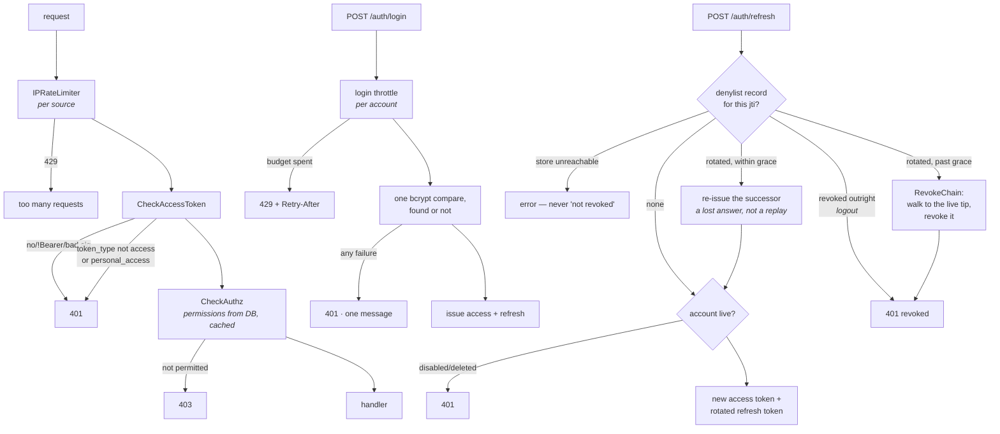
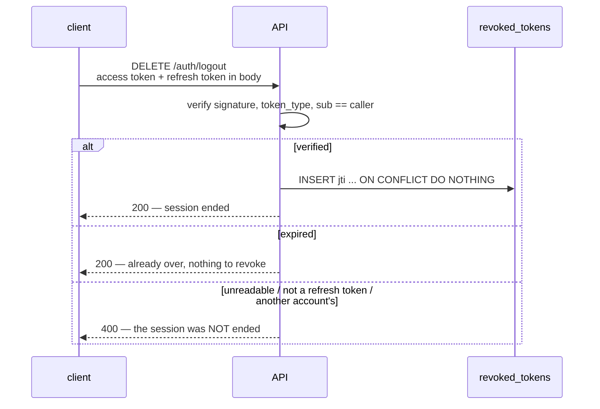
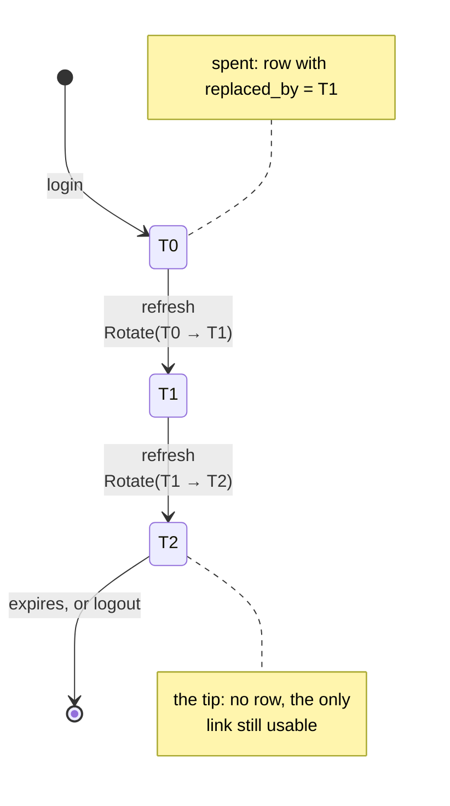
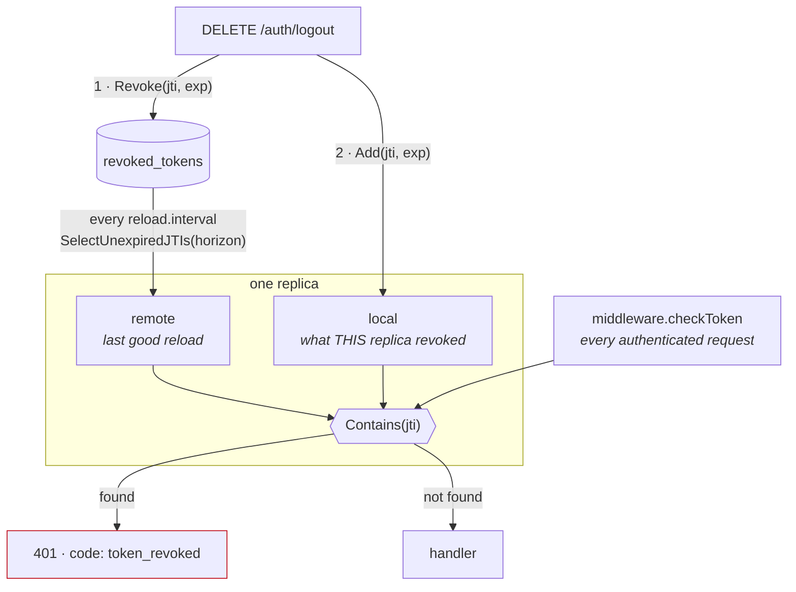
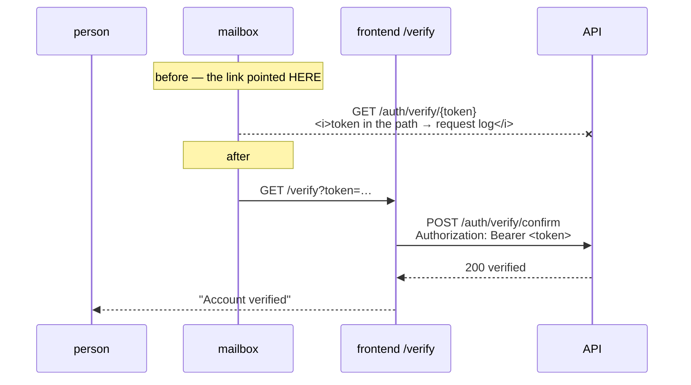
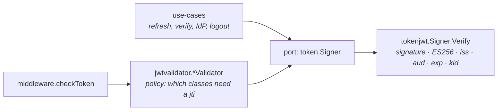
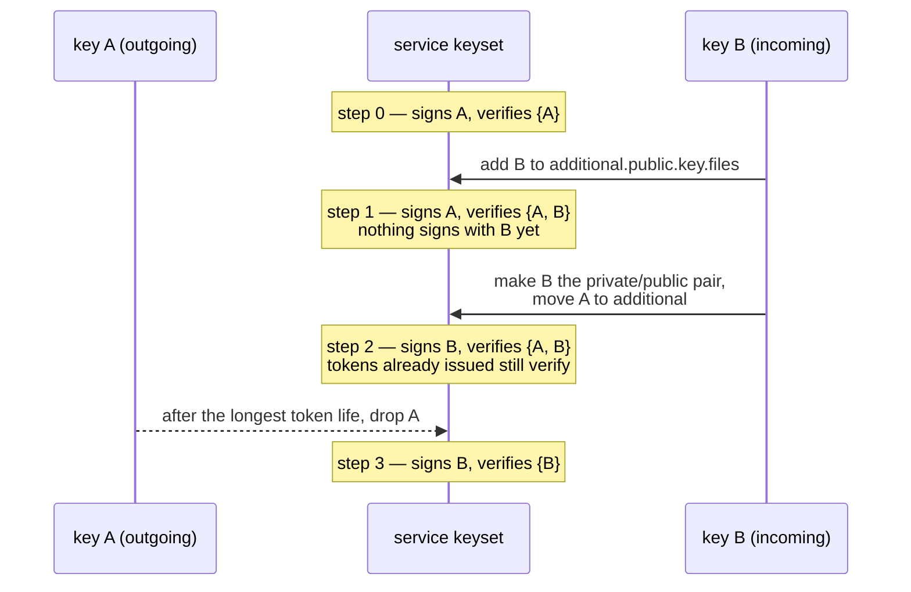

# Authentication

How a caller proves who they are, how long that proof lasts, and how it is taken
away again.

Authorization — deciding what an identified caller may do — is a separate
concern handled by `CheckAuthz` and the OPA policy bundle; this document stops
at identity.

## Token classes

> Sign-in through Google, GitHub, Entra ID or Okta — what a provider is
> trusted for, identity by subject rather than email, the frontend callback
> and the PKCE/nonce/ID-token flow — is its own document:
> [Identity providers](./identity-providers.md).

> How long the access and refresh tokens live, where that number is stored,
> and what a change does to tokens already issued is its own document:
> [Token lifetimes](./token-lifetimes.md).

Every token is an ES256-signed JWT produced by the same signer
([`tokenjwt`](../../internal/adapter/driven/tokenjwt/adapter.go)) and told apart
by its `token_type` claim. There is no other kind of credential.

| Class | Default life | Carries | Revocable |
| --- | --- | --- | --- |
| `access` | 5 min | `sub`, `email`, `jti` | **no** — see [what is not revocable](#what-is-not-revocable) |
| `refresh` | 24 h | `sub`, `email`, `jti` | yes, by logout — and spent by each use, see [rotation](#refresh-tokens-are-single-use) |
| `personal_access` | 1 h – 365 d | `sub`, `jti` = its own row id | yes, by deleting or disabling the row |
| `password_reset` | 15 min | `sub`, `jti` | single-purpose |
| `verification` | 24 h | `sub` | single-purpose; travels in a header, not a URL |
| IdP `state` | short | `sub`, `idp` | single-use is an open item |

`token_type` is checked at every point that consumes one. It is what stops a
refresh token being presented as an access token, or a password-reset token
being used to call the API.

## The request path



## Brute force is bounded twice

The two limits are independent and neither substitutes for the other.

**Per source** — [`IPRateLimiter`](../../internal/adapter/driving/http/middleware/middlewares.go)
keys on [`ClientIPResolver`](../../internal/adapter/driving/http/middleware/clientip.go),
which honours `X-Forwarded-For` **only when the peer is a configured trusted
proxy** (`http.server.trusted.proxies`, empty by default). Reading that header
unconditionally let a caller pick its own bucket: a rotating value was a fresh
budget per request, so the limiter did not weaken, it disappeared.

**Per account** — `authn.login.throttle.*` bounds failures against one address
regardless of where they come from, because the IP limiter does nothing about
guesses spread across many sources. Five failures refilling over fifteen
minutes, by default.

Measured against the running API, guessing at one account with a rotating
`X-Forwarded-For`:

```text
before either fix:  {401: 30}          every guess evaluated
after both:         {401: 5, 429: 25}
```

The throttle key is a hash of the **submitted** address, derived before any
lookup, so an attempt against an unknown address costs exactly what a real one
costs. Throttling only real accounts would answer *"does this address have an
account?"* through the difference.

It **delays, it never locks**: anyone who knows an address can spend its budget,
and a self-refilling ceiling is what stops that being an account someone can
hold shut.

## A failed login says one thing

Every reason a login does not succeed — no such address, wrong password,
disabled account, an account that authenticates through an identity provider —
answers `401` with `domain.AuthnInvalidCredentials` and nothing else. Distinct
messages previously let one request answer whether an address had an account,
and the unknown-address case echoed the probed address straight back.

**Exactly one bcrypt compare runs on every login**, found or not, whichever
method was asked for. An unknown address used to return before any hashing — a
timing oracle that survives any care taken over the response body.

The reason is not lost: it goes on the span as `authn.login.failure_reason` and
into the log. Telling a typo from a disabled account is a support question, not
something the caller needs.

### So does password recovery

`/auth/password/recover` was the same question asked a different way, and it
answered honestly. Measured against the running API:

```text
no such address        ->  500  "user: not found: User not found with email: <the address>"
a local account        ->  200  "Password recovery email sent"
an IdP-backed account  ->  500  "user is not a local account, cannot recover password"
```

**A better oracle than login had ever been** — no password to guess and no
throttle in the way — and it answered two questions at once: whether an address
has an account, and whether that account signs in through an identity provider.
The second is exactly what someone choosing a target wants to know. The
unknown-address case also echoed the probed address back, which is the same
mistake login used to make.

Every outcome now answers `200 "Password recovery email sent"`: no account, a
disabled account, an IdP-backed account, or a real recovery. The reason goes on
the span as `authn.recovery.no_email_reason` and into a `DEBUG` log.

The probed address is deliberately no longer logged at `WARN` either. It was, on
every miss — which turns an unauthenticated endpoint into a way to write
attacker-chosen text into the log at will.

**`POST /auth/verify` (resend verification) was already uniform** and needed no
change; it was checked at the same time rather than assumed.

### And so does registration

Registration was the last of the three. It answered `409 "user: already exists:
email=<address>"` for a taken address and `201` for a free one, so one
unauthenticated request said whether an address was registered.

It was left alone longer than the others for a real reason: unlike a failed
login or a recovery request, **somebody genuinely has to learn their address is
already taken**, or they sit waiting for an email that will never come.

It is closed by telling them somewhere the prober cannot see. Both cases answer
`201` with the same message, no second account is created, and the address owner
gets an email saying someone tried to register with it — pointing at the sign-in
page, carrying **no token and no action**, because anyone can cause it to be sent
to any address.

The frontend says *"check your email to finish setting up your account"* rather
than *"account created"*, which is the one instruction that is true whichever of
the two emails arrives.

A failure to send that mail is logged, not returned. The answer to the caller
must not depend on it, or the difference becomes the oracle again.

### And it is bounded per address

Recovery used to be reachable at the per-IP limiter's rate and no slower, which
left enumeration at speed and a way to send a great deal of mail to somebody
else's address.

It now spends the same per-account budget login does — `authn.login.throttle.*`
tunes both — but from a **separate bucket**. That separation is the load-bearing
part: sharing one would mean spending an address's recovery budget locked that
same address out of *signing in*, turning a mild abuse control into a denial of
service anyone could aim at any address they know. `throttleKey` namespaces them
by purpose.

Every request spends and nothing refunds. Unlike a login there is no "success"
that proves the caller had any business asking, so the budget is simply how many
recovery emails one address can provoke in a window.

**A throttled request answers `429` with `Retry-After`, and that does not
reintroduce the oracle.** The budget is keyed on the *submitted* address before
anything is looked up, so an address with no account is throttled exactly like a
real one.

## Revocation

[`revoked_tokens`](../../database/migrations/00014_revoked_tokens.sql) is a
denylist of `jti` claims. Only revoked-and-unexpired tokens have rows, so it
holds one row per logout rather than one per live session, and rows are swept
once the token they name has expired anyway.

### It lives in Postgres, and that is the design

- **Not Valkey.** `cache.enabled=false` is a supported mode, so a cache-backed
  denylist would silently not exist there and logout would go back to doing
  nothing. The cache's [documented invariant](./caching.md) — a fault never
  fails a request — is also exactly wrong for this question, because it means
  answering "not revoked" when the truth is unknown.
- Postgres is a hard dependency of the service, so the denylist has the same
  availability as the service. A cache may sit in front of it, but only as an
  optimisation: a miss falls through to the truth, never to a decision.
- **An error from the store is fatal, never "not revoked."** Treating an
  unreachable denylist as an empty one lets a database blip re-validate every
  token anyone has logged out of.

`revoked_tokens.users_id` is deliberately **not** a foreign key to `users`:
deleting a user must not delete their revocations, or removing an account would
quietly re-validate every token it was ever issued.

### Logout ends a session, or says it did not



Three properties worth keeping:

- **The refresh token is what gets revoked.** The access token expires on its
  own; the refresh token is the one that mints new ones for days.
- **The token is verified before it is revoked** — signature, `token_type`, and
  `sub` matching the caller. Without those an ordinary logged-in user could
  revoke somebody else's token, a denial of service against any account whose
  refresh token leaked into a log.
- **Logout never claims a success it did not deliver.** An expired token
  answers 200 because that session really is over. A token that cannot be read
  answers 400, because the caller's session is still live and reporting
  otherwise is the exact bug this endpoint was fixed for.

The body is optional, so a caller that sends only an access token still logs
out — but the session is not ended, and the service logs a warning saying so.

## Refresh tokens are single-use

A refresh token used to come back from `/auth/refresh` unchanged, so one
credential minted at login stayed valid for its whole life however often it was
used. A copy of it was indistinguishable from the original: nothing in the
exchange could ever reveal that two parties held the same token.

Now each refresh **spends** the token it was given and issues a successor. The
denylist records the link between them, and that record is what turns a second
use into evidence.



Three properties follow from that shape, and each is load-bearing:

- **The expiry is carried, never renewed.** Every link expires when the token
  that started the chain would have. Renewing it on each refresh would make a
  merely-active session immortal — a decision about how long people stay signed
  in, and not one rotation should make on its way past.
- **Rotation requires the denylist.** Issuing a successor without retiring its
  predecessor is strictly worse than not rotating at all: it hands out a second
  usable credential and takes nothing back. With no store configured, or with
  `authn.refresh.token.rotation.enabled=false`, the presented token is returned
  unchanged.
- **The signature comes before the record.** A failure between the two has to
  leave the old token working. Recording the rotation and then failing to sign
  would revoke the credential the caller still holds and hand back nothing —
  a locked-out client. This order makes a failure an error and a retry.

### The token spent is the one that was verified

`/auth/refresh` is authorised by `CheckRefreshToken`, which verifies the token in
the `Authorization` header and puts its claims on the request context. The
handler then decoded a **second** token out of the request body and refreshed
that one instead, so the token a request was authorised with and the token it
spent were two different values, and the validated one was discarded.

Measured before the fix, with account A's token in the header and account B's in
the body: `200`, and the response carried **B's** new access and refresh tokens.
It is not an escalation — you must already hold B's token to send it — but it is
the shape one grows into, and with rotation it also means A can spend a token B
is still holding.

The handler now uses the token the middleware verified. The body is still
accepted, because every existing client sends the token in both places, but it
may no longer disagree: a mismatch answers `400` rather than being resolved by
quietly picking one.

### A replay ends the chain, a retry does not

The two look identical in a request: the same spent token, presented again.
Only *when* separates them.

| | What it means | What happens |
| --- | --- | --- |
| Presented within `rotation.grace` | The answer carrying the successor never arrived — a dropped response, a client that died before storing it, two requests refreshing at once | The successor it already issued is re-issued. No new link, no alarm |
| Presented after the window | The legitimate client moved on long ago, so this is a copy | `RevokeChain` walks `replaced_by` to the live tip and revokes it. The session ends |
| Revoked outright, never rotated | A logged-out client with a stale credential | `401`. No chain, nothing to detect |

**Ending the session punishes the victim too, and that is the point.** Nothing
in the request says which party is the thief. Leaving the chain alive would
leave whoever stole the token with a working session; ending it costs the
legitimate user a login and costs the attacker everything.

**The grace window is a real trade, made deliberately.** Inside it a stolen
token is accepted alongside the real one. Without it the alarm would fire on
every dropped packet, and an alarm that fires constantly is one nobody can act
on — the detection would be worth less than the false logouts it caused. Thirty
seconds is far longer than a retry needs and far shorter than a theft takes to
notice. Setting it to zero gives strict detection and occasional spurious
logouts.

**A refusal always says the same thing.** Every rejection answers with the
ordinary revoked message. A caller learns their token no longer works, never
that the service noticed it was replayed — which would tell whoever stole it
exactly how much is known. The detection is recorded as a `WARN` with the user,
the jti and the tip instead.

### What rotation costs

The denylist takes a row per refresh rather than a row per logout — with a
five-minute access token against a twenty-four-hour session, on the order of
288 rows per session per day. `DeleteExpired` had no caller until now; a sweeper
runs it every `authn.revoked.tokens.sweep.interval`, and because every lookup
already carries `expires_at > NOW()`, the sweep can run late, early or not at
all without changing an answer.

If that volume ever stops being acceptable, the alternative is a session table
keyed by a `sid` claim — one row per session, updated in place. It buys row
economy by giving up the invariant that **absence means valid**, which is what
currently keeps this store from being able to lock anyone out. That was not
worth the trade at this size.

### Both sides have to agree

Rotation is a two-repo contract. A client that keeps the token it just spent
presents a revoked credential on its next refresh, which is indistinguishable
from a replay and ends the session. The frontend stores what the response
returns (`updateRefreshToken` in `src/lib/server/cookies.ts`), which is a no-op
against an API that does not rotate — so **the frontend deploys first**, and
`authn.refresh.token.rotation.enabled` exists so rotation can be turned off
without redeploying the API if that order goes wrong.

## Access tokens are revocable, without a lookup on the hot path

**Logout ends the access token it was called with**, not only the refresh token.

It did not, for a long time, and the reason was a real trade rather than an
oversight: the denylist is in Postgres and has to fail closed, so checking it on
every authenticated request means a database round trip on the hot path — to
close a window that the access token's own lifetime already bounds. That is the
standard JWT trade, and it is why the access-token lifetime is five minutes.

Measured against the running API before this changed:

```text
before logout, GET /me            -> 200
DELETE /auth/logout               -> 200
AFTER logout, same access token   -> 200, with the full profile
```

### A mirror, not a per-request lookup

What changes the trade is that the set is **small by construction**. Only
revoked-and-unexpired access tokens matter, so it is bounded by *logouts in the
last access-token lifetime* — five minutes — and not by traffic, not by sessions,
and not by the refresh rotation that writes a row per refresh. Small enough for
every replica to hold all of it in memory and answer in O(1) with no I/O at all.



Two maps rather than one, and the second is not an optimisation. A reload
replaces the set wholesale; if it replaced local additions too, this
interleaving would lose a revocation outright:

```text
t0  reload query reads the table
t1  a logout commits its row and calls Add   <- inside the query's window
t2  the reload result lands and overwrites the set
    -> the token is live again, on the replica that just revoked it,
       until the next tick
```

So `local` is only ever added to, and pruned by expiry. `TestALocalRevocationSurvivesAReload`
fails if that is collapsed back into one map.

### What it costs, stated plainly

- **Revocation is not instant across a cluster.** A token revoked on replica A
  is honoured by replica B for up to `authn.access.token.revocation.reload.interval`
  — 10 seconds by default, about 3% of an already-small window. Pretending
  otherwise would be the mistake, so it is written down rather than hidden.
- **A revocation made by this replica is immediate**, before the logout
  response is written.
- **The order is store first, then local set.** The store is what the other
  replicas see and what survives a restart; the local add is what makes it
  effective here straight away. Adding locally and then failing to record would
  leave a revocation that exists on exactly one replica until it restarts.

### Failure is loud, never silent

- **A failed reload keeps the last good set** and logs an `ERROR`. Clearing it
  would mean "nothing is revoked" — the fail-open answer — served confidently by
  a process that looks healthy. `TestAFailedReloadKeepsTheLastGoodSet` covers it.
- **The first load is fatal at startup.** A mirror that never loaded is an empty
  set, which is the same fail-open answer, on every request, forever. Refusing
  to start is the loud version of that fact.
- **Alert on staleness, not on failures.** `..._staleness_seconds` is seconds
  since the set was last rebuilt from the truth, and it grows without bound if
  reloads stop. Before the first load it reports a huge number rather than zero,
  so a mirror that has never loaded cannot look freshly loaded. `..._size` and
  `..._reload_failures` are published beside it.

### The alerts, and why staleness is the one that pages

The rules ship in
[`dev-env/configuration/prometheus/alerts.yaml`](../../dev-env/configuration/prometheus/alerts.yaml)
and are loaded by the dev stack, so they can be exercised rather than merely
written down. Nothing in them is dev-specific — copy the file into a production
Prometheus and reference it from `rule_files`.

| Alert | Fires when | Severity | Why that number |
| --- | --- | --- | --- |
| `RevokedAccessTokenSetStale` | staleness > `60s` for 2m | warning | six times the 10s reload interval: outside the normal 0→10s sawtooth, well inside the token's life |
| `RevokedAccessTokenSetStalerThanTheTokenLifetime` | staleness > `300s` for 1m | critical | the access-token lifetime — past it, a token revoked elsewhere outlives the window this check exists to close |
| `RevokedAccessTokenReloadsFailing` | >3 failures in 10m, for 5m | info | a leading indicator, deliberately below the consequence |

Staleness is the paging signal and reload failures are not, because **failures
are a cause and staleness is the consequence** — and staleness covers causes
nobody has thought of. If reloads fail and recover without staleness moving,
nothing was wrong from a caller's point of view.

What makes this worth alerting on at all is that it has **no other symptom**. A
replica whose reloads have stopped keeps answering, confidently, from a snapshot
that ages every second. No request fails, no error rate moves, and the component
that would tell you is the one that has stopped working.

The thresholds assume the shipped reload interval; change
`authn.access.token.revocation.reload.interval` and the numbers here have to
change with it. The access-token *lifetime* is no longer a literal in any rule:
it is a runtime setting, so the critical rule compares staleness with the
`authn_access_token_lifetime_seconds` gauge each replica exports — see
[Token lifetimes](./token-lifetimes.md).

**The rules are unit-tested.** `make check-alerts` runs `promtool check rules`
and `promtool test rules` against
[`alerts_test.yaml`](../../dev-env/configuration/prometheus/alerts_test.yaml),
and it is a CI gate. The cases pin the properties the rules were written for,
not merely that they fire: a healthy sawtooth must not trip them, the `for:`
delay must be respected, the critical rule must stay quiet while staleness is
merely bad, and recovery must clear them. The alternative way to check an alert
rule is to break a production dependency and wait, which is why rules rot.

Verified end to end as well, by stopping Postgres against the running stack:

```text
19:41:52  postgres stopped
19:43:13  staleness 69s   RevokedAccessTokenSetStale -> pending
19:45:14  staleness 204s  RevokedAccessTokenSetStale -> firing        (for: 2m)
19:47:16  staleness 324s  ...StalerThanTheTokenLifetime -> pending
19:48:16  staleness 384s  ...StalerThanTheTokenLifetime -> firing     (for: 1m)
19:48:30  postgres restarted
19:49:10  staleness 9.7s  both cleared
```

### The window the query uses, and why it is exact

The reload asks for revocations whose token expires within one access-token
lifetime (plus a minute for clock skew), not for every unexpired row. That is
not a sample: an access token cannot outlive its own lifetime, so every revoked
access token that still matters has an `expires_at` inside that window. What it
excludes is nearly every refresh-token row, which is what keeps the set small.

The margin exists because `expires_at` is written from the service's clock and
compared against the database's `NOW()`. Erring wide costs a few rows; erring
narrow would silently omit a revocation.

**A credential that outlives the window cannot use this mirror.** A personal
access token lives up to a year, so it is revoked the other way — see below.

### The endpoint that revokes is not gated on the check

`/auth/logout` runs a chain **without** the revocation check. Otherwise the
second of two tabs logging out at once is answered `401`, and logging out twice
has to keep succeeding. It is the only endpoint where letting a revoked token
through costs nothing: logout is idempotent and can act only on the caller's own
tokens, which it verifies.

### A revoked 401 says so, because a client must not retry it

A 401 has two meanings a client has to treat differently. An **expired** access
token should be refreshed and the request retried; a **revoked** one must not
be, because the refresh token was revoked in the same breath — the retry burns
two more requests and lands in the same place, then shows the user the wrong
message.

Nothing in the old response distinguished them, and a client cannot be asked to
match on English. So the revocation 401 carries a stable machine-readable
reason:

```json
{
  "message": "session ended, please sign in again",
  "code": "token_revoked",
  "status_code": 401
}
```

`code` is `omitempty` and present only where a client has to branch, so no
existing caller sees a change. The string is a published contract; the prose
next to it is not. The message says the session ended and not how that was
discovered — that a specific token was found on a denylist is not something a
caller can act on.

### Turning it off

`authn.access.token.revocation.enabled=false` restores the previous behaviour
exactly: a logged-out access token keeps working until it expires. It does not
turn off refresh-token revocation, which has never been optional. Startup warns
when it is off, because the absence is invisible from the outside — every
request still succeeds, and a token that should be dead looks like a session
that has not ended yet.

## What is still not revocable this way

The access-token lifetime is still the **outer bound** on residual access:
between replicas it is the reload interval, and a token whose revocation never
reached the store expires on its own. That is why it is five minutes.

`run.sh` and `.air.toml` used to override it to 24 hours for development
convenience, and that override hid everything it touched: refresh was never
exercised locally, so the frontend bug that made `POST /auth/refresh` 404 against
its own origin survived unnoticed, and a logged-out token stayed usable for a day
on a developer's machine while the shipped default made it five minutes. Dev now
runs what ships. This is the same rule the IP rate limiter arrived at — a dev
stack that disagrees with production hides exactly the bugs production will have.

A five-minute token means an ordinary session spends most of its life with an
expired one, so **an absent access token is the normal state, not a logout**.
The frontend's `authHandle` refreshes before the route runs, and its route guard
reads the user-id cookie, which tracks the refresh token's lifetime rather than
the access token's. Both are covered by `src/hooks.server.test.ts`; gating either
on the access token would sign people out every five minutes.

**Personal access tokens are revocable, by a different mechanism.** They do not
use the denylist: a long-lived credential is minted with **its own row id as the
`jti`**, so presenting the token is enough to find the record that governs it.
`CheckPATokenActive` reads that row on each request and refuses a token whose row
is gone or disabled.

### The token itself is never stored

A consequence of the `jti` being the row id: verification needs the signature and
the row, never the token's text. It was stored anyway — AES-encrypted, and
decrypted on **every** read — and that bought nothing, because no endpoint ever
returned it. The value is handed back once, in the response that creates it, and
every later read dropped it before answering.

So the column held a live credential at rest for every token in existence,
recoverable by anyone holding the database and the symmetric key — **the same key
that protects the identity-provider secrets**, so one disclosure
would have taken all three. It is gone: no column, no ciphertext, and the
PA-tokens service no longer takes a cipher at all.

A token is shown exactly once and cannot be recovered. Losing one means deleting
it and making another, which is what deleting is for — and the frontend already
said so (*"Copy this token now. You won't be able to see it again!"*) while the
backend was quietly keeping a copy.

The row rather than the denylist, because disabling is **reversible** and a
denylist has no un-revoke. It also costs one indexed point read per request
carrying a PA token — access tokens skip the lookup entirely, since they are
short-lived and not revocable anyway.

### That read stays uncached, and this is the measurement behind it

Caching it was on the plan. Measured against the running stack first, because
the case for it rests entirely on what it saves:

| | |
| --- | --- |
| the query itself | **0.023 ms** — an index scan on the primary key |
| a request carrying an access token | **4.6 – 4.8 ms** |
| a request carrying a PA token | **5.6 – 6.0 ms** |
| so the lookup costs | **~1.1 ms**, almost all of it round-trip rather than query |

Against that, every way of caching it gives back something this check exists to
provide:

- **Invalidate synchronously and fail the mutation when invalidation fails.**
  Correct, but it makes *revoking* a token depend on Valkey being reachable —
  and revoking a leaked token is exactly what you need to do during an incident,
  possibly the same incident that has Valkey down. A security control should not
  become less available than the thing it protects.
- **Invalidate best-effort, as the rest of the service does.** Then a failed
  invalidation means `DELETE` answers 200 while the token keeps working, which
  is precisely the bug logout and PA-token deletion were both fixed for.
- **A short TTL** bounds the damage rather than removing it: a revoked token
  keeps working for the length of the window. Defensible — the access token
  already carries a five-minute residual window on the same reasoning — but it
  trades away the immediacy this check was added for, in exchange for 1.1 ms.

So it is deliberately uncached. **If it is ever revisited**, the shape is fixed
by [the cache's own invariant](./caching.md#the-question-this-invariant-disqualifies-the-cache-from-answering):
a miss must fall through to the truth, never to a decision — and the thing to
justify is not the miss but the **stale hit**, which is where a revoked token
would survive.

## An OAuth state is spent once

The `state` parameter is the only thing binding a provider callback to the
redirect that started it. It was verified — signature, `token_type`, event, idp
— and then left usable for the rest of its life, so the same state could be
presented again and again: a callback URL captured from a log, a `Referer` or
browser history stayed live until it expired.

It is now spent on first use. The record goes on the same `revoked_tokens`
denylist, which is what the table is for: jtis that must not be honoured again.
`users_id` is the nil uuid, because a state token's subject is the event that
started the flow and in a registration flow no account exists yet.

**Spending it is one statement, not a check and then a write.** `Consume` is
`INSERT … ON CONFLICT DO NOTHING RETURNING jti`: the row comes back only when
that statement inserted it, so "am I first" is answered under the primary key's
own lock. Two callbacks arriving together would both pass a separate check and
both proceed — which is the replay the check exists to stop.

**The state is spent before the authorization code is exchanged.** A state that
survives a failed exchange is a state an attacker can retry. The cost is that a
transient failure at the provider means starting the flow again, which is the
right way round.

**A replay is refused with the same wording as any other bad state.** Telling a
caller their state had already been used confirms to whoever captured it that
they hold the real thing. It goes to a `WARN` log with the jti instead.

**Nor does the callback speak the provider library's words.** A failed code
exchange used to answer with `golang.org/x/oauth2`'s own text:

```text
invalid authenticationService: failed to get user info: invalid
authenticationService: failed to get access token: oauth2: "invalid_client"
"The OAuth client was not found."
```

That is a dependency's wording published as this API's contract — the same rule
[the one verification path](#one-verification-path) states — and it also hands
back the provider's view of how our client is registered with it. The `oauthidp`
adapter now logs the provider's text at `WARN` with the IdP name, and returns
wording this service owns:

| Caller sees | Operator sees |
| --- | --- |
| `the identity provider did not accept this sign-in` | `oauthidp: the identity provider refused the authorization code` + the oauth2 error |
| `the identity provider did not return the account details` | `oauthidp: could not read the account details from the identity provider` + the transport error |

The second matters for a reason beyond wording: those errors carry the
provider's user-info URL and, for a transport failure, `net/http`'s description
of our own outbound connection.

## A credential never travels in a URL

The account-verification token used to arrive as a path segment, on
`GET /auth/verify/{token}`. Measured against the running API, a single request
wrote it into the service's own log twice:

```text
url=/auth/verify/eyJhbGciOiJFUzI1NiJ9.THIS_IS_A_VERIFICATION_TOKEN.sig
path=/auth/verify/eyJhbGciOiJFUzI1NiJ9.THIS_IS_A_VERIFICATION_TOKEN.sig
```

A live credential, in the application log, on every verification — and in the
browser history and `Referer` of whoever clicked the link, and in any proxy
between them and us.



The password-reset flow already worked this way; verification is now the same
shape. Three things make it hold:

- **The email links to the page, not to the API.**
  `authn.user.verification.web.endpoint` (default `http://localhost:5173/verify`)
  is a frontend URL. The setting was called `...api.endpoint` and pointed at the
  API, which is what put the token on an API route in the first place.
- **The page hands the token over in a header**, and confirms on load — clicking
  the link in the email *is* the confirmation.
- **`GET /auth/verify/{token}` is gone.** Leaving it routed would leave the leak
  for anything still calling it.

The token is still in the *page's* URL, which is unavoidable for a link someone
clicks — but that URL is the frontend's, not an API route, and the page sets
`Referer-Policy: no-referrer` so it does not travel onward.

### Also fixed here: the plain-text reset email linked to nothing

`{{.ResetPasswordAPIEndpoint}}/{{.ResetPasswordToken}}` — a path segment, in the
**text/plain** half of the password-reset email, while the HTML half correctly
used `?token=`. The frontend reads `url.searchParams.get("token")` and has no
path route, so anyone whose mail client rendered the plain-text part got a dead
link *and* a token in a URL path. Both halves now use the query parameter.

## One verification path

Every token this service issues is verified by `tokenjwt.Signer.Verify`, and the
HTTP middleware reaches that same routine through the same port rather than
carrying an implementation of its own.



There used to be two, and they did not agree:

| | `tokenjwt.Signer.Verify` | `jwtvalidator.validateToken` |
| --- | --- | --- |
| Used by | use-cases | every HTTP request |
| Signing method pinned | no — relied on a library behaviour | yes |
| `kid` checked | yes | no |
| `iss` / `aud` checked | **no** | **no** |
| Key parsed | on every call | on every call |

Two verifiers that disagree are not defence in depth: the weaker one is the one
that decides. Neither was exploitable from outside — algorithm confusion was
blocked in both, in one case deliberately and in the other as a side effect of
`golang-jwt` refusing an `*ecdsa.PublicKey` where HMAC expects bytes — but that
is a property of the dependency rather than of this code, and it was written
down in only one of the two places.

### `iss` and `aud` are now checked, having been written and never read

`Sign` sets `iss` to the configured issuer and `aud` to the same value on every
token. Nothing validated either. Demonstrated against the running API before the
fix: a token minted with `iss = aud = "https://attacker.example"` was accepted,
answering `200` with a full model list.

That needs the signing key, so it is not an outsider's forgery. What it does mean
is that **a token minted for a different issuer is accepted on its signature
alone** — a staging token in production, a token from another service sharing the
key, a token issued for a different audience. The claims exist precisely to say
"this credential is not for you", and they were decoration.

Consequently, **changing `authn.issuer` invalidates every token already issued**.
That is correct — the claim is what it says — but it is now a restart that signs
people out rather than one they do not notice.

`exp` is required as well: a token that simply omits it is refused rather than
treated as one that has not expired.

### A refused caller is told nothing about why

Every verification failure answers `401` with `Invalid or expired token`. The
middleware decides that, in one place, and the validators below it return opaque
errors rather than phrasing it themselves.

Before, the middleware wrote the validator's `err.Error()` straight into the
body, which carried `golang-jwt`'s own text out to clients:

```text
"failed to parse token: token is malformed: could not JSON decode header:
 invalid character '\x9e' looking for beginning of value"
"failed to parse token: token signature is invalid: crypto/ecdsa: verification error"
```

That is a dependency's internals published as part of this API — one upgrade away
from silently changing, which is the same trap `handler.uuidParseReason` was
written to avoid when the stdlib `uuid` collapsed its parse errors.

The reason goes to a `DEBUG` log instead, where an operator can read it. The raw
token is no longer put in the error either: it is a live credential until it
expires, and an error message is the one place guaranteed to reach a log file.

**When a caller genuinely needs to tell "expired, go refresh" from "revoked, go
sign in", that is a deliberate signal to design** — it is on the plan as part of
access-token revocation — and not a library string to leak in the meantime. The
frontend already refreshes once and retries on any `401`, so nothing depends on
the difference today.

### The `Bearer` scheme is matched case-insensitively

RFC 7235 makes the auth-scheme case-insensitive. `bearer <token>` was refused,
and the message told the caller to send exactly what they had already sent.

### `kid` names the key, so rotation is possible

`kid` is the **RFC 7638 JWK thumbprint** of the signing key: the SHA-256 of a
canonical JSON encoding of the key's public parameters, base64url without
padding. It is derived from the key material, so anyone holding the public key
computes the same value and no registry has to be kept in step.

It used to be `signKey.Params().N` — the order of the P-256 base point, a public
constant of the curve. Every token this service ever issued carried the same
value, and the check compared a constant to itself. Two keys were
indistinguishable, which is the one thing a key identifier exists to do.

The keys are parsed **once, at construction**. The package comment claimed that
was already true; it was not, so a malformed key was discovered by the first
request instead of at startup. A private key whose public half is not the
configured public key is also refused at startup — that pair signs tokens the
service cannot verify, and there is no reading of it that is not a mistake.

#### Rotating the signing key without downtime

Verification resolves `kid` against a **keyset**, so a key can verify before it
signs and after it stops. `authn.additional.public.key.files` is the overlap.



**Step 1 is the one that used to be impossible.** With `kid` unable to name a
key there was no way to trust two at once, so replacing a key invalidated every
live token at the instant of the deploy.

**Step 3 waits for the longest-lived token signed by the old key.** That is a
personal access token, up to a year — not the access token. Dropping the old key
early refuses every token still carrying it.

The startup log states the posture, because it is invisible from a request: the
signing thumbprint at `INFO`, or a `WARN` naming every trusted key while more
than one is present. An overlap is a transitional state somebody has to finish,
and a keyset that keeps a retired key indefinitely is a key that never retired.

Verified end to end against a running stack, in three phases:

```text
sign with A, verify {A}       -> token from A: 200
sign with B, verify {A, B}    -> token from A: 200   <- the overlap
sign with B, verify {B}       -> token from A: 401   <- the keyset is what accepts it
```

#### Deploying this invalidates every token issued before it

Tokens minted by the old code carry the curve constant as their `kid`, which
names no key in any keyset, so they are refused. Access tokens (5 min) and
refresh tokens (24 h) age out on their own; **personal access tokens do not** —
they last up to a year and have to be reissued. This is a one-time cost of
`kid` becoming meaningful, and it is the last deploy that has it.

## Configuration

| Setting | Default | What it does |
| --- | --- | --- |
| *(access and refresh lifetimes)* | `5m` / `24h` seeded | **not flags any more** — one database row, edited through `PUT /auth/token_lifetimes`; see [Token lifetimes](./token-lifetimes.md) |
| `authn.token.lifetimes.reload.interval` | `1m` | how often each replica re-reads that row; the floor for propagation without a cache |
| `authn.refresh.token.rotation.enabled` | `true` | spend each refresh token and issue a successor |
| `authn.refresh.token.rotation.grace` | `30s` | how long a spent token still answers with its successor |
| `authn.revoked.tokens.sweep.interval` | `1h` | how often expired denylist rows are deleted; `0` disables |
| `authn.access.token.revocation.enabled` | `true` | logout ends the access token too; `false` restores the old window |
| `authn.access.token.revocation.reload.interval` | `10s` | how stale a revocation made on **another** replica may be here |
| `authn.login.throttle.enabled` | `true` | per-account budget, for failed logins **and** password-recovery requests (separate buckets) |
| `authn.login.throttle.max.attempts` | `5` | consecutive failures before refusing |
| `authn.login.throttle.window` | `15m` | how long a spent budget takes to refill |
| `authn.additional.public.key.files` | *(empty)* | keys that may verify but never sign — the rotation overlap |
| `authn.user.verification.web.endpoint` | `http://localhost:5173/verify` | page a verification email links to; it hands the token to the API in a header |
| `http.server.trusted.proxies` | *(empty)* | whose `X-Forwarded-For` is believed |
| `ratelimit.enabled` | `true` | per-source limits, from the `rate_limits` table (seeded at 100/s, burst 300) |

## Known gaps

Tracked in the auth review; listed here so the shape of what is missing is
visible from the architecture docs.

