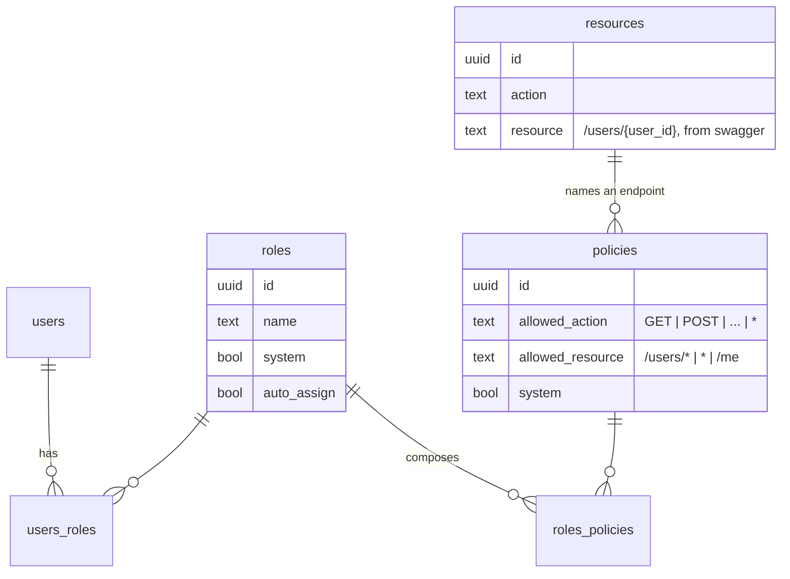
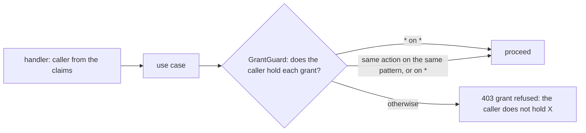

# Authorization: roles, policies, and the decision

Who may call what. This document is the model as it is. It was ported from
`svc-qu3ry-core`'s authorization review of 2026-09-06, and each section says
what changed there and why, because the same code shipped here.

## The model



- A **policy** is one grant: an action and a resource pattern. The pattern
  grammar is a whitelist (`/[a-z_]{1,50}`, a UUID, or `*` per segment, at
  most eight), which is why the engine needs no escaping.
- A **role** composes policies; a **user** holds roles. `system` rows cannot
  be edited or deleted; copy one to tune it.
- **`resources`** are the API's endpoints, generated from the Swagger spec.
  They are referential: a policy must name a real endpoint when it is
  created, and nothing reads them at decision time.

### The seeded roles

| Role | Holds | Meant for |
| --- | --- | --- |
| `Administrator` | `*` on `*` | the bootstrap account |
| `AuthenticatedUser` (auto-assigned) | logout, refresh, password reset, `/me`, `/me/authz`, `/me/identities`, `/me/resources_limits`, IdP linking, `GET /users` | every account |
| `ReadOnly` | `GET` on `*` | auditors, dashboards |
| `ProjectMember` | the projects the account belongs to, and their products | the ordinary user |
| `ProjectManager` | `ProjectMember` plus creating projects and managing their members | a team lead |
| `UserManager` | users, their roles, projects and password resets; reading roles | an account administrator |

`GET /me` and `PUT /me` were seeded from the start and linked to no role, so
every non-administrator got 403 on their own profile; `AuthenticatedUser`
holds them now. The seed is `00008`; the default roles are its last block,
and `products` is the one entity here that the core does not have, so
`ProjectMember` holds its six routes in place of the RAG ones.

## The decision

```mermaid
sequenceDiagram
    participant M as middleware.CheckAuthz
    participant U as UsersService.SelectAuthz
    participant C as cache authz:<uid>
    participant E as policyopa.Engine
    M->>M: sub from the claims; HEAD folded to GET
    M->>U: SelectAuthz(uid)
    U->>C: get
    C-->>U: hit, or fetch users→roles→policies once
    U-->>M: {"permissions": {"users": {uid: {pattern: [actions]}}}}
    M->>E: IsAllowed(uid, action, path, permissions)
    E->>E: prepared query, permissions in input
    E-->>M: allow, or an error
    M-->>M: error → 500 · false → 403, logged · true → next
```

**OPA, used properly.** The policy is a Rego module compiled **once** in
`policyopa.New`; each request evaluates the prepared query with the decision
as input. The caller's permission set travels in `input`, the idiomatic place
for request-scoped data, so no store is built per request. It used to be
parsed and compiled on every authenticated request, with the permissions
loaded as OPA's data document each time.

The policy itself (`policyopa/rego/bundle/authorization/policy.rego`):

- `*` as a resource is the global grant; a literal path matches exactly; a
  path with `*` expands each `*` to one lowercase UUID segment, anchored, so
  `/users/*` admits `/users/<uuid>` and refuses `/users/me`, `/roles/*`
  refuses `/roles/<uuid>/users`, `/rate_limits/*` refuses
  `/rate_limits/effective`.
- `*` as an action means every method, wherever it appears. It used to mean
  that only on the global resource, so `*` on `/roles` validated, inserted
  and admitted nothing.
- The administrator rule is membership, `"*" in actions`, not list equality.
  It used to be `== ["*"]`, so attaching one more `*`-resource policy turned
  the list into `["*", "GET"]` and locked every administrator out of every
  non-GET call, including the unlink that would have undone it. Measured.

**Fail closed, everywhere.** No grants is a refusal; a store fault, an
engine error or a non-boolean answer is a 500 and a refusal; a denial is a
403 logged at `Warn` with the request id and counted with an `authorized`
label on the metric.

**Tests that run.** `make lint` runs `opa check --strict`, `opa fmt` and
`opa test --coverage --threshold 100` on the bundle; `policyopa.TestEngineDecisions`
is the Go twin of `policy_test.rego`, driving the same cases through the
port with the wire-shaped map; `usecase.TestIsAuthorized` covers the use
case's failure paths. The Rego tests existed before and were never run.

**After the grant**: `RequireProjectMembership` (see
[security.md](./security.md)) asks whether the caller belongs to the project
named in the path, because a grant on `/projects/*/…` cannot know that.

**Disabled accounts.** A token issued before an account was disabled keeps
verifying; `CheckUserExists`, on the `/me` chain, refuses it with 403. It
surfaced when `/me` stopped being 403 for everyone.

## Who may grant what

Every request in the escalation chain was, on its own, one the caller was
allowed: `POST /policies`, `POST /roles`, `POST /roles/{id}/policies`,
`POST /users/{id}/roles`. The policy engine cannot see that together they
mint an allow-all policy and hand it to the caller. `usecase.GrantGuard`
can: before a policy is created, before an edit changes a policy's action or
resource, before policies are linked to a role, before roles are linked to a
user, the caller's **live** grants (the repository, never the cache) must
cover every grant being handed out. Renaming a policy or rewording its
description widens nothing and is not guarded: a UserManager may tidy a
policy they do not hold, but may not change what it grants.



"Holds" is literal on purpose: the same action on the same pattern, or on
`*`. A holder of `GET /projects/*` may not hand out `GET /projects/<one id>`
though it would be sound; narrowing patterns is the engine's job, and doing
it twice, differently, is how the two would drift. The seeded `UserManager` holds only
user, role-read and token routes, so on its own it can assign no role whose
grants it does not hold; an administrator who wants a `UserManager` to hand
out `ProjectMember` gives it `ProjectMember` too. That is the intended
shape: the right to assign a role is the right to hand out its contents.

The two links that make the bootstrap administrator an administrator
(`Administrator` → `Full Access`, the seeded account → `Administrator`) are
refused deletion by a trigger on the link tables, whoever asks. One
`DELETE /roles/<Administrator>/policies` used to lock every administrator out
for good. `PUT /policies/{id}` now cross-checks the `resources` table as
`POST` does, so an edit cannot name an endpoint that does not exist.

`TestGrantGuardStopsTheEscalationChain` keeps the proof: each step of the
chain answers 403 for the regular account and succeeds for an
administrator. `TestBootstrapLinksCannotBeSevered` covers the trigger.

## The cache, and why a revoke is never stale

A user's effective permissions are cached under `authz:<uid>` for hours, with
the user, every role and every policy as dependencies. Each path that
widens or narrows a grant invalidates; the two unlink paths used to
invalidate fewer keys than their link twins (`PoliciesService.UnlinkRoles`
dropped only the policy's, `RolesService.UnlinkPolicies` only the role's),
leaving a revoke to the dependency cascade, which nothing tested. Both
invalidate the same keys as their link now, and
`TestARevokedGrantBitesOnTheNextRequest` drives all three unlink routes and
asserts the next request is refused. One `authzCacheKey` helper spells the
key; eight sites used to spell it by hand beside an interface that nothing
implemented.

Grants written straight into the database bypass every invalidation and
stay invisible until the TTL; that is by design, and it bit two live
proofs during the review. Grant through the API.

## Adding a project-scoped route

A grant names a route; membership names a project. OPA expands the `*` in
`/projects/*/…` to any uuid and cannot know membership, so
`middleware.RequireProjectMembership` asks the database once per
project-scoped request, keyed on the `project_id` path value, **after**
`CheckAuthz`: no grant is 403, wrong project is 404, the same as a missing
project. An administrator bypasses and is logged as one.

A new project-scoped route needs nothing. A new path wildcard that is not
named `project_id` gets **no** check, so name it `project_id` or add one.
