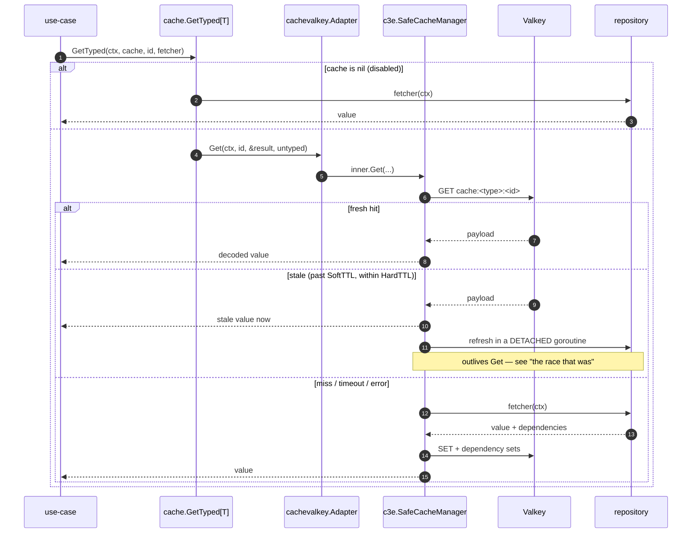
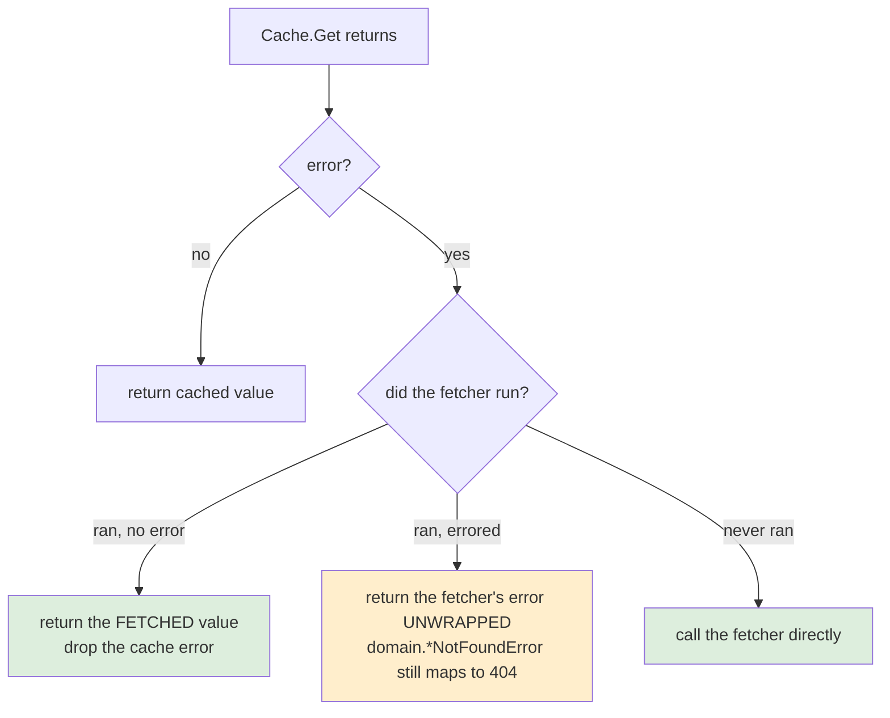
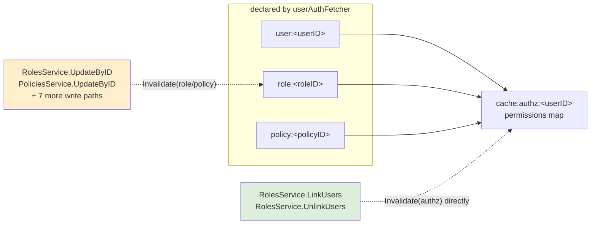

# Caching

How reads are cached, why a cache fault can never fail a request, and how a
permission change reaches an already-cached authorization decision.

The port is `internal/core/port/driven/cache`; the adapter is
`internal/adapter/driven/cachevalkey`, which wraps
[`github.com/slashdevops/c3e`](https://github.com/slashdevops/c3e) over Valkey.
Use-cases see only the port — `TestCoreHasNoInfraImports` enforces that.

## What is cached

`cache.GetTyped` call sites across the use-cases, all **control-plane
metadata**: users (by id and by email), the authorization permissions map,
roles, policies, projects, resources, and the available-IdP list.

Three things are deliberately **not** cached:

- Nothing negative-caches. A fetcher that errors writes nothing, so every
  lookup of a non-existent user or email reaches Postgres.
- **Lists are not cached.** The key would have to carry the filter, sort, fields
  and page token, which makes it effectively unique per request -- so every
  lookup misses, and every miss still stores.
- **Products are not cached**, and the reason generalises. Its repository
  answers a read differently depending on whether the caller belongs to the
  project, so the result is a function of the *caller* as well as the row. That
  leaves no good key: one without the user id serves a member's row to a
  non-member, and one with it cannot be invalidated on write, because nothing
  can enumerate the users who have read a product. **Any entity whose read is
  tenant-scoped in SQL inherits this**; the way to earn a cache is to resolve
  membership once, cache that, and key the row on the project alone.

## The read path

Every read goes through `cache.GetTyped`, which is generic over the caller's
concrete type. It is the **only** supported entry point: `Cache.Get` is the raw
port and cannot make the guarantees below, because it has no type to write a
fallback value into.



Three TTL-ish numbers govern that: `cache.entities.soft.ttl` (8h) is when an
entry starts being served stale while a refresh runs behind it,
`cache.entities.hard.ttl` (12h) is when it stops existing, and
`cache.ttl.jitter.percent` (0.1) spreads both so entries do not expire in
lockstep. Reads are bounded by `cache.max.query.timeout` (70ms); past that c3e
falls through to the fetcher, which is why a Valkey outage degrades to database
latency rather than to errors.

## The invariant: a cache fault must never fail a request

A cache is an optimisation, and every use-case that consults one has a source of
truth behind it. `GetTyped` enforces that a fault in the cache layer costs
latency and nothing else.



The middle branch is the one that matters. It exists because the service
shipped without it: the default `gob` encoder could not encode the
authorization permissions map, `c3e` returns an *encode* failure to the caller
(unlike a failed `SET`, which it logs and swallows), and the error surfaced as
`500 "authorization service unavailable"` on **every authenticated request**.
Nothing had caught it because `.air.toml` and `run.sh` both overrode the
encoder to `json`, so no one ever ran the shipped default.

Both halves of the fix are load-bearing: the encoder was made to work *and* the
fallback was added, so the next serialization problem — a new encoder, a changed
struct during a rolling deploy — degrades instead of failing.

The one error never swallowed is the fetcher's own, returned unwrapped so
handlers keep mapping `domain.*NotFoundError` to 404 rather than 500.

### The question this invariant disqualifies the cache from answering

Fail-open is right for every question the cache is asked, and *wrong* for one:
**is this token revoked?** Answering "not revoked" because the cache faulted
grants a token somebody logged out of, so the invariant above — a fault costs
latency and nothing else — is exactly the behaviour that must not apply.

That is why [`revoked_tokens`](./authentication.md#revocation) is a Postgres
table rather than a cache entry, and it is not a compromise:

- **`cache.enabled=false` is supported.** A Valkey-backed denylist would simply
  not exist in that configuration, and logout would go back to doing nothing —
  silently, in a deployment nobody would call misconfigured.
- **Postgres is a hard dependency of the service**, so the denylist has the same
  availability as the service itself. Losing it means the service is down, not
  that revocation quietly stopped working.
- **An error from the store is fatal, never "not revoked."** Treating an
  unreachable denylist as an empty one lets a database blip re-validate every
  token anyone has logged out of.

A cache may sit in front of it, but only as an optimisation: a **miss falls
through to the truth, never to a decision**. That is the shape any future
caching of the personal-access-token lookup has to take too.

## Keys and dependency invalidation

Three key spaces in Valkey: `cache:<type>:<id>` holds entries, `dep:<type>:<id>`
is the reverse-dependency set (which entries depend on this thing), and
`deps-for:<type>:<id>` is the forward set.

A fetcher returns its dependencies alongside its value, so invalidating one
identifier cascades breadth-first to everything that declared a dependency on
it. The authorization entry is the interesting case:



34 `Invalidate` calls across ten use-cases. **None of them can fail a write** —
every call site logs and continues, because the database transaction has already
committed and refusing the response would be worse than a stale entry.

The cascade runs on `context.WithoutCancel` with its own
`cache.invalidate.timeout` budget (5s). Detached because a half-finished cascade
is worse than one that never started — the write is already committed, so every
entry the walk did not reach stays cached and wrong until its hard TTL, and a
client hanging up mid-request must not cause that. Bounded because the caller's
context often has no deadline at all: the HTTP server deliberately sets no
`ReadTimeout` or `WriteTimeout` (see
[HTTP server timeouts](./http-server-timeouts.md)), and the cascade is one round
trip per node of the walk.

### A cache key must be at least as specific as its query

A cache hit skips the fetcher, so anything the key omits stops being checked.
That makes an under-specified key an authorization bypass rather than a harmless
abbreviation.

`GetEmbeddingParameter` shipped keyed on the config id alone, while the query
behind it — `SelectEmbeddingParameter(ctx, configID, projectID)` — is
project-scoped and returns not-found when the config belongs to someone else. A
caller who supplied another project's resource id together with their own
project id was therefore served the other project's row, because the query that
would have refused them never ran. Both ids come from client input on a
project-scoped path.

A second bug hid inside the same split: the read cached under `<resourceID>`
while update and delete invalidated `<projectID>:<resourceID>`, so **the
invalidation never matched** and an edit left the old value cached for the full
hard TTL.

The rule both bugs point at: build a cache key in **one** function, used by the
read *and* by every invalidation, and make it carry every id the fetcher's query
filters on.

When adding a cached value, check its key against its fetcher's arguments: if
the query filters on an id the key omits, the cache can serve one tenant's row
to another.

### A shared dependency set may only have its TTL raised

This one is worth knowing because it was wrong for a long time and the symptom
was invisible.

A reverse-dependency set is shared by every entry that depends on the same
thing. `c3e` used to issue an unconditional `EXPIRE` on it at every write, so
the **last** writer's TTL won even when it was shorter. With 10% jitter on a 12h
hard TTL, entries land anywhere in 10.8h–13.2h, so `dep:role:R` could expire up
to **2.4h before** an authorization entry still listed in it. Inside that window
`Invalidate(role:R)` found an empty set, cascaded to nothing, and reported
success — a revoked role kept working until the dependent entry expired on its
own. Nine write paths reach the authz cache through the cascade alone, including
**every** policy edit.

Since `c3e v0.0.2` the set's expiry may only be raised: `EXPIRE … NX` sets it
when the set has none, `EXPIRE … GT` raises it when a longer-lived dependent
joins. Both are needed — `GT` treats a key with no expiry as infinite and would
refuse to set one, leaving the sets persistent forever.

`TestCacheDependencyTTLIsNotShortened` is the standing reproduction here, so
moving the `c3e` pin back below v0.0.2 fails the suite rather than silently
restoring the window.

### A collection needs a collection-level dependency

`GetAvailableIDPs` caches a whole list under one key. Dependencies derived from
the members it happens to contain express "this list changed" but never "the
list gained a member" — so update and delete invalidated correctly while
**create was invisible for the full 12h TTL**. The fix is `idpCollection()`,
returning `idp_collection:all`, declared by the fetcher and invalidated from
create, update *and* delete. `idps_available:all` is the only collection cache
in the service; the other fourteen keys are single entities.

## Encoding

**json is the only encoder** (`cache.encoder.type`). Anything else is rejected by
`config.CacheConfig.Validate` before the service starts.

It is worth recording why, because `gob` was supported and was briefly the
default, and the argument for it is superficially good.

Gob will not encode a value whose static type is an interface unless the
concrete type behind it is registered. The authorization map comes out of a
JSONB column via pgx, so it is `map[string]any` and `[]any` all the way down,
and two `gob.Register` calls made it encodable. That was the whole fix, and it
was not enough: **registration makes gob able to encode, not lossless.**

Gob cannot tell a nil pointer from a pointer to a zero value. It omits any field
holding its type's zero value and flattens a pointer to the value behind it, so
`*bool(false)` is transmitted as nothing and decodes as `nil`. `domain` carries
**40 `*bool` and 52 `*string`** fields — `Admin`, `Disabled`, `System`,
`LocalAccount` — and handlers forward them straight into responses. Under gob
the same endpoint answered `"admin": null` on a cache hit and `"admin": false`
on a miss: a response that changed with cache state.

Nothing was traded away by dropping it. Gob was also *larger* here — `c3e`
builds a fresh `gob.Encoder` per entry, so each carries its own type descriptor:
626 B against 286 B stored for the authz map. Its one genuine advantage, being
type-aware rather than coercing, does not apply: the authz map originates as
JSON, so its numbers are already `float64` before the cache ever sees them.

A startup warning was tried first, and removing the option outright replaced it.
A setting that silently drops data should be impossible to select rather than
discouraged — the warning still required someone to read it before the support
ticket arrived.

`TestCachePreservesOptionalFields` guards the property rather than the encoder:
it asserts the shipped default preserves the nil / false / true tri-state, so a
future encoder that cannot would fail it.

One consequence outlives gob. `GetTyped` refuses to hand a nil pointer to the
encoder, originally because `gob.Encode` **panics** on one — and on the
stale-while-revalidate path that panic runs in a detached goroutine with no
recover, taking the *process* down rather than the request. json would store a
nil happily as `null`, but the guard stays: storing it would be negative
caching, which this service deliberately does not do.

## Observability

`c3e.Hooks`, wired from `cachevalkey.Instruments.Hooks()` in the composition
root, reports `cache_requests_total` (labelled hit / stale / miss / timeout /
error), `cache_duration_seconds` and `cache_refresh_total`.

### The race that was

The adapter used to infer hit-vs-miss itself: set a flag inside the fetcher
closure, read it after `inner.Get` returned. That was wrong twice. c3e also
calls that closure from the detached stale-while-revalidate goroutine, which
outlives the read — a genuine data race the detector reports at the write in the
closure against the read after the call. And a stale serve *does* run the
fetcher, so it was counted as a hit, quietly reporting expired data as fresh.

Only c3e knows the outcome, so only c3e can report it. Wiring `Hooks` removed
the race and the wrong numbers together, and left `Adapter` with nothing to do
but translate types — which is what a driven adapter should be.

A nil `*Instruments` is a no-op, so the cache works unchanged when telemetry is
off.

## Health and lifecycle

The `cache` component in `/health` `PING`s within `cache.max.query.timeout` and
reports **degraded**, never unhealthy — the service genuinely works without a
cache, and a readiness probe must not fail over a cache blip. The
`valkey.Client` is retained on `App` and closed in `Stop()` after the HTTP
server drains and before telemetry shuts down.

## Credentials are never cached

`domain.User` carries `PasswordHash`, and both `SelectByID` and `SelectByEmail`
scan it — so a cached user would put bcrypt hashes in Valkey: a store outside
the database, held for the full hard TTL, and reached over a cleartext
connection unless `cache.tls.enabled` is set. TLS protects the wire; it does not
make that a good place to keep them.

`UsersService.GetByEmail` and `GetByID` therefore return users with the
credential fields cleared, by way of `withoutCredentials`. The clearing happens
inside the fetcher, not at the return, because that is what decides the bytes
written to Valkey — stripping afterwards would return a clean value while
caching the hash anyway. The nil-cache path runs through the same fetcher, so
what a caller receives does not depend on whether caching is enabled.

Exactly one caller needs a hash: `AuthnService.LoginUser`, to compare a
password. It uses `GetByEmailForAuth`, which reads straight from the repository
and is **deliberately uncached**. That costs one indexed lookup per login, which
is nothing next to the exposure — logins are rare beside authenticated requests,
and the per-request authorization data is cached separately under
`authz:<userID>` and unaffected.

Two designs were considered and rejected. A second cached type without
credentials would mean two shapes to keep in sync, and every new field would
become a question about which one it belongs to — for the sake of one caller.
And `json:"-"` on the fields does not work at all: `c3e` serialises the fetched
value and decodes it back into the caller's destination, so the fields would be
dropped on a cache **miss** too, and the login compare would run against an
empty string.

`TestCacheNeverStoresPasswordHashes` asserts on the bytes in Valkey rather than
on the Go value, because the Go value is not the thing at risk. It decodes the
`CachedItem` wrapper — the payload is base64 inside JSON, so a hash is not
visible in the raw bytes — and fails on anything resembling a bcrypt prefix.

## Known limitations

- **The key namespace carries no encoder or schema version.** Changing
  `cache.encoder.type` on a warm cache means every entry decodes as garbage.
  Since `c3e v0.0.2` a payload that no longer decodes is treated as a miss and
  refetched, so the entry heals itself; versioning the prefix would avoid even
  that one extra read.
- **Singleflight is per-process**, so herd protection stops at the pod boundary.

## Testing

`cachevalkey/gob_test.go` pins the authz round-trip; `port/driven/cache/cache_test.go`
covers the `GetTyped` fallback and nil-cache behaviour. Both are unit tests and
need no Valkey.

Anything exercising the cascade, stale serving or encoder compatibility needs a
real server and belongs in `tests/integration/` behind the `integration` tag —
remember that `make test` uses `-tags=unit` and will not compile it, so
type-check every tag before believing a green run:

```bash
for t in unit integration eval; do go vet -tags=$t ./... ; done
```

## See also

- [Architecture overview](./README.md) — the hexagon and the request flow
- [HTTP server timeouts](./http-server-timeouts.md) — why a request context
  carries no deadline, which is why invalidation brings its own
- [Resource limits](./resource-limits.md) — the other control-plane cross-cut
