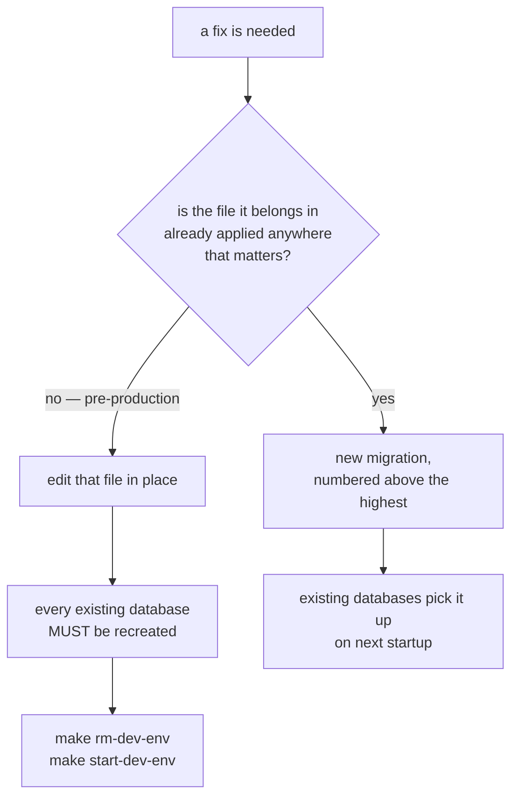

# Database migrations

`database/migrations/` is embedded into the binary (`database/migrations.go`,
`//go:embed migrations/*.sql`) and applied by `goose.UpContext` at startup when
`database.migration.enabled` is set. There is no separate migration step and no
`AllowMissing`: the schema a running service sees is exactly what these files
build, in numeric order.

This document covers the shape of that set, the invariants a new migration has
to respect, and the two things about `goose` that make a mistake here silent
rather than loud.

## The file set

16 files, numbered **contiguously** from `00001` in the order goose applies
them. The convention is a `_tables` file that creates structure followed by a
matching `_upsert` file that seeds it:

```text
00001  shared functions        the system-row guard, once; everything below depends on it
00002  users                   00003  seed  ← the development administrator
00004  projects                00005  projects_users   00006  seed
00007  roles / policies        00008  seed  ← generated in part by cmd/apiendpoints
00009  products                ← the worked example entity
00010  idps                    00011  seed
00012  resource limits         00013  seed
00014  revoked tokens          ← the logout/rotation denylist
00015  rate limits             00016  seed  ← rules + windows, and their authz rows
```

The set used to be numbered with gaps (`200`, `1000`, `1100`, … `20004`) so a
file could be slotted between two topics. It was renumbered to a closed
sequence before the first production deploy, because the gaps invited exactly
the mistake the ordering rule below forbids: a "products" migration numbered
`4001` to sit beside `4000_products_tables.sql` sorts below the applied `20004`,
and goose rejects it at startup as a missing migration. With a contiguous
sequence there is one place a new file can go, the end, and `goose create`
puts it there:

```bash
goose -dir database/migrations -s create add_widgets sql   # writes 00017_add_widgets.sql
```

**Every database built from the old numbering has to be recreated** —
`make rm-dev-env && make start-dev-env` — because goose tracks versions by
number: a database at version `20004` sees sixteen files below it and refuses
to start the service. Nothing was in production when the renumbering happened,
which is the only reason it was possible; see the next section.

There is no `100_extensions.sql`. The schema needs no PostgreSQL extension: `uuidv7()`
is **native in PostgreSQL 18**, which is why [requirements](../requirements.md)
names 18 and not "18 or later, with an extension". Earlier revisions of this
template carried a hand-written `uuidv7()` in SQL to run on PostgreSQL 17; that
file is gone and the function it defined is now the server's.

## This set was consolidated once, and cannot be again

The files above are a *first version*. Nine increments (`20002`–`20010`) that
had accumulated on top of the base schema were folded back into the files they
amended, and several of them disappeared entirely rather than moving, because
they existed only to correct a file that could now simply be corrected in place.

That was safe **only** because nothing was in production. From the first
production deploy, migrations are additive and the ordering rule below is
absolute.



### Why the failure mode is silence

`goose` records applied migrations **by version number only — it does not
checksum file contents**. Two consequences, both quiet:

- Rewriting an applied file does nothing to a database that already ran it.
  goose sees the version as applied and skips it.
- Deleting files does not error either. A database at version `20010` with a
  highest file of `20001` simply has nothing pending; `goose up` exits 0.

So a stale database keeps working and quietly stops matching the migrations.
Nothing reports it. That is the whole risk of the consolidation, and the
mitigation is procedural: recreate the database.

## Invariants

### Ordering

A new migration must sort **after every already-applied one**. `goose.UpContext`
runs without `AllowMissing`, so a file numbered below the current database
version is rejected as a missing migration and **startup fails**. The sequence
is contiguous, so a new file takes the next number whatever its topic —
`goose -dir database/migrations -s create <name> sql` computes it — and it is
never slotted between two existing files, however related they look.

The one exception is a **shared object**, which must sort *below* everything
that depends on it. goose applies Up ascending and Down descending, so
`00001_shared_functions.sql` is created before the first table that uses its
function and dropped after the last one is gone.

### System rows are guarded by a trigger, and it blocks UPDATE too

Twenty tables carry a `system BOOLEAN` marking rows that ship with the product.
Each has a `tr_restrict_delete_update_on_system_<table>` trigger, and all twenty
execute **one** function:

```sql
CREATE OR REPLACE FUNCTION fn_restrict_delete_update_on_system()
RETURNS TRIGGER AS $$
BEGIN
    IF TG_OP = 'DELETE' AND OLD.system THEN
        RAISE EXCEPTION 'System % cannot be deleted.', TG_TABLE_NAME;
    ELSIF TG_OP = 'UPDATE' AND OLD.system THEN
        RAISE EXCEPTION 'System % cannot be updated.', TG_TABLE_NAME;
    ...
```

It rejects **both** UPDATE and DELETE, so a down migration cannot clear the flag
first. It must disable the trigger, delete, and re-enable:

```sql
ALTER TABLE models DISABLE TRIGGER tr_restrict_delete_update_on_system_models;
DELETE FROM resources;
ALTER TABLE resources ENABLE TRIGGER tr_restrict_delete_update_on_system_resources;
```

Do not add a per-table copy of the function. There used to be twenty, and three
of them had drifted from the table they guarded, reporting a name that did not
exist (`permissions` for `resources`, among others). `TG_TABLE_NAME` cannot drift.

The function raises rather than falling off the end for an unexpected event.
That matters: returning `NULL` from a `BEFORE` row trigger **cancels the
operation**, so the old version would have silently discarded rows if one of
these had ever been attached to `INSERT`.

### Identifiers must fit in 63 characters

Postgres truncates longer names **silently**, so the name in the file stops
being the name in the database. This has caused two real bugs:

- A down migration had to hardcode
  `tr_restrict_delete_update_on_system_model_types_llm_engine_endp` — a string
  nobody wrote, produced by truncation.
- `repositorypg` mapped a duplicate index to `409 Conflict` by matching a
  constraint name, and the string it matched was the truncation of an
  83-character name. Shortening the name turned the 409 back into a 500, caught
  by `TestEmbeddingConfigIndexesCreate/duplicate_index_returns_conflict`.

The schema has zero 63-character identifiers. Keep it that way:

```sql
SELECT relname FROM pg_class
 WHERE relnamespace = 'public'::regnamespace AND length(relname) = 63;
```

**A constraint name referenced from Go is a contract.** `handlePgError` maps
PostgreSQL error codes to domain errors -- see
[`products.go`](../../internal/adapter/driven/repositorypg/products.go), where
`23505` on `unique_project_product_name` becomes a `ProductAlreadyExistsError`
and therefore a `409`. Rename the constraint without updating the mapping and
the API starts answering `500` for a duplicate name.

### Index only what is queried

The schema was carrying 288 indexes across 36 tables — eight per table — because
a template had been applied without asking what each line earned. 130 were
removed:

| Category | Count |
| --- | --- |
| Exact duplicate of a PK or UNIQUE index | 55 |
| Strict prefix of a composite index on the same table | 19 |
| Single-column on `created_at` / `updated_at` | 56 |

An index on `id`, or on a `UNIQUE` column, duplicates the index the constraint
already builds — Postgres creates one automatically, and a second identical one
buys nothing while costing every write.

**Do not choose what to drop by scan count.** A full integration run scanned
only 93 of the 288, but the most-scanned indexes in the database were
duplicates: `idx_users_id` at 2448 scans is identical to `users_pkey`. Given two
identical indexes the planner picks one arbitrarily, so a high count on a
duplicate means one of the pair is used — drop it and the scans move to the
constraint's index at identical cost. Meanwhile a PK index at zero scans cannot
be dropped at all. Redundancy is structural, so compute it structurally:

```sql
-- an index whose columns exactly match a PK/UNIQUE index on the same table
SELECT a.indexrelid::regclass FROM pg_index a JOIN pg_index b
  ON a.indrelid = b.indrelid AND a.indexrelid <> b.indexrelid
 WHERE a.indkey = b.indkey AND NOT a.indisunique AND (b.indisprimary OR b.indisunique);
```

Index a foreign key's leading column — an unindexed FK means a full scan of the
child table on every parent delete — and index what a query actually filters or
sorts on. Nothing else.

## Down migrations

They must work, and until recently they did not. `goose down` could not run to
completion; the failures found by walking it end to end were:

| File | What was wrong |
| --- | --- |
| `100` | `DROP EXTENSION IF NOT EXISTS` — not valid syntax |
| `1100` | `DELETE FROM user` — reserved word, and the table is `users` |
| `1501`, `8501` | deleted system rows without disabling the guard trigger |
| `10000` | dropped `idp_types` but never `idps`, which references it |
| `5000` | never dropped the `api_method` enum, so a second `up` failed |
| 13 files | **an entirely empty Down that reported `OK`**, leaving ~30 tables behind while claiming to have rolled back |

That last row is the dangerous one: an empty down does not fail, it *succeeds
wrongly*. Verify a round trip, and verify the residue:

```bash
goose ... up
goose ... down-to 0
goose ... up
```

After `down-to 0` nothing should remain but `goose_db_version` — no tables, no
functions, no enum types.

## Verifying that a change did not alter the schema

The strongest check is to build a database from scratch both ways and compare.

```bash
pg_dump --schema-only --no-owner --no-privileges | grep -vE '^\\(un)?restrict '
pg_dump --data-only   --no-owner -T goose_db_version | grep -vE '^\\(un)?restrict '
```

Three things make that diff look broken when it is not:

1. **`pg_dump` emits a random `\restrict` token on every run.** Two dumps of the
   same idle database never match until those lines are filtered. This is not
   optional — it is why the `grep` is in the command above.
2. **Timestamps differ between runs**, so `created_at`/`updated_at` must be
   normalised before a `--data-only` comparison.
3. **`serial_id` shifts whenever insert order changes.** It is assigned by a
   `BIGSERIAL`, so reordering the seed changes it without changing content.

An ordered digest sidesteps all three and is easier to scope to one table:

```sql
SELECT md5(string_agg(t::text, '' ORDER BY t.id)) FROM models t;
```

This is how the consolidation was proven faithful: the schema dump diffed to
**zero lines**, and the seeded data was 440 rows on both sides with no
differences.

## Seed data

- Generate ids with `go run cmd/uuidgen/main.go -n 1 -v 7`. Every id in the
  schema is a UUIDv7.
- Secrets are never seeded. An `idps` row's `client_secret` is seeded empty and
  supplied per deployment, stored encrypted.
- The `resources` rows in `00008` are generated from `docs/api/swagger.json` by
  `cmd/apiendpoints`. Regenerate rather than hand-edit that block; everything
  above its marker, and the hand-written `policies` and `roles_policies` blocks
  below it, are maintained by hand.
