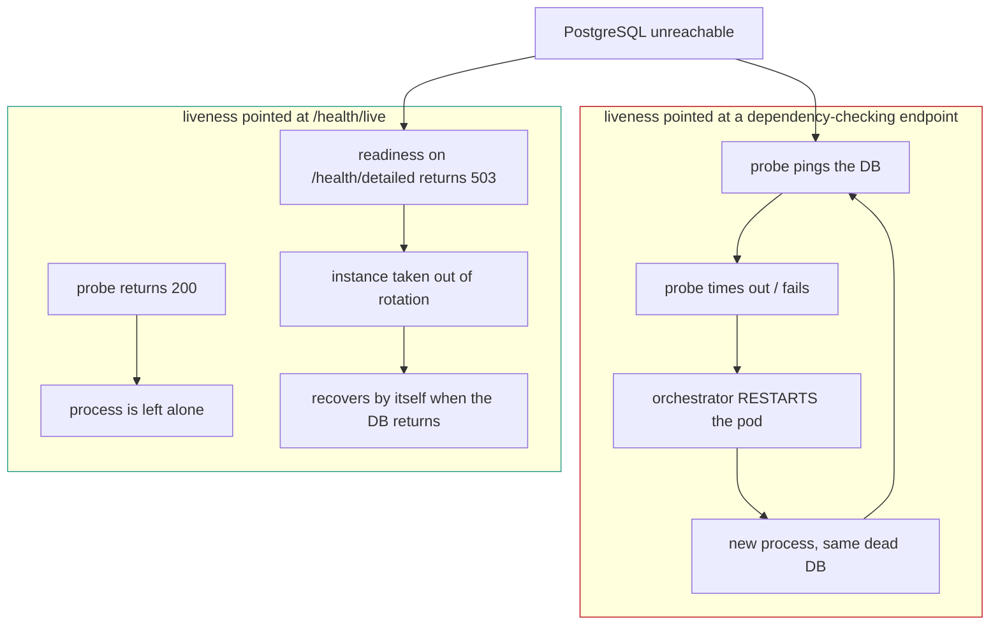
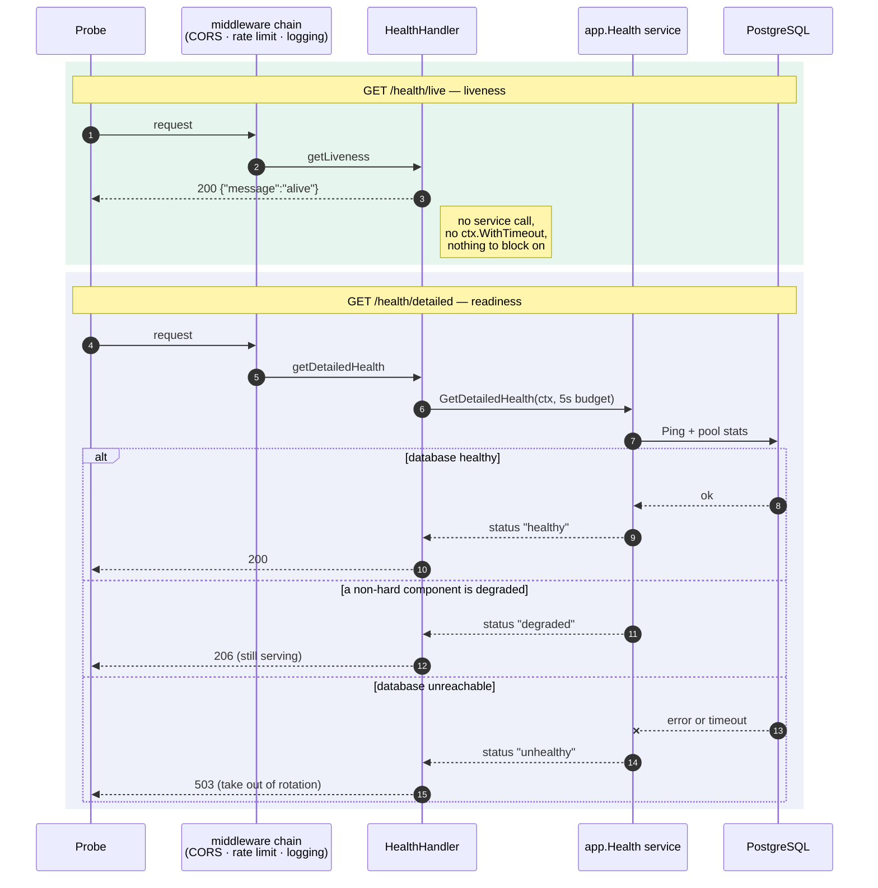

# Health endpoints and probes

The service exposes three health endpoints, and they are **not**
interchangeable. Each answers a different question, and pointing a probe at the
wrong one produces a failure that looks like the service is broken when it is
not — or the reverse.

| Endpoint           | Question it answers                            | Touches dependencies | Status codes       | Use it as        |
| ------------------ | ---------------------------------------------- | -------------------- | ------------------ | ---------------- |
| `/health/live`     | can this process serve HTTP at all?            | **no**               | `200`              | liveness probe   |
| `/health/detailed` | should this instance receive traffic?          | yes                  | `200` `206` `503`  | readiness probe  |
| `/health/status`   | what is going on in there?                     | yes                  | `200` `500`        | diagnostics only |

All three are public — they are registered before the authentication chain in
[`internal/app/server.go`](../../internal/app/server.go) — and all three sit
under the API prefix, so the real paths are `/{apiPrefix}/health/...`.

## Why liveness and readiness cannot be the same endpoint

The two probes have opposite consequences, so they need opposite behaviour:

- **Liveness failing kills the process.** The only fault it should react to is
  one a restart can fix — a wedged process, a deadlocked router, an
  unresponsive listener.
- **Readiness failing removes the instance from rotation.** It *should* react to
  a dependency being unreachable, because an instance that cannot reach
  Postgres cannot serve.

An endpoint that pings the database therefore makes a correct readiness probe
and a **dangerous** liveness probe. When Postgres goes down, every replica fails
its liveness check at once, every replica is killed, and the restarts do nothing
about the database — a restart loop stacked on top of the original outage, which
also destroys the replicas' ability to serve the requests that never needed the
database at all.



`/health/live` is the endpoint that cannot be dragged into that loop, because it
consults nothing:

```go
func (ref *HealthHandler) getLiveness(w http.ResponseWriter, r *http.Request) {
	respond.WriteJSONMessage(w, r, http.StatusOK, "alive")
}
```

Reaching that line *is* the check — the listener accepted the connection, the
router matched the route, and a goroutine ran. There is no code path in it that
can block, so there is no code path in it that can hang a probe.

## What each endpoint does on a request



## Which components are actually probed

`/health/detailed` reports a component per subsystem, and they are not all the
same kind of thing. Three do I/O; the rest assert that a startup phase ran.

| Component         | What its check does                         | Typical time | Reaches overall status |
| ----------------- | ------------------------------------------- | ------------ | ---------------------- |
| `database`        | `Ping`, 5s budget                           | ms           | **yes** — the only one |
| `cache`           | Valkey `PING`, `cache.max.query.timeout`    | ms           | no — fail-open         |
| `ratelimit_store` | Valkey `PING` on the cache's client, `ratelimit.store.timeout` | ms | degraded only |
| `mail_service`    | TCP connect to the transport, 3s budget     | ms           | no                     |
| `telemetry`       | TCP connect to the OTLP collector, plus the SDK's recorded export failures | ms | no |
| `runtime`         | `runtime.ReadMemStats`                      | µs           | no                     |
| `http_server`     | structural — the phase completed            | **ns**       | no                     |
| `repositories`    | structural                                  | **ns**       | no                     |
| `services`        | structural                                  | **ns**       | no                     |
| `handlers`        | structural                                  | **ns**       | no                     |

**`response_time` means one thing for every row: how long that component's
check took.** Where the check is a round trip, the round trip dominates and the
number is the round trip. Where the check reaches nothing, the number is the
sub-microsecond cost of not reaching anything.

**The magnitude is the tell, and it is why filling the column is safe.** A
component whose check is a network round trip cannot report `200ns`, and one
that reaches nothing cannot report `3ms`. A reader who sorts by this column sees
the two groups separate themselves.

### Why `ratelimit_store` has no response time of its own

Not because nothing was measured — because it was measured under another name.

The shared counter runs on the **same Valkey client as the cache**, owned by
`initCacheClient`; `App.Shutdown` deliberately does not close it twice. A ping
here would time the identical connection the `cache` component already reports,
and publishing one round trip as two numbers invites an operator to compare them
and read meaning into the difference. Its `details` say where the latency lives:

```json
"details": {
  "latency_reported_by": "cache",
  "reason": "shares the cache's Valkey client, so its round trip is the cache component's"
}
```

Its **status** still comes from the limiter's own gauge rather than a fresh ping,
because the gauge answers what the limiter actually experiences — which is the
question this component exists to ask.

### The collector dial is a complement to the export errors, not redundancy

`telemetry` does both, and neither alone is enough:

| Signal | Sees | Blind to |
| --- | --- | --- |
| TCP connect to `opentelemetry.trace.endpoint:port` | nothing listening, **without needing traffic** | anything that accepts and then fails |
| `ExportErrors` from `otel.SetErrorHandler` | a collector that accepts and rejects payloads | everything, until something has been sent |

The dial closes a real gap: with no traffic there is nothing to export, so a
collector refusing connections since startup produces **zero** export errors and
the component reported `exporting`. A quiet service is exactly when nobody is
watching a dashboard closely enough to notice it has gone flat.

**But a TCP connect proves something is listening, not that a collector works.**
Measured, and recorded because it is easy to mistake for the probe succeeding:
with Tempo stopped, podman's `gvproxy` still held `:4318`, so the dial connected
and telemetry reported `healthy`. The export-error path caught it once traffic
flowed. A port forwarder, proxy or sidecar in production behaves the same way.

Nothing is dialled when the exporter is `noop` — there is no host, and timing a
connection the service never makes would be a fabricated number.

### `runtime` is timed; the four structural components are not

`runtime.ReadMemStats` is real work — it can stop the world — so the duration
means something: a collection that takes noticeably longer than usual is a
symptom of heap pressure, which is what an operator opened this page to see.

`http_server`, `repositories`, `services` and `handlers` are pointer
comparisons. Timing one would put a number in the column that says nothing about
the component, and a number reads as evidence of contact in a way a dash does
not. That is the one change to resist here: **a filled column is not the goal, a
truthful one is.**

**A blank response time now means the component is not there.**
`ComponentHealth.ResponseTime` is a pointer, and `nil` is reserved for a
component whose check did not run at all — `database not initialized`,
`mail service not initialized`. Every component that *was* checked reports how
long that took.

This was not always so: the four structural components were deliberately left
blank on the reasoning that a number implies contact was made. **That was
reported as missing data three times**, which is the stronger argument — an
empty cell says "we failed to measure this", and that was not what was
happening. The message beside each of them still says `structural check, nothing
is probed`, and that sentence is what stops a small number being read as a round
trip. It is load-bearing; `TestEveryHealthyComponentCarriesAResponseTime` pins
both halves.

The pointer is still a pointer rather than an `int64` for the original reason: a
duration of zero and a check that never ran are different facts. An earlier
version truncated sub-millisecond pings to `0` and then blanked them as
unmeasured, so every component on a healthy local stack reported nothing.

### `mail_service` and `telemetry` used to be nil checks

Both answered `healthy` on the strength of a non-nil pointer:

```text
mail_service   healthy   —   mail service running
telemetry      healthy   —   telemetry active
```

Both statements are equally true of a service that has not delivered an email or
exported a span since it started. That is the failure mode these two components
exist to catch, and neither could.

**Mail matters more than it looks, because a failed send is lost.**
`mailer.MailService.deliver` logs the error and returns — there is no retry and
no dead-letter queue. An unreachable SMTP host does not delay a verification
email, it destroys it, and nothing in the request path notices because sending is
asynchronous: the user is told to check their inbox, the mail never arrives, and
every health signal says healthy.

`checkMailHealth` dials the configured transport — `mail.smtp.host:port` for
SMTP, the `mail.api.url` host for Mailgun — within its **own** 3s budget rather
than the request's, because a health poll usually carries no deadline at all and
an unreachable host would otherwise hang the endpoint for the platform's TCP
connect timeout. Measured with the bound removed: **75 seconds**.

It stops at reachability on purpose. A full SMTP conversation or an
authenticated API call spends credentials and provider quota on every poll, and
fails for reasons — a rejected password, a rate limit at the provider — that
would be reported here as the transport being down. The payload says what was
*not* verified rather than letting a reader assume:

```json
"details": {
  "sender": "smtp",
  "probe": "tcp connect only; credentials and delivery are not verified"
}
```

**Telemetry cannot be probed by asking it anything.** Both pipelines are batched
and asynchronous: a span is handed to a `BatchSpanProcessor` and the call returns
long before anything reaches a collector, so there is no error for instrumented
code to see. The SDK reports those failures to the process-wide handler set with
`otel.SetErrorHandler`, and the **default handler writes them to the standard
logger and forgets them**.

[`o11y.ExportErrors`](../../internal/o11y/export_errors.go) is installed as that
handler and keeps a count, a timestamp and the most recent message — not the
errors themselves, since an export failure repeats once per batch and a slice
would grow without bound during exactly the outage it reports.

Measured live, with Tempo stopped and traffic flowing:

```json
"telemetry": {
  "status": "degraded",
  "message": "the telemetry exporter is failing; traces and metrics from this replica are not reaching the collector",
  "details": {
    "export_errors": "4",
    "last_export_error": "traces export: Post \"http://localhost:4318/v1/traces\": EOF",
    "trace_exporter": "otlp-http"
  }
}
```

Restarting Tempo returned it to `healthy` without restarting the service.

**An old failure is forgotten.** `ExportErrors.Failing` takes a window — twice
the longer of `opentelemetry.trace.exporter.batch.timeout` and
`opentelemetry.metric.interval`, floored at a minute — because an exporter
retries on its own schedule, so a failure is evidence of a *current* outage only
while it is newer than that. A collector restarted an hour ago must not leave the
component degraded forever, or an operator learns to ignore it. The count stays
in `details`, because it happened.

**`noop` is reported as disabled, not active.** With both exporters off the
component is `healthy` — an operator chose that — but the message says
`telemetry is disabled` and names the settings. Half-on is called out too, since
one pipeline feeding dashboards while the other silently produces nothing is
easy to miss.

### Neither failure reaches the overall status

Losing mail or telemetry costs delivery and visibility, not service: every
request still succeeds and no caller can tell. Failing readiness over either
would evict a replica that is serving correctly — and since replicas share a
collector and a mail host, all of them at once. Same reasoning as
[the cache](#the-cache-never-affects-the-verdict); the database remains the only
component that moves the verdict.

### The four structural components stay

`http_server`, `repositories`, `services` and `handlers` reach nothing, and every
one of them is implied by the request being answered at all — the handler serving
`/health/detailed` *is* one of the handlers it reports on.

They are kept because a **missing** component is a real signal: a phase that did
not run leaves no entry. But their messages now say `structural check, nothing is
probed`, so a blank response time reads as by design rather than as a bug — which
is exactly how it was reported.

### The status code carries the verdict

`httpStatusForHealth` in
[`internal/adapter/driving/http/handler/health.go`](../../internal/adapter/driving/http/handler/health.go)
is the whole mapping:

| Overall status | Code  | Why                                                                        |
| -------------- | ----- | -------------------------------------------------------------------------- |
| `healthy`      | `200` | serving normally                                                            |
| `degraded`     | `206` | serving, but something is wrong — a success code, so rotation is kept       |
| `unhealthy`    | `503` | a hard dependency is unreachable — a load balancer must stop sending work   |
| anything else  | `200` | an unrecognised state is treated as serving, so a new state cannot silently take a working instance out of rotation |

This endpoint **used to answer `200` unconditionally**, with the verdict only in
the body. Anything that treated `2xx` as healthy — which is what a Kubernetes
readiness probe and most load balancers do — kept routing traffic to an instance
whose database was gone.

### The cache never affects the verdict

`overallForDatabase` in [`internal/app/health.go`](../../internal/app/health.go)
is the only thing that moves the overall status, and it takes the **database**
status alone. That is deliberate: the cache is fail-open by contract
([caching.md](./caching.md)), so a cache fault never fails a request, and an
endpoint that reported `503` for a dead cache would take a fully-serving
instance out of rotation.

### `/health/status` is not a probe

It pings the database inside a five second budget and, when the ping fails,
answers `500` and discards the summary it had just built. Measured against the
running service with Postgres stopped:

```text
GET /health/status    500 after 0.41s   (connection refused)
GET /health/status    500 after 5.00s   (container paused — a hung database)
```

So it is unusable as a liveness target for the reason above — it hangs as long
as the database does — and unhelpful as a readiness target, because the one
moment you want its detail is the moment it returns none. It is kept as a
human-readable diagnostic summary, and its `@Summary` says so.

### A failing health check does not say why

These endpoints are registered **before** the authentication chain, because a
probe cannot hold a token. Whatever they write is readable by anyone who can
reach the port — and they used to write the error verbatim:

```json
{
  "message": "failed to connect to `user=username database=go-rest-api-service-template`:\n\t[::1]:5432 (localhost): tls error: EOF",
  "status_code": 500
}
```

That is the database user, the database name, and every address the pool tried,
published by an endpoint whose entire purpose is to be polled. Both endpoints
now answer with a fixed string — `health check failed`, and
`database ping failed` in the component — and the reason goes to the span and an
`ERROR` log, which is where an operator reads it from anyway. It is the same
rule the rest of the service follows: **never forward a library's error string
into an API response.**

`TestHealthFailureDoesNotDiscloseTheReason` drives both endpoints with a service
that fails with the real captured text and asserts none of `user=username`,
`database=go-rest-api-service-template`, `5432` or `tls error` reaches the body.

## Configuring the probes

The paths below assume the default API prefix; substitute yours.

```yaml
livenessProbe:
  httpGet:
    path: /api/v1/health/live
    port: 8080
  periodSeconds: 10
  failureThreshold: 3

readinessProbe:
  httpGet:
    path: /api/v1/health/detailed
    port: 8080
  periodSeconds: 5
  failureThreshold: 2
```

Two things to get right:

- **Readiness must accept `206`.** Kubernetes treats any `2xx` as success, so
  this works out of the box — but a load balancer configured with
  `expected status: 200` will drop a degraded-but-serving instance. Configure
  the range, not the single code.
- **The IP rate limiter covers these routes too.** It wraps everything under the
  API prefix — but `/health` and `/version` are in `ratelimit.bypass.prefixes`
  and are answered **without consulting the limiter at all**, so a probe cannot
  be answered `429` however busy the source address is.

  That was not always true. The bypass lived inside the rule limiter, which was
  off by default, so in the shipped posture probes *were* limited: measured at
  1 req/s, eight probes came back `1 × 200` then `7 × 429`, which every
  orchestrator reads as a failed probe. The exemption now sits outside the
  limiter, so it holds whether limiting is on or off.

## Who may ask what

The three endpoints have two audiences, and until `#391` they had one:

| Endpoint | Access | Carries |
| --- | --- | --- |
| `/health/live` | public | the process is alive. ~120 bytes |
| `/health/status` | public | the verdict, per named check. ~140 bytes |
| `/health/detailed` | **authenticated** | every component, its configuration, its timings, the Go runtime |

**`/health/status` used to ship 5268 bytes**, including the full
`runtime.MemStats`, the Go version, the CPU count and the goroutine count — to
anyone, with no token, on a path the rate limiter also exempts. Two problems in
one: a version string an anonymous caller can match against published
advisories, and a 5 KB unauthenticated response with no limit in front of it,
which is a cheap amplifier.

**The data was not deleted, only moved.** The runtime detail is a `runtime`
component on `/health/detailed`, which now requires a token. An operator loses
nothing; an anonymous caller loses the reconnaissance.

**The probes stay public, and must.** An orchestrator carries no credentials, so
a readiness probe that answers `401` is a replica that never joins the load
balancer — which is the same failure the rate-limit bypass exists to prevent,
arriving from the other direction.

## What the tests pin

[`health_liveness_test.go`](../../internal/adapter/driving/http/handler/health_liveness_test.go)
drives both endpoints against a `HealthService` whose methods **never return** —
what a hung Postgres looks like from inside the handler:

- `TestLivenessAnswersWithoutTouchingAnyDependency` fails if `/health/live` so
  much as calls the service. Verified to fail by making `getLiveness` call
  `HealthCheck`.
- `TestReadinessReflectsDependencies` fails if `/health/detailed` answers
  *without* consulting it. Verified to fail by stubbing the service call out.

The two tests fail in opposite directions on purpose: the mistake this split
exists to prevent is the two endpoints converging back into one.

`TestHealthFailureDoesNotDiscloseTheReason` covers the second half, described
above.

### A data race these tests uncovered

Driving two endpoints of one handler concurrently was enough for `-race` to
flag `ref.metricsMetadata.Action = "..."`. That field lives on the **handler**,
which is shared by every request it serves, so writing it per request is a race
between concurrent callers — and when one request wins, the other's span and
metric are filed under the wrong action.

It was the pattern everywhere: 447 sites across the handlers, `repositorypg` and
`usecase`, because the `o11y` package documentation showed it that way. The
action is now a **parameter** of `o11y.SetupTrace`, `SetupTraceHTTP` and
`SetupTraceWithTimeout`, which set it on their own copy — `Metadata` is passed
by value, so the stored one is never touched:

```go
ctx, span, attrs := o11y.SetupTraceHTTP(r, ref.ot.Traces.Tracer, ref.metricsMetadata, "getStatus")
```

It went unnoticed because no unit test drove a single instance concurrently
under `-race` and the integration suite runs a binary built without it.
`TestNoSharedMetadataActionWrite` and
`TestSetupTraceKeepsEachCallersActionSeparate` cover both halves now.
