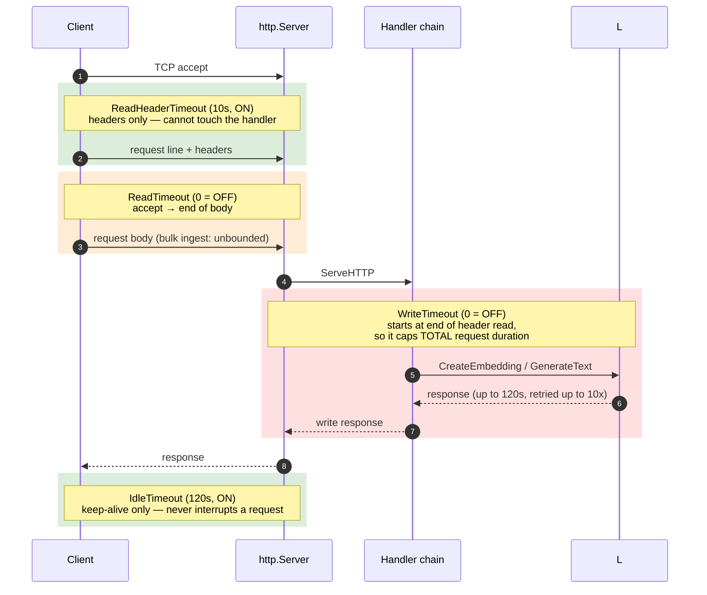
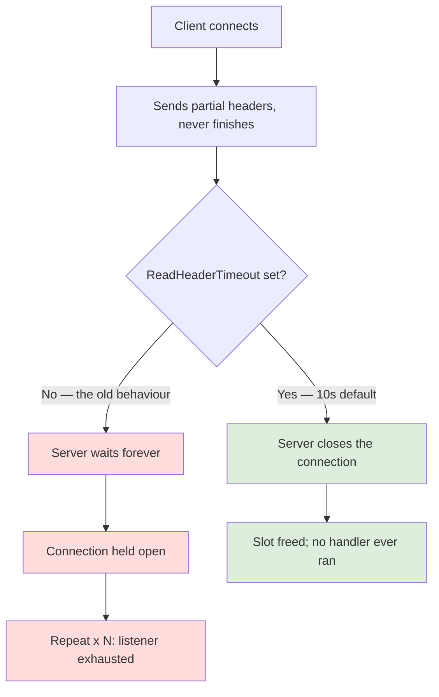

# HTTP server timeouts

How the inbound HTTP server bounds a request, which bounds are on by default,
and why two of them are deliberately off.

## What this used to do, and why it was wrong

`server.NewHTTPServer` built its `http.Server` from two fields:

```go
httpServer: &http.Server{
    Addr:    addr,
    Handler: conf.HTTPHandler,
},
```

Go applies **no header deadline of its own**. With `ReadHeaderTimeout` unset,
a client could open a connection, send `GET / HTTP/1.1\r\nHost: x\r\n`, and then
trickle one header line per second forever. The server would wait forever. Repeat
across a few hundred connections and the listener is exhausted without a single
completed request — a textbook Slowloris.

Nothing in the middleware chain helped. The IP rate limiter counts *requests*,
and a Slowloris connection never finishes one.

## Where each bound applies

The five settings do not overlap. Each covers a different span of the
connection, and that is what makes two of them safe to enable and two of them
dangerous.



The failure path the fix exists for:



## The settings

| Flag / env var                                              | Default | On? | What it bounds                                        |
| ----------------------------------------------------------- | ------- | --- | ----------------------------------------------------- |
| `http.server.read.header.timeout` / `SERVER_READ_HEADER_TIMEOUT` | `10s`   | yes | reading the request headers                           |
| `http.server.idle.timeout` / `SERVER_IDLE_TIMEOUT`          | `120s`  | yes | an idle keep-alive connection between requests        |
| `http.server.max.header.bytes` / `SERVER_MAX_HEADER_BYTES`  | `1 MiB` | yes | total header size (this is Go's own default, restated) |
| `http.server.read.timeout` / `SERVER_READ_TIMEOUT`          | `0`     | no  | accept → end of request body                          |
| `http.server.write.timeout` / `SERVER_WRITE_TIMEOUT`        | `0`     | no  | end of header read → response written                 |

`0` means disabled. `ReadHeaderTimeout` and `IdleTimeout` may **not** be
disabled — `config.HTTPServerConfig.Validate` rejects `0` for both, because
`ReadHeaderTimeout` is the only thing standing between the listener and a header
trickle.

## Why `ReadTimeout` and `WriteTimeout` are off

This is the part most likely to be "helpfully" changed by someone hardening the
server. Both would break real traffic.

**`WriteTimeout` caps total request duration.** It starts when the request
headers are read — not when the response starts — so it covers the entire
handler. An outbound call made while serving a request is bounded
by `http.client.timeout` (**120s** by default) and retried up to
`http.client.max.retries` (**10**) times with a jitter strategy. A legitimate
request can therefore run for roughly **twenty minutes**. Any write deadline
short enough to be useful against an attacker is short enough to abort exactly
the request this service exists to serve, and the client sees a truncated
response rather than an error.

If you do want it, lower `http.client.timeout` and `http.client.max.retries`
first so the ceiling is something you can reason about. The server logs a
warning at startup whenever `WriteTimeout` is non-zero, so the trade-off is
visible rather than discovered under load.

**`ReadTimeout` bounds how long a client may take to upload.** A bulk endpoint accepts
an arbitrary amount of text, and a large upload over a slow link is a normal
request. `ReadHeaderTimeout` already closes the Slowloris hole, which is the
part that actually mattered; `ReadTimeout` mostly trades availability for very
little extra safety.

`Validate` also rejects a `ReadTimeout` **below** `ReadHeaderTimeout` — the whole
request would have to finish before the headers alone were allowed to, which is
never what anyone means.

## Verified

Against a live stack, with the default `ReadHeaderTimeout` of 10s: a socket that
sent a partial request and then trickled header lines was closed by the server
after **10.0s**. Before the change the same socket stayed open indefinitely.

`server.TestNewHTTPServerAppliesTimeouts` guards the wiring — the configuration
being correct is worth nothing if it never reaches the `http.Server`, which is
precisely the state that shipped. `server.TestNewHTTPServerDefaultsLeaveBodyTimeoutsOff`
pins the two deliberate zeros so flipping either default has to be an explicit,
argued change.

## Not set, and why

`Server.MaxHeaderValueCount` (new in Go 1.27) is left unset: an unset field
already means `http.DefaultMaxHeaderValueCount`, which is **500**, so writing it
out changes nothing. `Server.DisableClientPriority` is likewise left at the
default — RFC 9218 priority scheduling is on in Go 1.27 and there is no evidence
it hurts here.

## See also

- [Architecture overview](./README.md) — the hexagon and the middleware chain
