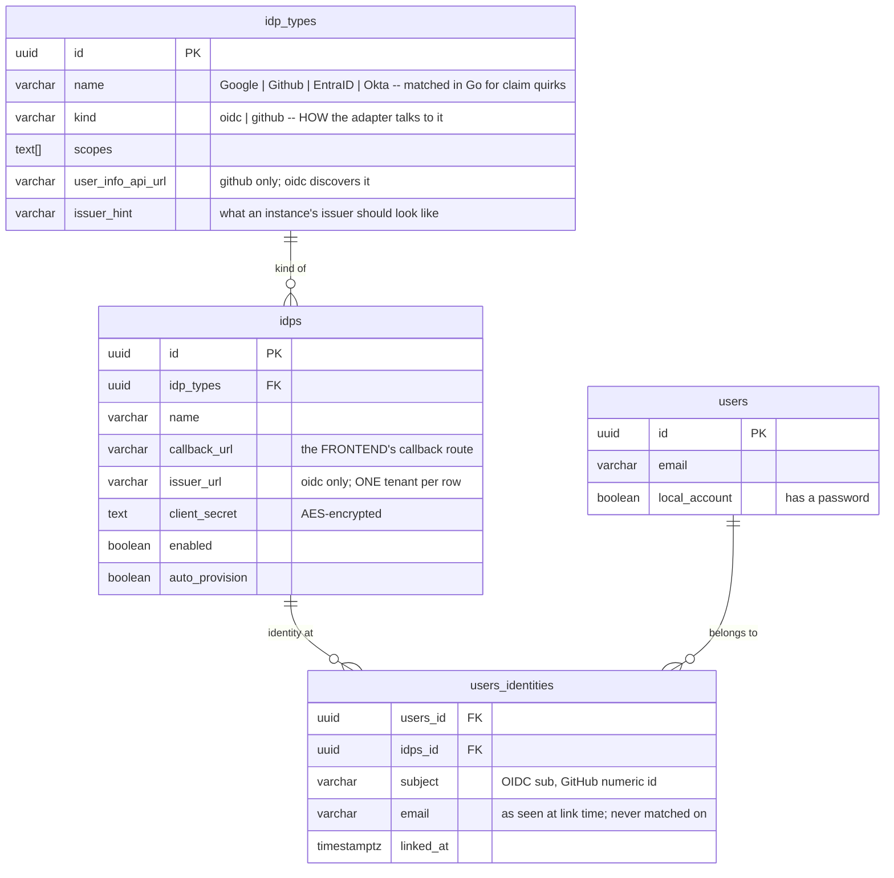
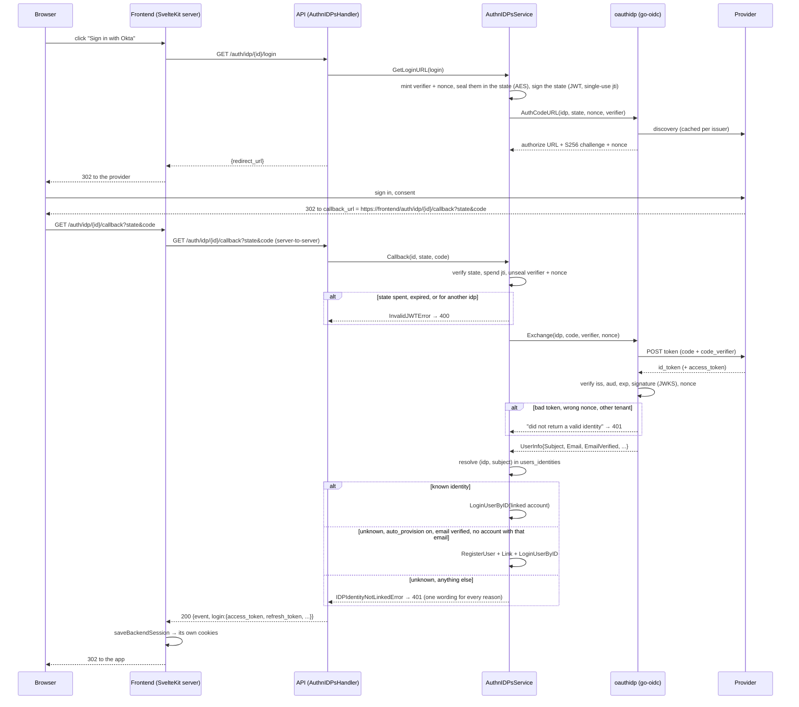
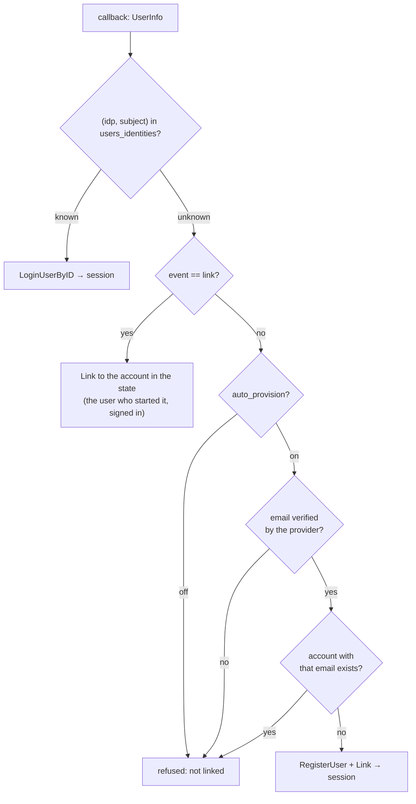

# Identity providers

How a person signs in through Google, GitHub, Microsoft Entra ID or Okta, what
this service trusts a provider for, and what it deliberately does not.

The short version: a provider proves a **subject**, never an email. The
identity is `(provider, subject)`, stored in `users_identities`; the email is a
hint used once, to create an account when the provider vouches for it. The
browser lands on the **frontend**, which talks to this API server-to-server;
this API sets no cookie and issues no redirect. OpenID Connect providers are
spoken to through discovery, with PKCE, a nonce and a verified ID token; GitHub
is plain OAuth2 with the primary verified email.

## The rows

**A type is a kind plus claim quirks.** `kind` decides the protocol; the
adapter used to switch on the *name* instead, so a row called anything but
`Google` or `Github` could be created and could never sign anybody in. The
name still matters for one thing: the per-vendor claim mapping (Entra ID's
`preferred_username`, see below).

**The issuer lives on the instance.** Google's is a constant; Entra ID's and
Okta's contain the tenant or the org, so a type cannot carry it. One tenant per
row, deliberately: the issuer is what the ID token's `iss` must equal, and a
second tenant is a second row rather than a `common` endpoint plus an
allow-list this service would have to maintain.

**`client_secret` is `TEXT`.** It holds ciphertext, and Okta's secrets are
already 64 characters in the clear.

## A sign-in, end to end

### What the callback used to do, and why it moved

The API was the provider's redirect target. It set three cookies **with the
frontend's cookie names on its own host** and redirected to a per-IdP
`login_redirect_url`. That worked in development only because both ran on
`localhost` — cookies ignore ports — and would have failed the first time the
API and the frontend had different hostnames: the SvelteKit server never sees
a cookie set for another host. It also contradicted the rule the frontend is
built on, that the browser never holds a token the API issued to it.

The callback now answers JSON, sets nothing and redirects nowhere. The
provider's `redirect_uri` is the frontend route, which exchanges state and
code with the API the same way it exchanges a password with `/auth/login`,
and stores the tokens with the same code. The two redirect URLs left the
`idps` row: where the browser lands is the frontend's decision.

## Identity, not email

**The refusal is one message for every branch.** Which addresses have
accounts here is not something whoever controls a provider account gets to
learn from the difference between "unverified" and "already registered".

**What it replaces.** `LoginUser` used to be called with the provider's email
and no password: it looked the account up by email, signed in, and if the
account was a local one set `local_account = false`, disabling the password.
Nothing proved the email belonged to the account — the provider's word was
enough, and an Entra administrator, a GitHub user with an unverified address,
or anyone at a provider that lets emails be changed could sign in as any
account whose address they could make a provider assert. `LoginUser` keeps its
one job, passwords; IdP sign-ins go through `LoginUserByID` after resolution,
and no login path changes the account on the way through.

**Linking is the holder's act.** A signed-in user starts
`GET /auth/idp/{id}/link`; the state carries their account id, sealed; the
callback attaches the identity to that account. The session proves the
account, the provider proves the identity, and it is the only moment both are
in hand. `GET /me/identities` lists them; `DELETE /me/identities/{idp_id}`
removes one — refused when it is the only way into an account with no
password, because nothing could sign in to it afterwards.

## What each provider is trusted for

| Provider | Kind | Subject | Email | Verified? |
| --- | --- | --- | --- | --- |
| Google | oidc, issuer `https://accounts.google.com` | `sub` | `email` | `email_verified` claim |
| Okta | oidc, issuer `https://<org>.okta.com/oauth2/default` | `sub` | `email` | `email_verified` claim |
| Entra ID | oidc, issuer `https://login.microsoftonline.com/<tenant>/v2.0` | `sub` (pairwise per app registration, stable for this row) | `email` if the optional claim is configured, else `preferred_username` when it is an address | **by construction**: one tenant per row, the address is the directory's own attribute |
| GitHub | github, fixed endpoints | numeric `id` (survives a rename; the login does not) | primary address from `/user/emails` (`/user.email` is null when private) | that address's `verified` flag |

Entra ID's trust is the one worth restating: there is no `email_verified`
claim, and the choice to treat a single tenant's addresses as verified is a
policy, recorded here and in the adapter, not a fact the provider asserts. The
scopes seeded for GitHub are `read:user user:email`; the old seed carried
`github:email` and `github:profile`, which are not GitHub scopes.

## The state token

Signed by this service, single-use, and it carries three things sealed with
the AES key in a `data` claim: the PKCE verifier, the nonce, and — for a link —
the account. Sealed because the state is readable by whoever sees the URL, and
the verifier must not be. Spent **before** the code is exchanged, on the
`revoked_tokens` denylist, so a state that survives a failed exchange cannot be
retried. A replay is refused with the same wording as any other bad state.

## What can go wrong

| Failure | Answer | Why |
| --- | --- | --- |
| provider cancelled (`error=access_denied`) | 401, "did not complete the sign-in" | the provider's description goes to the log, not the caller |
| state missing, spent, expired, for another idp, unsealable | 400 | one wording |
| discovery unreachable | 503 at start or callback | cached per issuer afterwards |
| ID token fails iss/aud/exp/signature, or wrong nonce | 401 | go-oidc's text is logged, never returned |
| identity unknown and not provisionable | 401, one wording | see above |
| identity already linked elsewhere (link) | 409 | the other account keeps it |
| provider disabled | 404 at start, at the callback, and absent from `/auth/idp/available` | a half-configured provider is never offered |

## Configuring a provider

| Field | Meaning |
| --- | --- |
| `idp_type_id` | one of the seeded types; decides kind and claim mapping |
| `issuer_url` | required for the oidc kind, refused for github; the type's `issuer_hint` shows the shape |
| `callback_url` | `https://<frontend>/auth/idp/<idp_id>/callback`, registered verbatim with the provider |
| `client_id`, `client_secret` | from the provider's app registration |
| `enabled` | offered and accepted; off while setting up |
| `auto_provision` | may a first sign-in with a verified email create an account |

At the provider: register the callback URL exactly; for Entra ID add the
`email` optional claim to the ID token or accept the UPN fallback; for Okta
assign the app to the users who should sign in.

## What it used to do, and why that was wrong

- endpoints chosen by the type's *name*, so `parseUserInfo(raw, idp.Name)`
  failed for any row not literally named `Google` or `Github`;
- no PKCE, no nonce, no ID token: plain OAuth2 and a user-info fetch, with
  the token exchange on `http.DefaultClient` and no timeout;
- `AccessTypeOffline` + `ApprovalForce` on every provider — Google-only
  options, forcing consent on every sign-in elsewhere;
- GitHub sign-in failed for anyone with a private email or a one-word name;
- accounts matched by email, `local_account` flipped on the way in;
- cookies set by the API on its host, redirect to a per-row URL;
- callback failures answered as JSON to a browser navigation;
- no `enabled` flag, no URL validation, every listing decrypting every secret.
