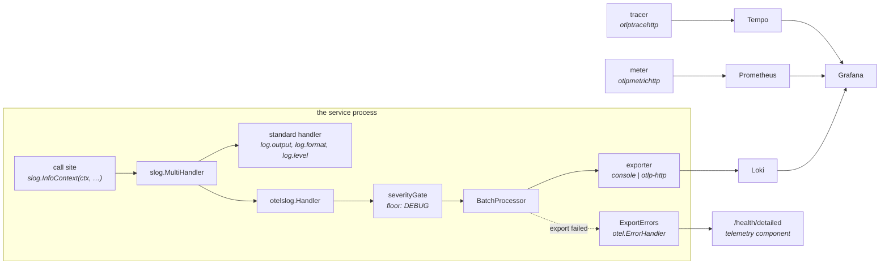

# Observability: three signals, one trace id

`go-rest-api-service-template` emits all three OpenTelemetry signals. Traces and metrics have
been here since the start; **logs joined them** and are the subject of most of
this page, because they are the signal with a second sink, a deliberate
disagreement between the two, and a rule about what may leave the process.

- The package is [`internal/o11y`](../../internal/o11y). Its package comment is
  the API tour; this page is the mechanism and the reasoning.
- The dev stack that receives the three signals is
  [`dev-env/`](../../dev-env) — Tempo, Prometheus and Loki behind one Grafana.

## The shape



## The vocabulary: one instrument pair, the layer as an attribute

Every layer records on the same two instruments:

| | |
| --- | --- |
| `app_calls_total` | counter |
| `app_call_duration_seconds` | histogram, seconds |

and the layer travels as the `app.layer` attribute, alongside `app.domain` and
`app.action`. Those six values are the only ones it takes:

| `app.layer` | Hexagon ring | What it is |
| --- | --- | --- |
| `handler` | driving adapter | the HTTP port. A gRPC handler would report the same layer; the protocol is an attribute on the span, not a layer |
| `usecase` | core | the business logic |
| `repository` | driven adapter | persistence, whatever implements it |
| `cache` | driven adapter | Valkey |
| `mail` | driven adapter | the mail transport |

**The values name port roles, not packages.** Swapping `repositorypg` for
another driver must not rename a metric or invalidate a dashboard.

**The ring is documentation, not a label.** No panel would ever ask for "all
driven adapters together" — one asks for `repository` or `cache` by name — and it
is derivable from the layer. A label nobody queries is cardinality nobody
wanted.

### What this replaced, and why

There used to be six instruments — `handler_calls_total`,
`service_calls_total`, `repository_calls_total` and a duration histogram each —
so the layer was encoded in the metric **name**. That is backwards from how
OpenTelemetry's semantic conventions work, where a dimension is an attribute
(`http.server.request.duration{http.route}`) and never part of the name, and it
was paid for daily:

```promql
# before: a regex over metric names
sum by (app_layer) (rate({__name__=~"(handler|service|repository)_calls_total"}[$__rate_interval]))

# after
sum by (app_layer) (rate(app_calls_total[$__rate_interval]))
```

A dashboard variable over the layer was not expressible at all before; now it
is just `app_calls_total{app_layer="$layer"}`.

Adding a layer used to mean a fourth copy of a per-package constants file and
two more metric names for every dashboard to learn, which is why the driven
adapters were instrumented unevenly and a layer breakdown stopped at the
repository.

Series count is unchanged — the same layer × domain × action combinations, in
one family instead of three.

`service` became `usecase` in the same change. The package has been `usecase`
since the ports refactor, and next to `service.name` and `service_name` the old
spelling read as "the whole binary" rather than "the core".

### One name means one description

Every construction of an instrument with a given name must agree on its
description, or the SDK reports a duplicate-instrument conflict and the
disagreeing registrations export as separate, half-populated series. With the
layer in the name this was invisible — each layer had its own instrument, so
each could describe itself differently, and three spellings had drifted in,
including `"Duration of %s handler calls"` on a repository. Sharing one name
makes agreement mandatory, so the text lives in one place and
`o11y.NewLayerMetrics` is the only thing that builds the pair.

### Buckets

`app_call_duration_seconds` sets its boundaries explicitly, 1 ms to 10 minutes.
The SDK default stops at 10 seconds, which is survivable while every layer is a
database call measured in milliseconds and is not once the same instrument
times a slow outbound dependency, which can run for far longer — the reason the
server has no write timeout. Everything past the last bucket lands in `+Inf`,
so a p95 over a slow dependency would be pinned at 10s and tell nobody
anything.

### Adapters keep their own instruments too

`cache` and `mail` record the shared pair **in addition to** their specialised
ones, never instead. The two answer different questions: `cache_requests_total`
measures what only a cache has (hit, stale, miss, timeout, per entity) and that
vocabulary is meaningless on a shared instrument, while the shared pair
measures what every layer has, so a layer breakdown includes them instead of
stopping at the repository and leaving a hole where a real dependency sits.
Different instrument names, so nothing is double-counted.

## What identifies a replica

Four attributes are set once on the resource, so they reach all three signals
at a time and cost nothing per record.

| Attribute | Source | Loki promotes it? |
| --- | --- | --- |
| `service.name`, `service.version` | build metadata | `service_name` yes |
| `service.instance.id` | a fresh uuid per process | yes |
| `host.name`, `process.pid` | the SDK's detectors | no |
| `deployment.environment.name` | `opentelemetry.environment` | yes |

**`service.instance.id` was missing, and the gap was invisible.** The SDK only
sets it behind an experimental flag. The dashboards carry an `instance`
variable keyed on it, and a variable over a label nothing sets resolves to
empty — while `service_instance_id=~""` still matches every series. So the
panels worked, the variable was dead, and nothing said so. It was found by
asking Prometheus which `service_*` labels it actually had, which is a question
worth asking of any label a dashboard depends on.

It is a fresh uuid per process because that is what the specification asks for:
a restarted process **is** a new instance, and an id that survived a restart
would make two processes' series look like one. `host.name` carries the
friendly name alongside it — in Kubernetes, the pod.

A consequence worth knowing: Loki promotes `service.instance.id` to a label, so
**one process is one stream**. That is the intent, and a restart starting a new
stream is correct. In the dev stack, where `air` rebuilds on every save, the
24h retention is what bounds it.

### There is no default environment

`opentelemetry.environment` is empty by default, and empty means the attribute
is not emitted at all. `development` would label a production replica wrongly
until somebody noticed, and `production` would do the reverse. Both are worse
than nothing, because **a wrong label is acted on and a missing one is asked
about**. The dev stack sets it explicitly in `run.sh` and `.air.toml`.

It is bounded to 63 characters because Loki makes it an index key, repeated on
every stream.

`resource.Default()` is merged in rather than replaced, which is what keeps
`OTEL_RESOURCE_ATTRIBUTES` working — the way a deployment adds its own
attributes with no code change.

## Logs are a second sink, never a replacement

`opentelemetry.log.exporter` adds a destination. It never takes `log.output`
away, and that is not a convenience:

- The lines written **before** telemetry exists have nowhere else to go. A
  rejected flag, an unreadable `.env`, a deployment still running the seeded
  administrator's password — all of these are logged while no exporter has been
  built.
- A container platform that collects stdout must keep working while the log
  collector does not. Losing telemetry costs visibility in Grafana; it must
  never cost the local record.

So the pipeline is *composed* onto the default logger rather than installed in
place of it (`App.composeLogger`), and a deployment that wants only the store
points `log.output` at `/dev/null` — a flag that already exists.

| `opentelemetry.log.exporter` | `log.output` | OTEL pipeline | Use |
| --- | --- | --- | --- |
| `noop` (**default**) | every record | none | local work, `kubectl logs`, any deployment with no log store. Identical to the behaviour before this setting existed. |
| `console` | every record | OTLP records pretty-printed | seeing the record the SDK *would* ship: its resource, severity number and attributes. Not a sink — everything it prints is already on stdout in the handler's format. |
| `otlp-http` | every record | batched OTLP/HTTP to `opentelemetry.log.{endpoint,port,path}` | Loki (the dev stack, `run.sh` and `.air.toml`) or an OpenTelemetry Collector |

`opentelemetry.log.path` is a setting because the two destinations disagree
about it: **Loki serves `/otlp/v1/logs`, a Collector serves `/v1/logs`.** It is
the same reason the metric exporter builds a full URL — Prometheus' OTLP
receiver sits under a prefix too.

### Why logs default to `noop` when traces and metrics default to `console`

Traces and metrics have nowhere at all to go without an exporter, so a console
default is the only way to see them. Logs already have somewhere. A `console`
default would print every line a second time, in a different shape, to the same
terminal — and `noop` is exactly what every deployment did before the setting
existed, so an upgrade changes nothing until an operator asks for it.

## TRACE never leaves the process

This is the one place the two sinks deliberately disagree, and it is a
constant, not a setting.

`cslog.LogLevelTrace` is where this service logs the things that are useful
next to a terminal and dangerous anywhere else:

- every SQL statement **with its arguments**, which on the authentication path
  are password hashes and token hashes;
- every outbound HTTP request and response body.

`.air.toml` and `run.sh` run the dev stack at that level on purpose. A
searchable, retained log store is the wrong destination for those lines, so
`o11y.ExportedLogFloor` raises the exporter's minimum severity to `DEBUG`
whatever `log.level` says:

```
-log.level=ctrace   →   stdout: TRACE and above      exporter: DEBUG and above
-log.level=warn     →   stdout: WARN and above       exporter: WARN and above
```

Raised, never lowered: a service running at `warn` exports `warn` and above.

**Why a constant and not an `opentelemetry.log.level` flag.** A flag can be
raised. With one, shipping SQL arguments to a log store would be one operator's
typo away, in production, with no review — and there is no value in that flag
that anybody wants and cannot get another way. The floor also makes the
"no secrets above TRACE" rule below enforceable rather than aspirational.

The gate is an `sdklog.Processor` that implements both `Enabled` and `OnEmit`.
`Enabled` is the cheap half — the slog bridge asks before building a record, so
a suppressed `cslog.Trace` costs an integer comparison rather than an
allocation. `OnEmit` is the correct half — the SDK documents that `OnEmit` is
called independently of `Enabled`, so a bridge that skips the question must
still be filtered.

## What the custom levels become

`otelslog` maps a `slog.Level` to a severity by a constant offset, and both of
this service's custom levels land where they should with no special handling:

| slog level | value | OTEL severity | exported? |
| --- | --- | --- | --- |
| `cslog.LogLevelTrace` | -8 | `TRACE` (1) | **never** |
| `slog.LevelDebug` | -4 | `DEBUG` (5) | at `log.level=debug` or below |
| `slog.LevelInfo` | 0 | `INFO` (9) | yes |
| `slog.LevelWarn` | 4 | `WARN` (13) | yes |
| `slog.LevelError` | 8 | `ERROR` (17) | yes |
| `cslog.LogLevelFatal` | 12 | `FATAL` (21) | yes |

## Where the identifying attributes live

`application` and `version` are attached to the **standard handler**, in
`setupLogger`, before the pipeline is composed on. On the exported side the
same two facts are resource attributes (`service.name`, `service.version`)
carried once per batch. Repeating them per record would pay for them per line
and give a Loki query two spellings of one thing to choose between.

This falls out of composing at the handler level:
`slog.NewMultiHandler(slog.Default().Handler(), otelHandler)` — the attributes
are already inside the first handler and the second never sees them.

## The ordering invariant

```
LoadConfigs → setupLogger        the standard logger exists
     ↓
initTelemetry → Start → composeLogger    the pipeline is added as a second sink
     ↓
initDatabase, initRepositories, initServices, …
```

Anything that captures `slog.Default()` for its own use keeps whatever logger
existed at that moment. Two things do: the cache client and the outbound HTTP
client, both wired in `initServices`. If a phase that captures the logger moved
above `initTelemetry`, it would hold a logger with one sink and its lines would
silently stop appearing in the log store — with nothing failing and no error
anywhere. `TestLoggerConsumersAreWiredAfterTelemetry` asserts the order from the
source, because the failure is invisible at runtime.

`Start` brings the pipelines up in the order traces → metrics → logs, so a
record emitted during setup has a tracer to be correlated against. `Shutdown`
reverses it: the log provider's flush is the last thing that can produce a span.

## When export fails

Every pipeline is batched and asynchronous, so an export failure cannot be
returned to the call site — the call returned long before anything reached a
collector. The SDK reports failures to the process-wide handler, which is
[`o11y.ExportErrors`](../../internal/o11y/export_errors.go), and from there:

- `/health/detailed` → the `telemetry` component goes **degraded**, never
  unhealthy. Losing telemetry costs visibility, not service; failing readiness
  over it would take a working replica out of rotation because a collector is
  down, and since replicas share a collector, all of them at once.
- `telemetry_export_errors_total` → a metric, so it can be alerted on and it
  has history. It is genuinely useful in exactly one situation, and that
  situation is the common one: **the metric pipeline is fine and the log
  collector is down.** The counter rises in Prometheus while every dashboard
  keeps working, which is the only way that outage announces itself.

`ExportErrors.Handle` must never log. Since the log pipeline exports through
that same handler, a `slog` call there is a loop: the line is emitted, its
export fails, the SDK calls `Handle`, `Handle` logs again. It would spin exactly
when telemetry is already broken, and the first symptom would be a pegged CPU
rather than a degraded health check. `TestExportErrorsHandleDoesNotLog` pins it.

The health component also **dials** each collector, because with no traffic
there is nothing to export and a collector that has refused connections since
startup produces zero export errors. Logs are dialled separately from traces —
they are separate processes at separate addresses, Loki on 3100 and Tempo on
4318 — and the second dial is skipped when the two addresses agree, which is
what one Collector in front of both looks like. See
[health-probes.md](./health-probes.md).

## How a log line finds its trace

Three things have to line up, and each of them was missing.

### 1. The span has to exist above the code that logs

The server span used to start **inside** the handler, in `o11y.SetupTraceHTTP`.
A context does not flow back up out of `next.ServeHTTP`, so by the time the
request line was written the handler's span was gone. No amount of changing the
log call could have fixed that.

It now starts in `middleware.Tracing`, above `Logging` and below `Recovery`:

```
RequestID → Recovery → SecurityHeaders → RewriteStandardErrorsAsJSON
          → OtelTextMapPropagation   adopt the caller's trace context
          → Tracing                  open this service's span in it
          → Logging                  write the request line INSIDE that span
          → HeaderAPIVersion → MaxBody → RequireJSONBody → handler
```

A second thing falls out: a request refused **before** the handler — by the
rate limiter, the body limit, or authentication — now produces a span where it
used to produce none. Those are exactly the requests somebody goes looking for.

`http.route` must be the route and never the path: `/users/{id}` is one span
name, `/users/019822af-…` is one per user. The route is not known on the way
in, because `ServeMux` assigns `Request.Pattern` while it routes, so the span
opens under a placeholder and is renamed on the way out. The rename reads the
pattern off the request the middleware **passed down**, not the one it
received, because the mux sets it on the request it was handed. Whether that
works depends on nothing in between cloning the request, which is not
guaranteed by anything — so a test asserts it and fails if a future middleware
starts to.

Only 5xx marks a span as an error. A 4xx is the server working correctly and
telling a caller so; marking those `Error` turns the error rate in a trace
backend into a measure of how often clients send bad requests.

### 2. The call has to pass the context

`slog.Info` and `slog.InfoContext` differ in one way that matters: the bridge
reads the span from the context argument and from nowhere else. 340 call sites
across the request path were converted at once, by an AST rewriter rather than
by hand, taking the context from a parameter, from an `*http.Request`, or from
the enclosing function when the call sits inside a closure.

`TestNoContextlessSlogInTheRequestPath` keeps it that way. The rule decays
silently otherwise — nothing fails, no test goes red, the line simply is not
there when somebody clicks "logs for this span" during an incident. Its
exemptions are keyed on the **function** rather than the file, because a
file-level exemption would silently cover every call added to that file
afterwards. `internal/app` is out of scope entirely: its logging is startup and
shutdown, where no span exists and a context would have to be invented.

### 3. Both sinks have to carry the ids

The bridge stamps `trace_id` and `span_id` on exported records. Nothing does
that for the standard handler, so `traceAttrsHandler` wraps it and adds the
same two attributes, under the same snake_case names, whenever a span is
current. A line scraped from stdout and a line delivered by OTLP then carry the
same field under the same name, so one Grafana derived-field rule covers both.

It has to reimplement `WithAttrs` and `WithGroup` to return its own type. The
cache client and the outbound HTTP client each capture `slog.Default().With(…)`
at wiring time, and a wrapper that dropped itself there would leave those two
components logging without trace ids — silently, and with nothing else to catch
it.

## The request line is the access log

One `Info` per request, written at the outermost point that has the trace. It
used to carry the method, path, peer address and status. What it was missing,
and why each matters:

| Field | Why |
| --- | --- |
| `duration_ms` | the first question anyone asks of an access log, and it could not answer it |
| `route` | the mux pattern. `/users/{id}` groups; a path does not |
| `client_ip` | resolved through the trusted-proxy policy. `RemoteAddr` behind a proxy is the proxy, logged identically for every caller |
| `bytes` | a slow endpoint returning a megabyte and a slow endpoint returning nothing are different problems a duration cannot tell apart |
| `trace_id` | via the context — the point of all of the above |
| `user_id`, `token_type` | "who was doing this" is the first question after "what failed" |
| `project_id`, `project_admin` | the tenant boundary. A slow or failing project was invisible, because nothing on the line said which one |

The response writer counts the bytes and returns an already-wrapped writer as
it is, so `Tracing` and `Logging` share one wrapper instead of stacking two.

### The subject reaches the line the same way the route does

The identity cannot simply be read where the line is written. The
authentication middleware puts the claims on a **new** request and passes it
down; the access log runs above it, holds the request it passed down, and never
gains that value — a context flows down and never back up. It is the same
structural problem that kept the trace id off the line.

So `Tracing` installs one pointer in the context, above everything that fills
it. The authentication and membership middlewares write through that pointer as
the chain descends; the access log and the server span read it on the way back
out. It is the pattern `otelhttp` uses for its labeler, and for the same
reason.

Both the writes and the read happen on the request's own goroutine — the writes
as the chain descends, the read after `next.ServeHTTP` has returned — so no lock
is needed. Nothing outside the middleware package can reach the pointer, which
is what keeps that true.

**The address is never recorded, only the `sub` claim.** An id identifies the
account for an operator without putting a person's e-mail in a retained,
searchable store. An anonymous request contributes no subject fields at all,
rather than a line padded with empty strings that read as "the empty user".

## What the key rules caught

The two rules above are tests rather than review habits because the failure
they prevent is silent and permanent: nothing breaks, the line simply exists in
a store that is retained and searchable by everyone who can read it. Each was
written after finding real lines.

**One SQL statement was logged at DEBUG, not TRACE.** 80 other SQL logs in the
same package already used `cslog.Trace`; this one was the outlier, and being
the outlier is why nobody noticed. DEBUG is above the export floor, so it
shipped — and it is `repository.Users.Insert`, which interpolates its
arguments: the user's e-mail address and their **bcrypt password hash**. The
TRACE floor was doing its job; this call was simply on the wrong side of it.

**Three WARN lines in the re-verification path carried the address** of every
account that asked to be re-verified. They now log `user_id`, and the one case
with no account to identify logs a reason instead.

**Two keys were named for something other than what they held.**
`"access_token"` and `"refresh_token"` on the startup line hold *durations*.
Besides being confusing on their own terms, they make any search for a leaked
token return that line. They are `access_token_lifetime` and
`refresh_token_lifetime` now.

**Twelve keys were camelCase**, including
a whole sentence used as an attribute key
(`"skipping languageID because it is the same as the embedding language"`, with
the id as its value).

## `error_type`, and why the message is not a key

`operation_failed` carries `error_type` as well as the message. Counting
failures needs something that does not change when the wording does: the
message is free text, it is often a wrapped vendor string, and a dependency
bump rewrites it — at which point a panel counting "how many times did *this*
failure happen" silently starts counting two things, or nothing.

It reports the type at the **bottom** of the wrap chain, because that is where
the cause is. `fmt.Errorf("selecting the user: %w", pgx.ErrNoRows)` is a
`*fmt.wrapError` all the way up, so reporting the outermost type would give one
value for every distinct failure in the service.

It is deliberately **not** a metric attribute. The set of error types is
bounded by the code rather than by traffic, but it is large, and the metric
already carries `successful=false` with the layer, domain and action — which is
the question a metric should answer. "Which error" is a log question, and the
log line is joined to the metric by the trace id.

That is also why the HTTP status is not on `operation_failed`. Putting it there
would mean plumbing the response writer into `internal/core`, which is the one
thing the hexagon forbids; and the access log already carries `status` and
shares a trace id with the failure, so the two are one click apart.

## Rules for writing a log line

1. **Take `ctx`.** `slog.InfoContext(ctx, …)`, `cslog.Trace(ctx, …)`. The
   bridge reads the span from the context and from nowhere else, so a
   context-less call can never be found from the trace it belongs to.
   `TestNoContextlessSlogInTheRequestPath` enforces it.
   `TestNoContextlessSlogInTheRequestPath` enforces it.
2. **No e-mail, token, password, secret or prompt text above TRACE.** Log ids.
   TRACE is the level that may carry SQL and payloads, and TRACE is the level
   that never leaves the process. `TestNoSensitiveKeysAboveTrace` enforces it
   from a blocklist of keys; see above for what it caught.
3. **Keys are lower_snake_case and entity-qualified**: `user_id`, not `userID`
   or a bare `id`. `TestLogKeysAreSnakeCase` enforces the spelling. A store
   holding both `userID` and `user_id` can be queried for neither — a filter on
   one silently misses the other's lines, and nothing reports the miss.
4. **The message says what happened; the operation travels as attributes.**
   `app.layer`, `app.domain` and `app.action` are flat attributes, never a
   `slog.Group`. Grouped, they reach a log store as `context_app_layer` — a
   name nobody guesses, and one that differs from the `app_layer` the metrics
   and the span carry, so the same fact could not be filtered the same way in
   all three.
5. **`ExportErrors.Handle` never logs.**

## The dev stack

`make start-dev-env` runs one podman pod; three of its containers are the
destinations of the three signals.

| Container | Port | Receives | From |
| --- | --- | --- | --- |
| Tempo | 4318 | traces | `otlptracehttp` |
| Prometheus | 9090 | metrics | `otlpmetrichttp`, under `/api/v1/otlp` |
| **Loki 3.7.7** | **3100** | **logs** | **`otlploghttp`, at `/otlp/v1/logs`** |
| Grafana | 3000 | — | queries all three |

`run.sh` and `.air.toml` set all three exporters to `otlp-http`, so the dev
stack runs the shipped posture. The Loki image is **pinned** for the reason
Tempo is: `:latest` is a moving target, and a log store that quietly changes
its schema or its OTLP behaviour breaks the one signal whose failure is
hardest to notice.

### The Loki configuration, and the two settings that are not optional

[`dev-env/configuration/loki/loki-local-config.yaml`](../../dev-env/configuration/loki/loki-local-config.yaml)
is a single-binary Loki on local disk with 24h retention. Two of its settings
are load-bearing rather than tuning:

- **`limits_config.allow_structured_metadata: true`** and a **v13 `tsdb`
  schema.** OTLP log attributes are stored as structured metadata, and without
  both of these the OTLP endpoint answers 400. Nothing appears on the Loki
  side; the only place the rejection shows up is `last_export_error` in the
  telemetry health component.
- **`compactor.retention_enabled: true`.** `retention_period` on its own
  deletes nothing — the compactor has to be told to enforce it, or the volume
  grows until the disk is full.

The data volume is `chmod 777`, like Tempo's and Prometheus': Loki runs as a
non-root uid and cannot create its WAL otherwise. The failure is an OTLP 500,
not a container that refuses to start.

### Labels are the index; everything else is structured metadata

Loki turns **resource** attributes into labels and every other attribute into
structured metadata. A label is an index entry, so one label combination is one
stream — which is why the promotion list is left at its default and nothing
request-scoped may be added to it. `app.action`, a user id or a request id
would each multiply the stream count without making one query possible that a
structured-metadata filter cannot already answer.

Measured on the live stack after a login and a handful of API calls:

```
$ curl -s localhost:3100/loki/api/v1/labels
{"status":"success","data":["service_name"]}

$ curl -s -G localhost:3100/loki/api/v1/series --data-urlencode 'match[]={service_name="go-rest-api-service-template"}'
{"status":"success","data":[{"service_name":"go-rest-api-service-template"}]}
```

One label, one series. `request_id`, `path`, `method`, `status` and the source
location are all on the line as structured metadata, and all filterable:

```logql
{service_name="go-rest-api-service-template"} | severity_number >= 13
{service_name="go-rest-api-service-template"} | path="/auth/login"
sum by (severity_text) (count_over_time({service_name="go-rest-api-service-template"} [$__auto]))
```

### Grafana links both directions

- **log → trace**: the `Logs` datasource declares a `derivedFields` entry that
  turns `trace_id` into a link to Tempo. Its `url` is written `$${__value.raw}`
  — the doubled `$` matters, because Grafana expands `$VAR` in a provisioning
  file before the datasource is created, so a single `$` leaves the URL empty
  and the link silently does nothing. There is no error; the field is simply
  not clickable.
- **trace → logs**: the `Traces` datasource declares `tracesToLogsV2` pointing
  back at Loki, which is the "Logs for this span" tab. Its tag maps
  `service.name` to `service_name`, because Loki rewrites dots to underscores
  when it promotes a resource attribute — a selector built from the raw
  attribute name matches nothing, silently, with an empty panel.

Until the call sites pass a context, exported records carry no `trace_id` and
the log → trace direction has nothing to link. That is the next change, not a
misconfiguration.

## The dashboards

Provisioned from [`dev-env/configuration/grafana/dashboard/`](../../dev-env/configuration/grafana/dashboard)
into the folder "Services". Each is named for the question it answers.

| Dashboard | Open it when |
| --- | --- |
| **Overview** | something is wrong and you do not yet know what. Golden signals, the layer breakdown, logs, traces, and whether telemetry itself is working |
| **Layers** | you know which layer. One dashboard for all six, selected by the `layer` variable, with a per-operation RED table |
| **Logs** | you have a trace id, a request id, or a question the metrics cannot answer |
| **Cache**, **Email** | the adapter's own vocabulary — hit ratio per entity, enqueue against send per template |

### What replaced what

`handlers`, `service` and `database` were three copies of one RED template, one
per layer, and they are gone. They existed because the layer was part of the
metric name, so a single dashboard with a layer variable was not expressible:
`{__name__=~"${layer}_calls_total"}` is not a query anyone should write. With
the layer as an attribute it is `app_calls_total{app_layer="$layer"}`, and one
dashboard covers six layers instead of three covering three.

`observability` became **Overview**, keeping its uid so existing links and
bookmarks still resolve.

### What every dashboard now carries

- **`service_name` and `instance` variables.** One Grafana can serve this
  service and the template it came from, or several replicas. Without the
  variable their series are summed together and nothing says so.
- **Restart and FATAL annotations, read from Loki.** A deploy that explains a
  step change in every panel at once is worth more than any single panel.
- **Links from a metric panel to the matching log lines.** A spike and the
  lines that produced it used to be two separate searches.
- **`clamp_min` on every ratio.** An error-rate panel that divides by zero while
  the service is idle renders NaN as a red 0% and reads as an outage.

They are generated rather than hand-written, because hand-edited JSON is how
six dashboards ended up with three spellings of the same query.

## Related

- [`internal/o11y`](../../internal/o11y) — the package comment is the API tour.
- [health-probes.md](./health-probes.md) — what the `telemetry` component
  probes and why a failing exporter is degraded rather than unhealthy.
- [dev-stack.md](../development/dev-stack.md) — the operator view: which
  settings, and what a start looks like.
