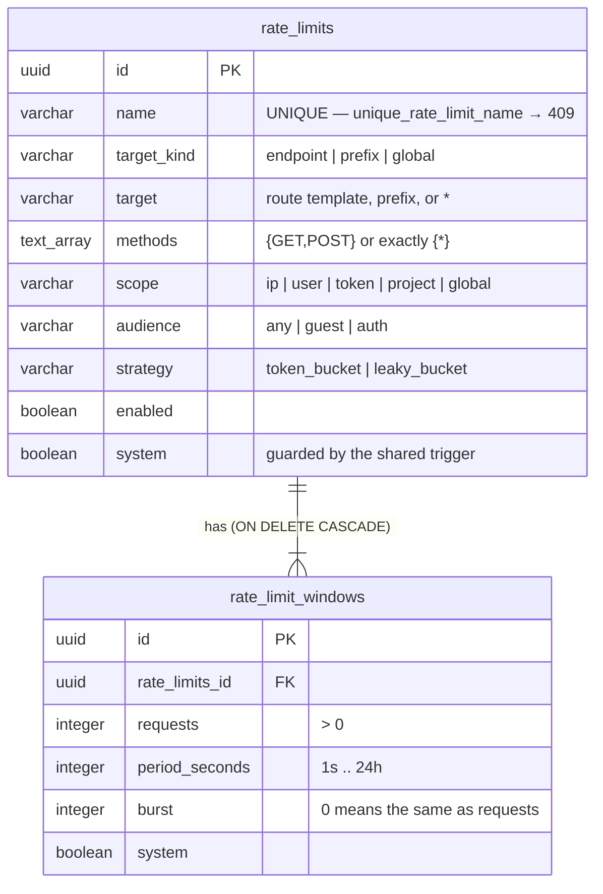
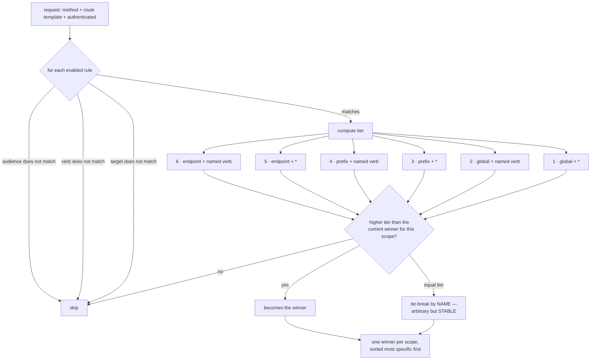
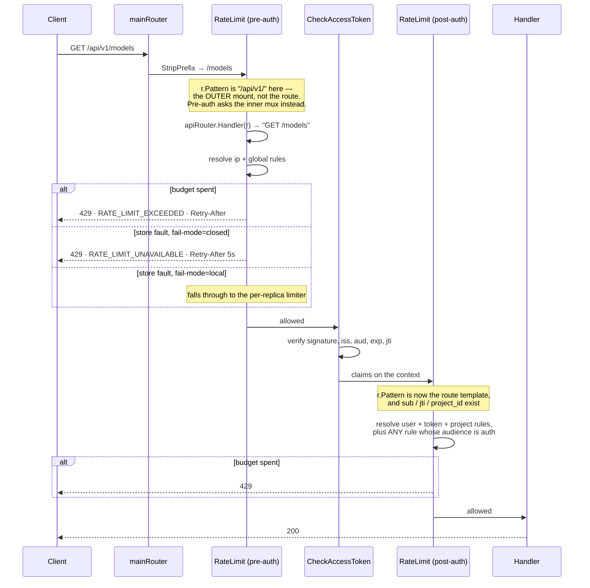
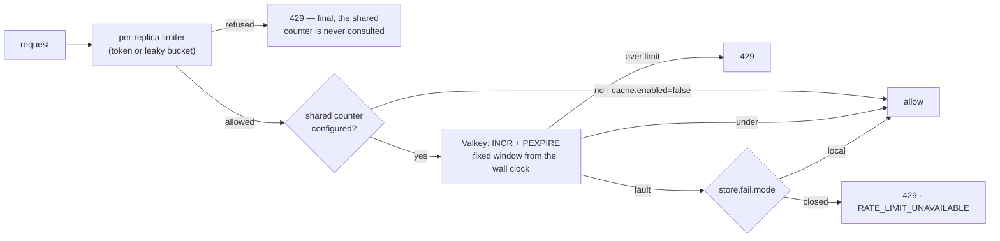
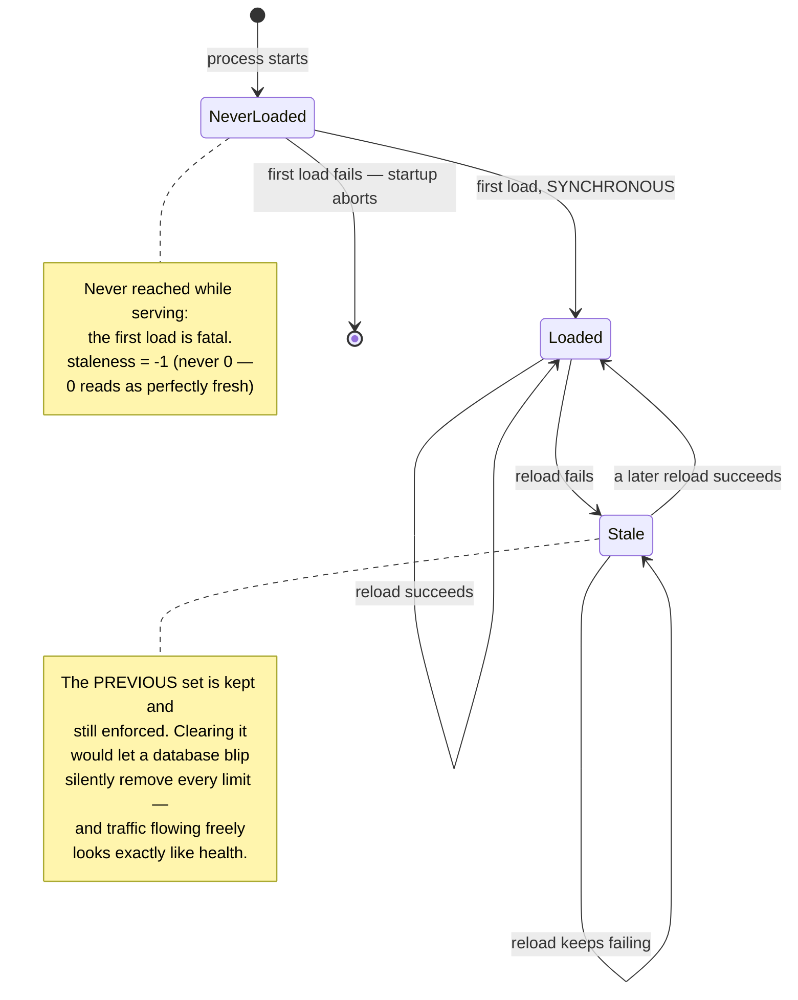

# Rate limiting

How a request is bounded, who decides the bound, and what happens when the parts
that decide it are unavailable.

## What this replaced, and why that was wrong

Until this landed, rate limiting was two flags:

```text
http.server.ip.rate.limiter.limit  100   # requests per second
http.server.ip.rate.limiter.burst  300
```

One bucket, keyed on the client IP, applied identically to **every** endpoint.

That is wrong in both directions at once, and the two errors compound:

- **An expensive write endpoint** may cost seconds of wall
  clock, real money, and a request that can be retried
  `http.client.max.retries` times. 100 per second per IP is not a limit on it.
- **`GET /models`** is a small indexed read. The same 100/s is stricter than it
  needs to be, so the cheap endpoint is the one that gets throttled first during
  a burst.

It also had no notion of *who* was calling. A single tenant could exhaust an
expensive endpoint for everyone behind the same egress IP, and an authenticated
caller with a personal access token was bounded exactly like an anonymous one.

**Those flags are gone.** They lasted one release longer than the rules did,
as a "floor" applied whenever no rule set had loaded — but the floor and the
seeded default rule carried the same two numbers, so one value lived in two
places and the two limiters that read them disagreed about exemptions. The
`rate_limits` table is now the only source of budgets, and
`ratelimit.enabled` is the only switch.

## The model



Three things about this schema are load-bearing and easy to get wrong.

**There is no foreign key from `target` to `resources`.** Those rows are
`system = TRUE` and are regenerated wholesale whenever swagger changes; an FK
would make a rate-limit row *block* that regeneration. It also could not express
the `*` global default. The target is validated against the endpoint catalogue
**on write** instead, so a rule for a route that does not exist is a `400` at
write time rather than a rule that silently matches nothing.

**`rate_limit_windows` has a `system` column even though nothing seeds it
`TRUE`.** The shared trigger function reads `OLD.system` *by name*, so a table
carrying that trigger must have the column — without it the cascade from
`rate_limits` raises `record "old" has no field "system"` and **deleting any rule
that has windows fails outright.**

**The seeded default rule is `system = FALSE`.** `system = TRUE` looks safer —
a deployment cannot delete its way to having no rule — but the trigger refuses
UPDATE as well as DELETE, so that row would be permanently un-tunable. The flags
are the better floor, because they also cover the case a seeded row cannot: the
database being unreachable.

## Resolution: one rule per scope, most specific wins

`domain.ResolveRateLimits` is a pure function. It takes the mirrored rules and a
`RateLimitRequest`, and returns **at most one rule per scope**.

One per scope, not one overall, is the whole design. An `ip` rule bounds a
*source* and a `project` rule bounds a *tenant*; collapsing to a single winner
would silently drop whichever bound the operator was not thinking about when
they wrote the more specific rule.



**Kind dominates verb.** An endpoint rule with `*` still beats a prefix rule that
names a verb — the ladder is crossed, not summed. This is the rung people get
wrong most often, which is why `GET /rate_limits/effective` exists.

**The tie-break is by name, and stability is the point.** An arbitrary winner is
acceptable; a winner that *changes between reloads* is not, because a limit that
appears to flap has no diagnosable cause.

**`HEAD` is covered by a `GET` rule.** `HEAD` is served by the `GET` route, so
without this a `HEAD` request slips past every rule written for that endpoint —
a hole invisible until somebody probes with it.

## The request path

Enforcement is **two-stage**, and the split is forced by where information
exists rather than chosen for tidiness.



**Why not do it all post-auth.** Post-auth runs after JWT verification and an
authz lookup. A flood would pay for that work *before* the limiter could refuse
it — the limiter's cost would scale with the traffic it exists to shed, which is
the opposite of the point.

**Why the stage filter matters.** Both stages see every matched rule. Without
`appliesInThisStage`, an `ip` rule is charged pre-auth *and* post-auth, halving
every IP limit — silently, and **only on routes that have a post-auth chain**.
That asymmetry would be miserable to diagnose.

**The filter reads audience as well as scope, and used not to.** Scope alone
sent every `ip` and `global` rule to the pre-auth stage — but the pre-auth stage
runs *before* `CheckAccessToken`, so nobody is authenticated there and the
audience check rejects every `auth` rule. Post-auth the audience matched and the
scope filter dropped it instead. The two halves never met, so an `ip` or
`global` rule with `audience = auth` was accepted by the API, listed in the UI,
returned by the ladder — and **charged in neither stage**.

An `auth` rule is now charged post-auth whatever its scope, which is what "auth
rules are only ever evaluated post-auth, where identity exists" always meant.
This reintroduces no double charging: the pre-auth stage cannot match an `auth`
rule to begin with, and `guest` and `any` rules still route by scope. `ip` and
`global` work post-auth because the client address is resolved in both stages —
so `ip` + `auth` buckets authenticated callers by address, a limit that could
previously be written but not obtained.

```text
             audience=any / guest        audience=auth
  scope=ip        pre-auth                 post-auth
  scope=global    pre-auth                 post-auth
  scope=user      post-auth                post-auth
  scope=token     post-auth                post-auth
  scope=project   post-auth                post-auth
```

(`guest` with `user` or `token` scope is refused at write time: a guest has
neither, so every anonymous caller would share one bucket wearing a per-user
label.)

**A rule whose scope key is absent is skipped, not bucketed under a
placeholder.** A `user` rule on an anonymous request would otherwise put every
anonymous caller in one bucket wearing a per-user label.

## What a budget is keyed on

```text
bucket key = (rule_id, window period : requests : burst, scope_key)
```

**The verb is not in it.** A `methods={GET,POST}` rule has one budget shared
across both, because the rule is the unit of budget. Expanding the key by verb
would silently double what such a rule allows — and this is the single most
likely misreading, which is why `/rate_limits/effective` returns it in words.

**The window's PARAMETERS are in it, not its id.** A rule carrying `10/s` and
`300/min` holds two buckets, and each survives an edit that leaves its own
numbers alone.

Keying on the window **id** was a live bug, and the exact trap PocketBase falls
into. `PUT` replaces a rule's window set wholesale, minting fresh uuids — so
renaming a rule, or editing only its description, gave every caller their full
allowance back. Measured against the running service: spend 4 of 6, edit the
description, and the next 4 requests were all admitted. After the fix the same
sequence admits 2 and refuses 2, and raising the budget to 20 correctly rebuilds
the bucket.

The adapter's own guard could not catch it: that one keeps a live bucket for an
unchanged budget under the same **key**, and the key was what changed. Only the
end-to-end proof could — which is exactly why it was on the backlog.

`TestBucketKeyStringNamesEveryComponentOfTheRealKey` reads the middleware source
and fails if the published string and the real key drift.

**The scope key is what the rule buckets on** — the client address, the `sub`,
the `jti`, the project id — and a rule whose scope key is absent is skipped
rather than bucketed under a placeholder.

### What it costs

Measured on an Apple M1 Pro (`go test -bench=RateLimit -benchmem`):

| | ns/op | allocs/op |
| --- | --- | --- |
| Route lookup alone | 200 | 2 |
| Whole pre-auth stage, 1 rule | 2238 | 31 |
| Whole pre-auth stage, 10 rules | 2295 | 31 |
| Whole pre-auth stage, 50 rules | 2463 | 31 |

The route lookup is about 9% of the stage, and fifty times the rules costs 10%
more — resolution walks the set but allocates nothing per rule. This matters
because the pre-auth stage runs on **every** request, including the flood a rate
limiter exists to shed: a lookup that scaled badly would make the limiter's cost
grow with the traffic it is meant to bound.

## Two layers of enforcement



**No Lua.** `INCR` is atomic on its own, and the window index is derived from the
wall clock, so two replicas compute the same key for the same instant without
coordinating. A script would be a second program in a second language with its
own version-skew failure mode, and nothing here needs one.

**The shared counter is a FIXED window**, which admits up to 2N across a
boundary. That is a real trade, not an oversight: the per-replica token bucket
sits *in front* of it and smooths exactly that burst. The layering is the answer
to the fixed window's weakness — removing either half makes the other's trade
worse.

**A local refusal is final.** The shared counter is not consulted, because
spending a shared budget on a request nobody served makes the observed limit
lower than the configured one.

**`PEXPIRE` runs only on the first increment of a window.** Not because the
window would otherwise never roll — it rolls because the *key* changes with the
clock index, whatever the TTL says — but because re-pushing the expiry on every
request keeps every past window's key resident for as long as traffic continues.

## Strategy: budget or pace, not bursty or smooth

`strategy` selects between a token bucket and a leaky bucket (GCRA).

**Measured, the two admit identically at equal parameters**, and now *tested* —
`ratelimitmemory.TestBothStrategiesAdmitIdenticallyAtEqualParameters` charges
both over a fixed schedule in a `synctest` bubble and fails if they diverge.
`10/s burst 1` and `100ms interval, capacity 1` are the same admission pattern —
they are duals.

That test replaces one that could not exist. The obvious thing to ask for is a
test proving `leaky_bucket` *paces* where `token_bucket` *bursts*; because the
two are duals, any such test is really measuring something else. The first
attempt gave them different **bursts** and passed with the strategy hardcoded to
`token_bucket`.
What differs is the *parameterisation each invites*: a token bucket is written as
"N per period with a burst of B", a leaky bucket as "one every interval with a
tolerance of B".

So the column records **which question the operator was asking**, and the UI must
present it as *budget* vs *pace*. Selling it as "bursty vs smooth" would promise
a difference that does not exist.

`token_bucket` is the default, and that default is what keeps every existing rule
and every seeded row behaving as it does today.

### The breaker stops re-asking a store that is down

Without it, an outage costs a failed round trip **per request**: the call waits
out `ratelimit.store.timeout` and returns the answer the previous thousand
requests already established. Measured against a paused Valkey, 20 requests:

| | total | per request |
| --- | --- | --- |
| breaker off | 1861 ms | **93.1 ms** |
| breaker on (threshold 3) | 483 ms | **24.1 ms** |

**It changes no outcome.** The breaker returns an *error* while open, never
"allowed" — so `store.fail.mode` still decides what a fault means, fail-closed
still refuses and fail-local still falls back. Only the waiting is gone. A
breaker that answered "fine" would remove the limit exactly when the system is
least healthy, which is the decision `fail.mode` exists to let an operator make.

**The benefit depends on how the store fails, and that is worth knowing.** A
*stopped* Valkey refuses connections instantly, so there is no timeout to save
and the breaker buys almost nothing — measured, the same 20 requests took 485 ms
with it and 262 ms without, which is noise. The saving is real when the store
*hangs*: paused, unreachable through a firewall, or overloaded. That is also the
case where the cost was worst, so the breaker helps where it matters.

**Half-open admits exactly one probe.** Closing optimistically after the
cooldown would send the full waiting load back at a store that may still be
down, which is how a recovering datastore is knocked over by the traffic that
queued for it.

A cancelled request does not count as a store failure — the caller gave up, the
store did not fail — or a burst of client timeouts would open the breaker
against a store answering perfectly well.

### A write on one replica reaches the others at once

The reload ticker was the only propagation, so a rule written on replica A was
invisible on B for up to `ratelimit.reload.interval`. A single-replica
deployment never noticed; behind a load balancer, a rule appeared to take effect
or not depending on which replica answered.

Each replica now publishes to a Valkey channel on write and reloads when it
hears one. Measured with **two replicas and the interval set to 10 minutes**, so
only pub/sub could account for the timing:

```text
before          B effective: [Default per-IP limit]
create on A     201
after 1 second  B effective: [proof cross replica]
B enforces it   7 x 200 then 3 x 429     (the rule's own 7/min budget)
delete on A     B is back to the default within a second
```

**The payload is a signal, never the rules.** A message says only "something
changed"; the receiver then queries. That is what makes a lost message cost a
delay and a duplicated message cost a query, rather than either installing a
wrong rule set — shipping the rules would make delivery order load-bearing, and
pub/sub offers no order across a reconnect.

**It is an optimisation, never the mechanism.** The ticker remains the floor.
The transport is optional (`cache.enabled=false` is supported), a publish may
fail, a subscription may drop — and the only consequence of any of it is that a
change takes up to the reload interval, which is exactly the behaviour before
this existed.

**A replica ignores the echo of its own message**, having applied that change
before publishing it. Confirmed in the same run: the writing replica logged zero
reloads while the other logged two.

**The notifier holds its own Valkey connection.** A subscribed connection
accepts nothing but further subscription commands, so sharing the counter's
client would stall every `INCR` the limiter makes.

## Failure modes

This is the part worth reading twice, because every failure here is quiet.



| What fails | What happens | Why that choice |
| --- | --- | --- |
| The rule set cannot be loaded at startup | **The service refuses to start** | There is no fallback budget, so a replica that started anyway would serve unlimited traffic. Postgres is already a hard startup dependency, so this adds no new class of failure — and it buys the invariant the limiter relies on: if the service is serving, it has rules |
| The rule set is somehow not loaded while serving | Nothing is charged; loud `ERROR`; `RateLimitRulesNeverLoaded` fires `critical` | Unreachable, because the first load is fatal. A can't-happen path that answered `429` would turn an internal inconsistency into an outage |
| Every rule is deleted | Nothing is limited; `RateLimitNoRulesConfigured` fires `warning` | An explicit operator action with an explicit alert, rather than a silent floor nobody can see |
| A reload fails | The previous set keeps being enforced; loud `ERROR` log; `rate_limit_rules_staleness_seconds` climbs | Clearing on failure means a database blip removes every limit |
| A rule has no windows | Skipped by the mirror, with a `WARN` naming it | It has no budget. Enforcing it would refuse **every** request to its target |
| A rule names a strategy no limiter can be built from | Same: skipped by the mirror, `WARN` | It cannot arrive through the API, so it came from a direct write. Defaulting it would enforce a `token_bucket` for a rule that says `leaky_bucket`, and nothing would say so |
| A rule reaches the limiter unbuildable anyway (the window between a bad write and the next reload) | The bucket is skipped for that request; `ERROR` naming the rule; `rate_limit_rule_faults_total` | A broken rule is a misconfiguration, not an outage. `rate_limit_store_up` is **not** touched and the fail mode is **not** consulted — see below |
| Valkey is unreachable, `fail.mode=closed` | `429` with `RATE_LIMIT_UNAVAILABLE` and a bounded `Retry-After` | An unknown budget is not an empty one |
| Valkey is unreachable, `fail.mode=local` | Falls back to the per-replica limiter | Bounded, but N replicas allow N × the rate. A deliberate choice, never a default |
| `cache.enabled=false` | Every rule is per replica; `WARN` at startup | A supported deployment. It must be stated, because the rule in the database reads as a total |
| A request matches `ratelimit.bypass.prefixes` or `ratelimit.excluded.ips` | No limiter runs at all — not "allowed by the limiter" | Applies in **both** postures. Skipping is what makes it survive a store outage under fail-closed |

**Health and version bypass the limiter in code**, before any rule lookup. With
fail-closed a Valkey outage would otherwise `429` the readiness probe, turning a
cache outage into an eviction from the load balancer.

**`ratelimit.excluded.ips` is config, not a database rule.** It is the escape
hatch an operator reaches for when the limiter *itself* is the incident, so it
must not depend on the database being reachable, or on a rule being loadable, to
work.

**Both exemptions sit outside both limiters, and used not to.** They lived
inside the rule limiter — which ran only when rules were enabled,
and they were **off by default**. So in the shipped posture neither existed:
`/health` was rate limited (measured: `1 × 200` then `7 × 429` against a 1 req/s
limiter, enough for a load balancer to evict the replica) and
`ratelimit.excluded.ips` did nothing, with no error and no log line.

`RateLimitExemptions.Wrap` decorates the limiter from outside it:

```text
exemptions.Wrap( limiter )
```

It stayed outside even after the second limiter was deleted, because an excluded
address must be exempt when `ratelimit.enabled=false` too — and because an
exempt request must skip the limiter, not be admitted by it.

An exempt request **skips** the limiter rather than being allowed by it. Under
fail-closed that is the difference between a readiness probe surviving a store
outage and being refused by it: a request that still has to ask an unreachable
store is not exempt in the way that matters.

**A store-fault `429` is distinguishable from a budget `429`.** They carry
different codes, because "slow down" and "the rate limiter is broken and nobody
is being limited correctly" need different responses from whoever sees them.

**A broken rule is not a store fault, and used to report itself as one.** The
per-replica limiter does no I/O — the only error it can return is a rule it
cannot build a limiter from — but the middleware treated every error from the
charge path as the shared counter failing. One malformed row therefore drove
`rate_limit_store_up` to zero, fired `RateLimitStoreDown` against a Valkey that
was healthy, and under the default fail-closed answered `429`
`RATE_LIMIT_UNAVAILABLE` to every request the rule matched — an outage of the
endpoint the operator wrote the rule to protect.

The two are now separate: a rule fault has its own counter, its own `ERROR` line
naming the rule, and skips only that bucket. **The fail mode is not consulted**,
in either direction. It answers what an unreachable counter should mean, and
this counter answered.

**An unenforceable rule must not shadow a working one.** Resolution picks one
winner *per scope* on specificity, so a malformed endpoint rule outranks a
working global rule. Letting it into resolution would not merely fail to add a
limit — it would switch off the limit that was in force. The mirror therefore
filters before resolving, in `usecase.EnforceableRateLimits`, and every caller
that resolves uses that same function. Two call sites filtering differently is
how `/rate_limits/effective` came to disagree with what was being enforced.

## Observability

| Metric | Type | What it answers |
| --- | --- | --- |
| `rate_limit_decisions_total{rule,scope,strategy,decision}` | counter | Which rule is refusing traffic, and did switching its strategy change anything |
| `rate_limit_store_up` | gauge | Is the shared counter answering |
| `rate_limit_store_faults_total{rule,scope,fail_mode}` | counter | How often it is not |
| `rate_limit_rule_faults_total{rule,scope,strategy}` | counter | Which rule is malformed and therefore enforcing nothing. **Not** a store problem, and deliberately a different instrument so it does not page whoever is on call for Valkey |
| `rate_limit_rules_reload_failures_total` | counter | How often a reload failed. Alert on staleness instead — this cannot distinguish "failing now" from "failed once, hours ago" |
| `rate_limit_rules_staleness_seconds` | gauge | Is what we are enforcing current. `-1` = never loaded |
| `rate_limit_rules_size` | gauge | How many rules are in effect |

**Alert on `rate_limit_store_up`, not on the fault rate.** With fail-local a
sustained fault is invisible from outside — every request succeeds, and each
replica quietly enforces the full limit alone. A fault rate that is high but
steady reads as a plateau; a gauge pinned at zero does not.

**`rule` is the rule NAME, not its id.** A name is what an operator wrote and
what they will search for. Names are unique, so cardinality is bounded by the
number of rules.

The rules live in `dev-env/configuration/prometheus/alerts.yaml` and are unit
tested in `alerts_test.yaml`; `make check-alerts` runs both. Each test pins a
property the rule was written for — the healthy state must *not* trip it, the
`for:` delay must be respected, and recovery must clear it.

## Configuration

| Setting | Default | Notes |
| --- | --- | --- |
| `ratelimit.enabled` | `true` | The only switch. Off means nothing is limited — there is no second limiter and no fallback budget |
| `ratelimit.reload.interval` | `30s` | The FLOOR for how stale a rule written on another replica may be. With a cache, pub/sub gets it there in under a second |
| `ratelimit.store.timeout` | `70ms` | One round trip to the shared counter. The HTTP server sets no read/write timeout, so without this an unresponsive store holds a request open |
| `ratelimit.store.fail.mode` | `closed` | `closed` refuses; `local` falls back to the per-replica limiter |
| `ratelimit.store.breaker.threshold` | `5` | Consecutive store failures after which the store is not called at all. `0` disables it |
| `ratelimit.store.breaker.cooldown` | `5s` | How long the store is left alone before one request tests it |
| `ratelimit.bucket.sweep.interval` | `5m` | An ip-scoped rule has one bucket per client address |
| `ratelimit.bucket.idle.after` | `10m` | Never applied sooner than a bucket's own window |
| `ratelimit.excluded.ips` | *(empty)* | Never limited. Config, not a rule. Accepts CIDR blocks and bare addresses, like `http.server.trusted.proxies`; a malformed entry stops startup rather than being silently dropped |
| `ratelimit.bypass.prefixes` | `/health`, `/version` | Answered before any rule lookup |

**`run.sh` and `.air.toml` set `ratelimit.enabled=true`**, which is also the
shipped default — so the dev stack now exercises exactly what is deployed. A dev
stack that disagrees with production hides production's bugs, which is the same
reasoning already recorded for the trusted-proxy posture and the token
lifetimes. `TestRunScriptAndAirAgree` fails if the two drift.

The integration suite is the one place that turns limiting **off**
(`tests/provisioning/integration-test.yaml`): it fires many requests from a
single address, and a limit would make failures depend on test order rather than
on the code.

## The API

| Method | Path | Notes |
| --- | --- | --- |
| `GET` | `/rate_limits` | filter · sort · fields · paginator |
| `POST` | `/rate_limits` | target validated against the endpoint catalogue |
| `GET` | `/rate_limits/{rate_limit_id}` | |
| `PUT` | `/rate_limits/{rate_limit_id}` | the window set is replaced **wholesale** |
| `DELETE` | `/rate_limits/{rate_limit_id}` | windows cascade |
| `GET` | `/rate_limits/effective` | which rules apply to a `(method, endpoint)` pair |

`period` is a **duration string** on the wire (`"1m0s"`) and seconds in the
column. Seconds are what the CHECK constraint bounds; a duration is what an
operator reads and what every other duration in this API uses.

**Windows are written with the rule**, not through a second endpoint: a rule
without a window has no budget, so creating them separately would leave a window
in which a saved rule is meaningless. `PUT` replaces the set in full — a partial
update of a set is the shape that produces two windows on one period.

`GET /rate_limits/effective` resolves with the **same pure function the
middleware uses**, so it cannot disagree with what is enforced. `method` is
required: naming a verb beats `*` at every tier, so a default would quietly
answer a different question than the one asked. Each entry carries prose saying
*why* it won its scope, because a tier number does not answer "why not the other
rule".

## Client IP resolution

The per-IP rate limiter keys on [`ClientIPResolver`](../internal/adapter/driving/http/middleware/clientip.go),
which honours `X-Forwarded-For` / `X-Real-IP` **only when the peer is a
configured trusted proxy**. This is a security boundary, not a convenience:

- **`http.server.trusted.proxies` is empty by default**, and empty means the
  headers are ignored entirely and the bucket is keyed on `RemoteAddr`. A
  deployment behind a proxy must set it to the proxy's IPs or CIDR blocks, or
  every client behind that proxy shares one bucket.
- **Never read a forwarding header without checking the peer.** The resolver
  exists because the old code read `X-Forwarded-For` unconditionally: a caller
  rotating the header drew a fresh budget on every request, so the limiter did
  not weaken, it disappeared. Measured against the running API with the limiter
  at 5 req/s, 30 password guesses went from `{401: 7, 429: 23}` to `{401: 30}`.
- The chain is walked **right to left**, returning the first hop that is not
  itself trusted — a trusted proxy appends what it saw, so everything to the
  left of our own hops is client-supplied. An unreadable chain falls back to the
  peer, which over-limits rather than trusting a guess.
- The startup log states which posture is active, and warns when nothing is
  trusted. Keep that: neither posture is visible from a request, and they fail
  in opposite directions.

`make test` covers this in
`middleware/clientip_test.go` and `middleware/ratelimit_clientip_test.go`;
both were verified to fail when the peer check is removed.

**The limiter is on in `.air.toml`** (100 req/s, burst 300) so the dev stack
matches the shipped default. It was previously disabled there, which is why the
bypass was invisible locally. Two full integration runs see zero 429s at those
values — if you lower them, re-check.

## The valkey tests need a reachable Valkey, or they skip

`ratelimitvalkey`'s tests connect to `127.0.0.1:6379` and skip when the ping
fails. **`make test` now sets `VALKEY_TEST_CA` for you** from
`certs/dev/ca.crt` when the dev stack has generated one, so the TLS-only dev
Valkey is reachable without remembering anything. Run a single package by hand
with an ABSOLUTE path, because `go test` runs in the package directory:

```bash
VALKEY_TEST_CA="$PWD/certs/dev/ca.crt" go test -tags=unit ./internal/adapter/driven/ratelimitvalkey/
```

Without the variable the client speaks plaintext, which is what **CI** uses: it
has no dev certs, so `pr.yaml` gives it a plaintext Valkey service container
instead of a certificate to generate and keep in step. Both shapes are
supported; which one runs depends on whether that CA file exists.

**A skipped test reports `ok`, and that is the whole hazard.** A suite that
verified nothing is indistinguishable from one that passed:

- a mutation test against a skipping suite reports "ok" and proves nothing —
  that happened while writing the notifier, twice;
- and the same silence broke the coverage gate for everyone. The package
  carries an 80% floor measured at 84.3% **with** a Valkey; skipping, it
  measures 17.6%, so `make test-coverage` failed on `main` on a package that
  had nothing wrong with it. The floor described an environment the gate never
  reproduced.

The rule that follows: **when a test can skip itself, something has to
guarantee the conditions it needs.** Documenting the variable was not enough —
a step you have to remember is a step that gets skipped, and this one is
silent.


## Naming: `rate_limits` is the entity, `ratelimit` is the mechanism

Two spellings exist on purpose, and each names a different thing. A
**`rate_limits`** file holds the entity, the `RateLimit` rule row an operator
creates, lists and edits: `domain/rate_limits.go`, `repositorypg/rate_limits.go`,
`handler/rate_limits.go`, `usecase/rate_limits.go`, and the per-replica mirror
`usecase/rate_limits_mirror.go`, the twin of `token_lifetimes_mirror.go`. That
is the same snake-case plural every other entity file uses. **`ratelimit`** is
the limiter itself, where a Go package name cannot carry an underscore: the
`ratelimit` port and its `ratelimitmemory`, `ratelimitvalkey` and
`ratelimitbreaker` adapters, the mock of that port, the middleware, the
`config/ratelimit.go` group whose flags start `ratelimit.`, and the `app`
wiring named after them. Name a new file for what it holds: a rule is
`rate_limits_<topic>.go`, a limiter is `ratelimit_<topic>.go`. The metric
names (`rate_limit_rules_*`, `rate_limit_store_up`) are wire names and stay
as they are.
