# Resource limits

How the multi-tenant control plane caps what a deployment, a user or a project
may create — the data model, the resolution chain, the write path, the integrity
scheme, and the failure branches of each.

The limited resources are `users`, `idps`, `projects` and `products`.

- [1. Where it sits in the hexagon](#1-where-it-sits-in-the-hexagon)
- [2. The data model](#2-the-data-model)
- [3. Resolving a limit](#3-resolving-a-limit)
- [4. The write path: reserve → create → release](#4-the-write-path-reserve--create--release)
- [5. Why reserve, and why in that order](#5-why-reserve-and-why-in-that-order)
- [6. Inside ReserveUsage](#6-inside-reserveusage)
- [7. The delete path](#7-the-delete-path)
- [8. The integrity signature](#8-the-integrity-signature)
- [9. Counter lifecycle and drift](#9-counter-lifecycle-and-drift)
- [10. Errors and status codes](#10-errors-and-status-codes)
- [11. Per-resource scope map](#11-per-resource-scope-map)
- [12. Known gaps](#12-known-gaps)
- [13. Where the code lives](#13-where-the-code-lives)

## 1. Where it sits in the hexagon

Limits are enforced in the **use-case layer**, through a driven port, exactly
like every other outbound concern. Nothing about limits appears in a handler
beyond mapping one error to one status code.

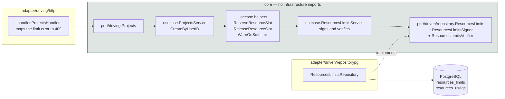

The signing key lives in `ResourcesLimitsService`, in **core**. The repository
never sees it: it receives a `ResourcesLimitsSigner` / `ResourcesLimitsVerifier`
callback instead. That keeps cryptographic material out of the adapter while
still letting the signature be written inside the adapter's transaction — see
[section 8](#8-the-integrity-signature).

## 2. The data model

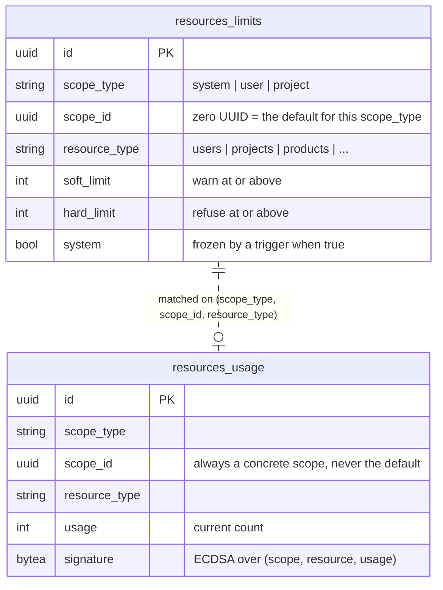

Two rules that are easy to miss:

- **`scope_id` = zero UUID means "the default for this scope type"** in
  `resources_limits`. In `resources_usage` it is a real scope (the system scope).
  The same value means different things in the two tables.
- **`system = TRUE` rows cannot be updated or deleted.** The trigger
  `fn_restrict_delete_update_on_system_resources_limits` rejects both. Seeded
  defaults are therefore written with `system = FALSE`, so an operator can raise
  a ceiling without disabling a trigger.

## 3. Resolving a limit

`resolveLimitCTE` in the repository is a single shared SQL constant used by both
`CheckUsage` (read) and `ReserveUsage` (write). Sharing it is deliberate: when a
read path and a write path each carried their own copy, they drifted, and the
drift is what hid the original enforcement bug for so long.

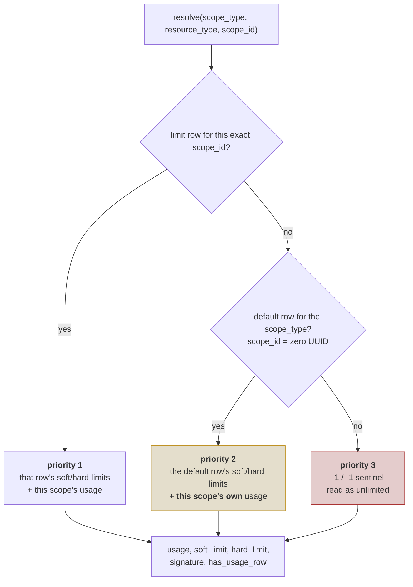

**Priority 2 is the common case and the subtle one.** The *limit* comes from a
row shared by every scope of that type; the *counter* must still come from the
caller's own scope. Those are two different `scope_id` values in one query.

> **What this used to do.** The usage join in priority 2 carried a hardcoded
> UUID left over from debugging instead of the caller's `scope_id`. It matched
> nothing, so `usage` read `0` for every scope relying on a default limit —
> which is nearly all of them. The limit resolved correctly, the counter never
> did, and the check always passed. Keep the caller's `scope_id` on both sides
> of the `UNION`.

`has_usage_row` distinguishes *"this scope has never been used"* from *"this
scope's counter is zero"*. Without it, an untouched scope and one whose
signature was stripped look identical, and the integrity check cannot tell them
apart.

## 4. The write path: reserve → create → release

Every creation follows the same three beats. The happy path:

```mermaid
sequenceDiagram
    autonumber
    participant C as client
    participant H as handler
    participant U as usecase.&lt;Entity&gt;Service
    participant L as ResourcesLimitsService
    participant R as ResourcesLimitsRepository
    participant E as &lt;Entity&gt;Repository

    C->>H: POST /projects
    H->>U: CreateByUserID(input)
    U->>L: ReserveUsage(scope, resourceType)
    L->>R: ReserveUsage(..., verify, sign)
    Note over R: one transaction, row locked
    R-->>L: newUsage
    L-->>U: ok
    U->>E: Insert(input)
    E-->>U: ok
    U->>L: CheckUsage (soft-limit warning only)
    U-->>H: nil
    H-->>C: 201 Created
```

Refused because the hard limit is reached — note that **nothing is created and
the counter does not move**:

```mermaid
sequenceDiagram
    autonumber
    participant C as client
    participant H as handler
    participant U as usecase.&lt;Entity&gt;Service
    participant L as ResourcesLimitsService
    participant R as ResourcesLimitsRepository

    C->>H: POST /projects
    H->>U: CreateByUserID(input)
    U->>L: ReserveUsage(scope, resourceType)
    L->>R: ReserveUsage(..., verify, sign)
    Note over R: usage >= hard_limit → rollback
    R-->>L: ResourcesLimitsHardLimitReachedError
    L-->>U: error
    U-->>H: error (no insert attempted)
    H-->>C: 409 Conflict
```

Creation fails *after* the slot was reserved — the reservation is handed back:

```mermaid
sequenceDiagram
    autonumber
    participant C as client
    participant U as usecase.&lt;Entity&gt;Service
    participant L as ResourcesLimitsService
    participant R as ResourcesLimitsRepository
    participant E as &lt;Entity&gt;Repository

    U->>L: ReserveUsage
    L->>R: ReserveUsage(..., verify, sign)
    R-->>L: newUsage (counter now +1)
    U->>E: Insert(input)
    E-->>U: duplicate name / FK violation / ...
    U->>L: DecrementUsage  (ReleaseResourceSlot)
    L->>R: DecrementUsage(..., sign)
    R-->>L: newUsage (counter back to where it was)
    Note over U: the release error, if any, is logged<br/>and never replaces the original failure
    U-->>C: 4xx/5xx for the real reason
```

The release covers **every** exit between the reservation and the successful
insert, not just the database call — a create path may sign or encrypt first,
`users` hashes a password, `idps` encrypts a client secret, and each of those
can fail after the slot is taken.

## 5. Why reserve, and why in that order

The old shape was *check → insert → increment*, three statements with no lock
between them. Every concurrent caller read the same pre-insert count:

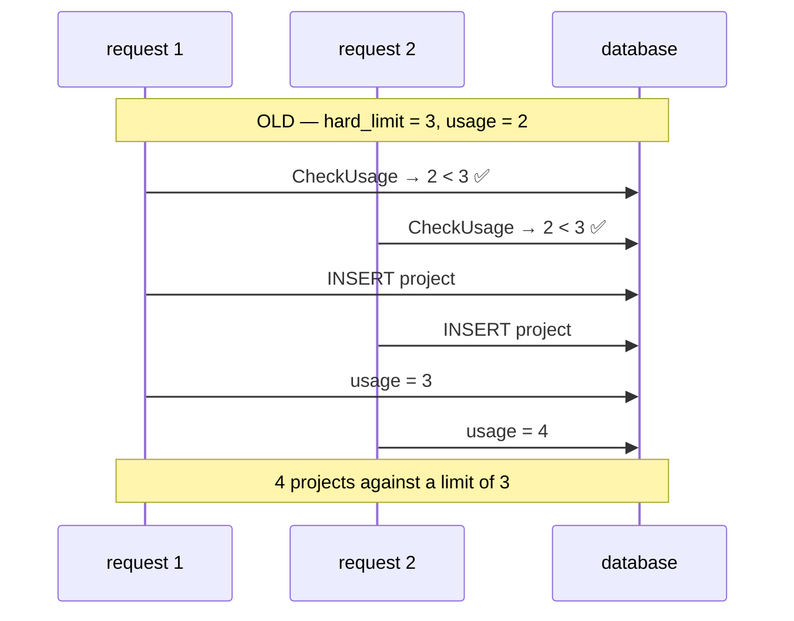

With the reservation the counter row is locked by the first statement of the
transaction and held to commit, so the second caller waits and then observes the
first one's result:

```mermaid
sequenceDiagram
    participant T1 as request 1
    participant T2 as request 2
    participant DB as database
    Note over T1,DB: NEW — hard_limit = 3, usage = 2
    T1->>DB: BEGIN; SELECT ... FOR UPDATE (lock)
    T2->>DB: BEGIN; SELECT ... FOR UPDATE (blocks)
    T1->>DB: 2 < 3 ✅ → usage = 3; COMMIT
    DB-->>T2: lock released, sees usage = 3
    T2->>DB: 3 < 3 ❌ → ROLLBACK
    Note over T1,DB: exactly 3, whatever the concurrency
```

**Reserving before creating is deliberate.** If the process dies between the
reservation and the insert, the counter is one too high — a later request is
refused. The other order would leave it one too low, handing out capacity that
was never licensed. Over-counting is visible and repairable; under-counting is a
silent loss. Given a licensed product, refuse-by-mistake beats allow-by-mistake.

## 6. Inside ReserveUsage

Everything below happens in one transaction. Any error rolls the whole thing
back, so a refusal never leaves a partial write.

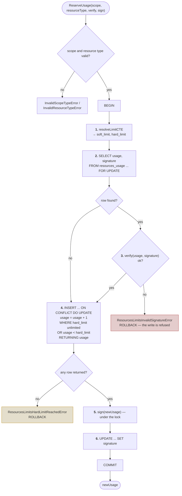

Two details in there are easy to get wrong, and both were:

**The lock is taken by its own statement (step 2), not through the resolution
query.** The resolution reaches `resources_usage` through a `LEFT JOIN`, and
PostgreSQL refuses to lock the nullable side of an outer join —
`FOR UPDATE cannot be applied to the nullable side of an outer join`,
SQLSTATE `0A000`. This is the same nullability constraint that led the schema to
store a zero UUID instead of `NULL` for `scope_id` in the first place. Locking
`resources_usage` directly, with no join, is legal.

**The limit is enforced a second time inside the increment (step 4), not only in
Go.** When the counter row does not exist yet there is nothing for step 2 to
lock, so two callers can both find it absent. `ON CONFLICT DO UPDATE`
re-evaluates its `WHERE` against the live row while holding the lock the unique
index gives it, so the loser of that race observes the winner's value and is
refused. No row returned means the limit was reached.

> The hard limit and the unlimited sentinel are both passed as parameters and
> cast (`$4::int`, `$5::int`). With two bare placeholders compared to each other
> PostgreSQL cannot infer a type and falls back to `text`, which fails at
> runtime with `operator does not exist: text >= integer`.

## 7. The delete path

Deletion decrements through the same transactional helper used by the release
path, `mutateUsage`, so the counter and its signature stay in step.

```mermaid
sequenceDiagram
    autonumber
    participant H as handler
    participant U as usecase.&lt;Entity&gt;Service
    participant E as &lt;Entity&gt;Repository
    participant L as ResourcesLimitsService
    participant R as ResourcesLimitsRepository

    H->>U: DeleteByID(input)
    U->>E: DeleteByID
    E-->>U: ok
    U->>L: DecrementUsage(scope, resourceType)
    L->>R: DecrementUsage(..., sign)
    Note over R: BEGIN<br/>UPDATE ... SET usage = usage - 1<br/>WHERE usage > 0 RETURNING usage<br/>sign(newUsage); UPDATE signature<br/>COMMIT
    R-->>L: newUsage
```

### Only a real deletion may give a slot back

The decrement runs after the repository returns without error, so "the delete
removed nothing" and "the delete succeeded" must not look the same. They used
to:

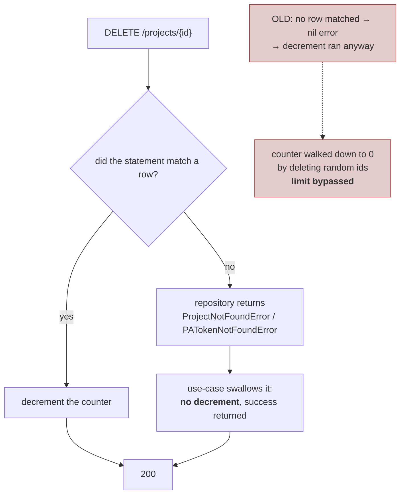

`projects` discarded the `Exec` result entirely; another path checked
`RowsAffected() == 0` and returned `nil` to stay idempotent. Either way the
use-case decremented, so this worked:

```text
DELETE /projects/<random uuid>   → 200, counter -= 1
DELETE /projects/<random uuid>   → 200, counter -= 1
…                                → counter floors at 0
POST   /projects                 → allowed again, indefinitely
```

Both endpoints are still idempotent and still answer success for a missing
resource — the HTTP contract did not change. What changed is that the repository
now reports the fact as a typed error and the use-case decides what to do with
it. **Repository states facts; use-case sets policy.**

Two further properties:

- **The counter never goes negative.** `WHERE usage > 0` means a decrement at
  zero matches no row; `mutateUsage` treats `pgx.ErrNoRows` as "already at the
  floor" rather than an error.
- **That floor hides drift rather than reporting it.** If the counter is already
  wrong, deleting more resources cannot bring it back into line.

All five delete paths were audited for this:

| Resource | Reported a no-op delete? | |
| --- | --- | --- |
| `products` | yes — `ProductNotFoundError` | already safe |
| `projects` | no — result discarded | **fixed** |

> **A related inconsistency, left alone deliberately.** `projects` answers
> `200` for a missing resource — its tests pin that — while
> `projects` also declares `@Failure 404` and carries a handler branch that can
> never fire. `products` propagates its not-found error instead, and its
> integration test pins *that*. Two delete semantics for the same kind of
> operation. Unifying them changes an established, tested response code, which is
> an API decision rather than a bug fix. The counter behaviour is correct either
> way, because the decrement is keyed off the delete actually having removed a
> row.

## 8. The integrity signature

`resources_usage.signature` is an ECDSA signature over
`scope_type`, `scope_id`, `resource_type` and `usage`. Its purpose is to detect
someone editing the counter directly in the database.

The signer is passed *into* the repository as a callback rather than applied
afterwards, and that shape is not stylistic:

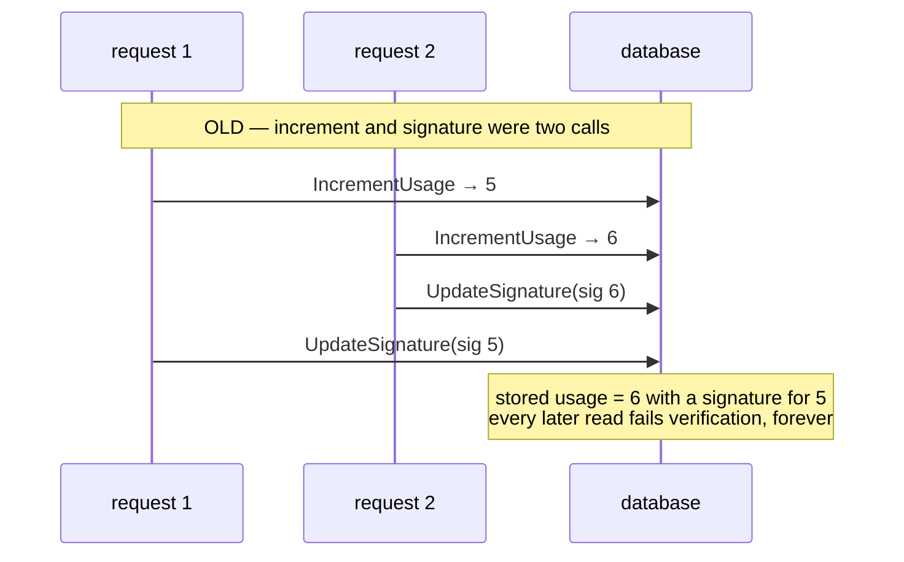

With the callback, the signature is produced and written while the transaction
still holds the row lock, so the pair can never be mismatched by interleaving.
This mattered in practice: the interleaving above was reproduced by an ordinary
concurrent test run and left a project permanently unable to create anything.

Recovery is the sharp edge here. Because only the service can mint a valid
signature, **a wrong counter cannot be corrected with SQL** — any hand-written
value is rejected as tampering. Repair requires a service-side tool holding the
key, which is why reconciliation is a prerequisite rather than a nicety.

### Which key signs the counters

`--resources.limits.signing.private.key.file` /
`RESOURCES_LIMITS_SIGNING_PRIVATE_KEY_FILE`, and the matching public setting.
Both **default to the JWT key pair**, so an existing deployment upgrades with no
change in behaviour.

Give them their own pair when you can. The two keys authenticate different
things and have different rotation pressures: a JWT key gets rotated after a
token leak, and while they are shared that rotation silently invalidates every
usage signature in the database — refusing writes for every scope at once, in
the middle of an incident response.

**Rotating this key is a procedure, not a setting**, because every stored
signature was made with the old one:

```bash
openssl ecparam -genkey -name prime256v1 -noout -out certs/limits.key
openssl ec -in certs/limits.key -pubout -out certs/limits.pub

# point the service at the new pair, then start ONCE with reconciliation on:
#   --resources.limits.signing.private.key.file=certs/limits.key
#   --resources.limits.signing.public.key.file=certs/limits.pub
#   --resources.limits.reconcile.on.start=true
```

That single reconciling boot recounts every counter and re-signs it with the new
key. Skip it and every counter stays signed by a key the service no longer
holds, which reads as tampering. Startup warns when it detects the split without
reconciliation enabled, rather than letting it surface later as "nothing works".

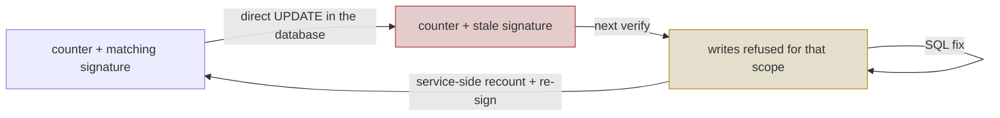

Both paths verify whenever a counter exists, and they differ only in what a
failure costs:

| Path | When it verifies | On failure |
| --- | --- | --- |
| `ReserveUsage` (write) | whenever a usage row exists | refuses the write, under the row lock |
| `CheckUsage` (read) | whenever a usage row exists | logs at ERROR, increments `resources_limits_signature_invalid`, returns the status with `TamperDetected` set and `CanCreate` forced false |

> **"Whenever a row exists", not "whenever usage > 0".** The old condition
> skipped verification for exactly the value an attacker writes — zeroing a
> counter buys back the entire quota, and checking `Usage > 0` meant nobody
> looked. `has_usage_row` is what separates *never used* (nothing to verify)
> from *counter reads zero* (verify it).
>
> **A read never fails on a bad row.** A tampered counter means the tenant
> cannot be trusted to *create*, not that they should lose sight of their own
> data. Hard-failing reads is what turned one racy write into a tenant-wide
> outage before the transactional fix. Creation is refused independently inside
> the reservation, which verifies under the lock, so nothing is weakened by
> letting the read through.

## 9. Counter lifecycle and drift

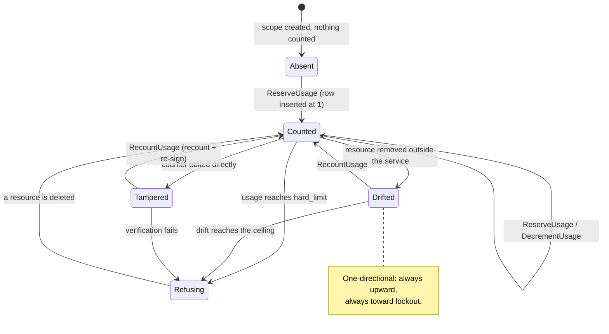

**Drift is the failure mode to understand.** `resources_usage` is a second
source of truth. Anything that removes a resource without going through the
service's delete path — direct SQL, an admin cleanup, a test helper, a future
`ON DELETE CASCADE` — leaves the counter high, and nothing brings it back down.

Measured in development after a single test run:

| | counter | reality |
| --- | --- | --- |
| `system` / `users` | 92 | 211 rows |
| `system` / `idps` | 25 — at its ceiling | **0 rows** |

IdP creation was refused because a counter claimed twenty-five existed when the
table was empty. This is why the seeded ceilings are generous and why **no
ceiling should be tightened before reconciliation exists**.

## 9b. Reconciliation — the way back from drift

A counter that has drifted cannot be fixed with SQL. It is signed, so a
hand-written value fails verification and leaves the scope refusing writes
instead of merely mis-counting. Repair has to happen where the signing key is,
which is `ResourcesLimitsService`.

```mermaid
sequenceDiagram
    autonumber
    participant Op as operator / startup
    participant S as ResourcesLimitsService
    participant R as ResourcesLimitsRepository
    participant DB as PostgreSQL

    Op->>S: ReconcileAll(ctx)
    S->>R: SelectTrackedScopes
    R-->>S: every (scope_type, scope_id, resource_type) with a counter
    loop each tracked scope
        S->>R: RecountUsage(scope, resourceType, sign)
        Note over R,DB: BEGIN<br/>SELECT usage ... FOR UPDATE<br/>COUNT(*) the resource table<br/>UPSERT the corrected value<br/>sign(actual); UPDATE signature<br/>COMMIT
        R-->>S: {Previous, Actual, HadUsageRow}
        alt Previous != Actual
            S->>S: WARN + drift metric
        end
    end
    S-->>Op: how many counters were wrong
```

The counter row is locked before counting, so a reservation racing with a repair
either waits for the corrected value or is included in the count. Without the
lock a creation landing mid-recount would be counted by neither.

### What each resource counts

`resourceCountQueries` in the repository maps a resource type to the source of
truth its counter mirrors. Two rules make the difference between a repair and a
new outage:

**System rows are excluded.** Rows with `system = TRUE` are seeded by migrations
and never went through a creation path, so no increment ever counted them. The
seeded catalogue rows in the default project would otherwise charge that project
for rows it never created.

**The count must mirror what the increment counted**, not what seems reasonable:

| Resource | Counted from |
| --- | --- |
| `users` | `users` |
| `idps` | `idps` |
| `projects` | `projects_users` joined to non-system `projects` — **by membership**, see below |
| `products` | `products WHERE projects_id AND NOT system` |

> **Projects are the imprecise one.** The schema records no owner: creation links
> the creator into `projects_users` and nothing marks them as the creator
> afterwards. Counting membership matches creation exactly until a project is
> shared — after that, a user linked to someone else's project counts it against
> their own limit, and a creator who is unlinked stops counting theirs. Making
> this exact needs a `created_by` column. Until then a recount can move a
> counter that increments would not have, which is why reconciliation is
> **opt-in**.

### Running it

`--resources.limits.reconcile.on.start` / `RESOURCES_LIMITS_RECONCILE_ON_START`,
**default off**. When enabled it runs before the HTTP server accepts traffic, so
requests are enforced against repaired counters rather than racing the repair. A
failure is logged and startup continues — the counters are no worse than they
were, and refusing to boot over a bookkeeping pass would turn a recoverable
inconsistency into an outage.

Drift is reported as `<prefix>resources_limits_drift_corrected`, labelled by
scope and resource type, and every correction logs at WARN. A counter that is
repeatedly wrong is not a number to keep fixing — it points at a code path
mutating resources without going through the service.

## 9c. Counters die with their scope

`resources_usage.scope_id` is polymorphic — a user id, a project id, or the zero
UUID for the system scope, depending on `scope_type` — so it cannot carry a
foreign key. Without one, deleting a user or project left its counters behind
permanently. Measured before the fix: 42 orphaned user counters and 26 orphaned
project counters on a development database.

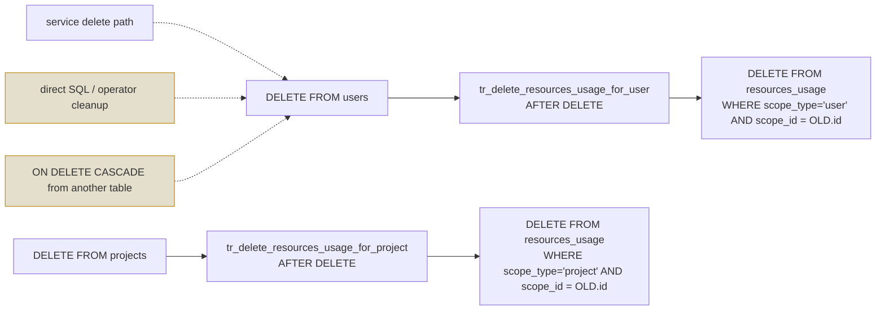

**Why triggers rather than cleanup in the use-case.** Counters drift precisely
when something removes resources *without* going through the service. A trigger
covers direct SQL and cascades from other tables; an application-level fix only
covers the paths someone remembered to change. `AFTER DELETE` so it fires only
once the delete has actually succeeded — in particular after the `BEFORE DELETE`
trigger that refuses to remove system rows.

## 10. Errors and status codes

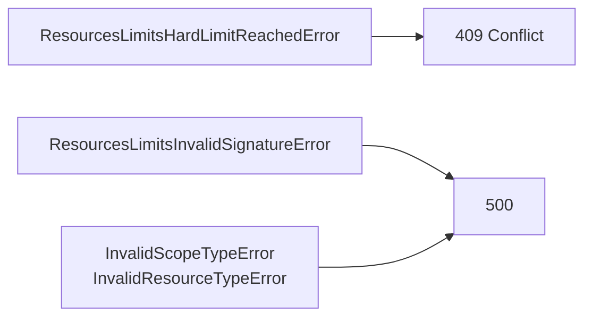

`409` rather than `500` for a quota rejection: hitting a limit is a business
rule the caller can act on by deleting something, and the client has to tell it
apart from a broken server. `429` was rejected because it implies time-based
backoff, and waiting does not help here.

Every create handler carries the mapping — `users`, `projects`, `products` and
`idps`. All four already declared `@Failure 409` for their existing conflict
cases, so the swagger contract did not change.

## 11. Per-resource scope map

| Resource | Scope | Counted against | Default limit (soft/hard) |
| --- | --- | --- | --- |
| `users` | `system` | the deployment | 500 / 1000 |
| `idps` | `system` | the deployment | 500 / 1000 |
| `projects` | `user` | the owning user | 100 / 120 |
| `products` | `project` | the owning project | 200 / 250 |

The defaults come from `00013_limits_upsert.sql` and are deliberately generous:
that migration turns the *mechanism* on without changing what an existing
deployment can do. Real ceilings arrive with the licence file.

> The scope must match on both ends. A project-scoped resource like `products`
> once checked the `user` scope with a *project* id on create while decrementing
> the `project` scope on delete, so the two ends addressed different rows and
> neither was ever right.

## 12. Known gaps

| Gap | Consequence | Status |
| --- | --- | --- |
| Reconciliation is opt-in | Drift is repairable but not repaired unless an operator enables it, because project counting is imprecise without an owner column | see §9b |
| No owner column on `projects` | Reconciliation counts membership rather than creation, and an admin deleting another user's project decrements their own counter | open |
| Delete uses the caller's id, not the owner's | An admin can delete any project; the decrement lands on the admin's counter, not the owner's. Blocked on a schema decision — `projects` has no owner column, only the `projects_users` link table | open |
| No on-demand recount trigger | Reconciliation only runs at startup; there is no endpoint or CLI to repair a scope while the service is up | open |
| `resources_limits` rows are unsigned | Anyone able to tamper with the counter can raise the limit instead | closes with the signed licence |
| `-1` means unlimited | "No policy configured" fails open, which is backwards for a licensed product | changes with the licence |

## 13. Where the code lives

| Concern | File |
| --- | --- |
| Entities, scope and resource types | `internal/core/domain/resources_limits.go` |
| Reserve, check, increment, decrement, signing | `internal/core/usecase/resources_limits.go` |
| Reserve/release/warn helpers | `internal/core/usecase/helpers.go` |
| Persistence port, signer and verifier contracts | `internal/core/port/driven/repository/resources_limits.go` |
| Shared resolution SQL, transactional counters | `internal/adapter/driven/repositorypg/resources_limits.go` |
| `GET /resources_limits` | `internal/adapter/driving/http/handler/resources_limits.go` |
| Tables, indexes, system-row trigger | `database/migrations/00012_limits.sql` |
| Default limits | `database/migrations/00013_limits_upsert.sql` |
| Tests | `tests/integration/api_resources_limits_test.go` |
