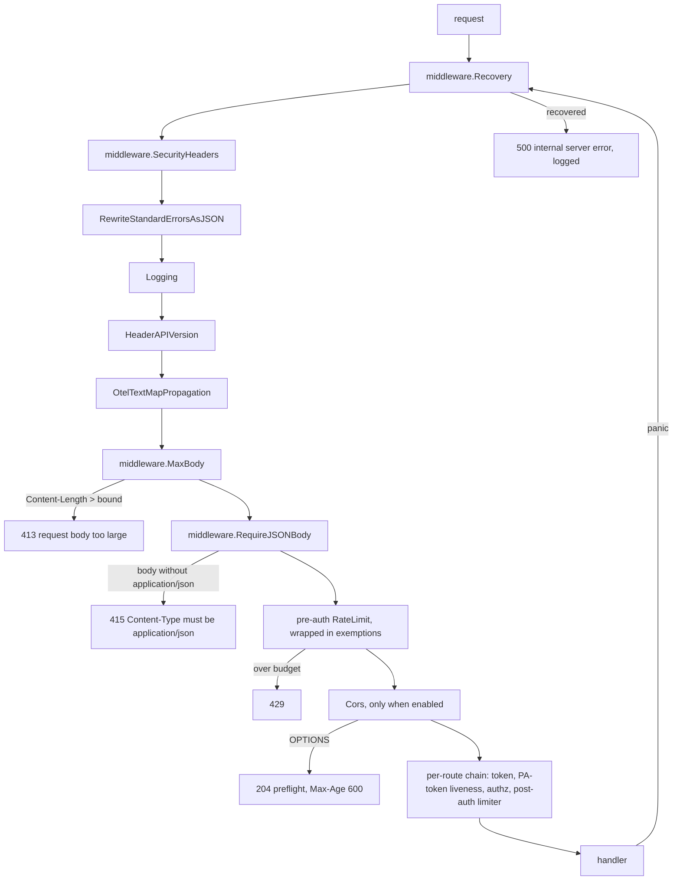
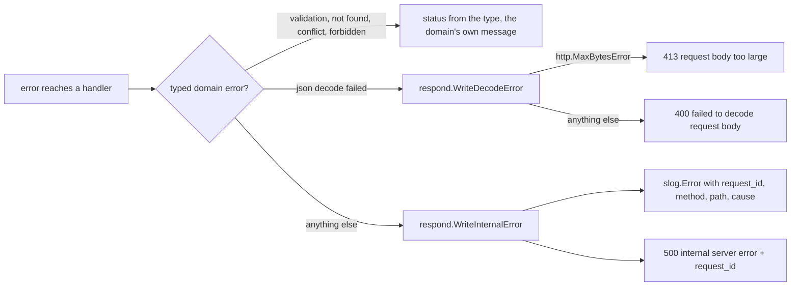
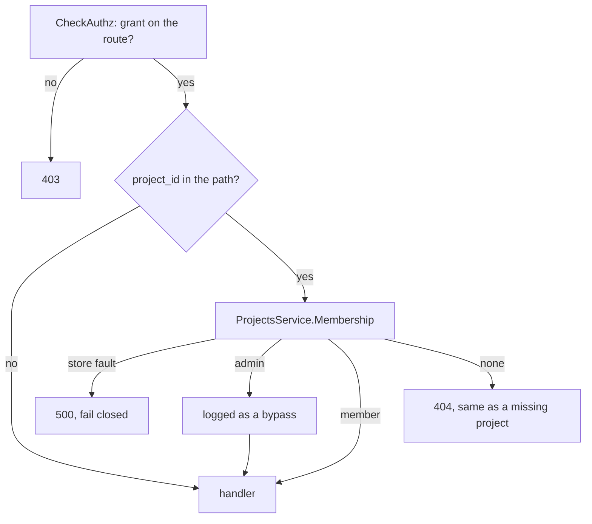
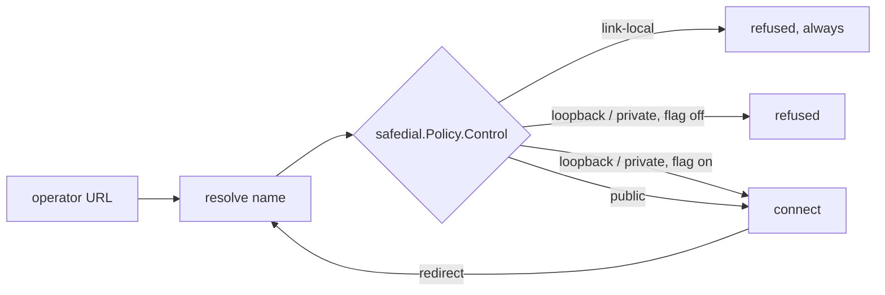

# API security: response hygiene and request bounds

> Written for `svc-qu3ry-core` and ported here unchanged. The template has no
> embedding ingest route and no LLM engines, so the large-body bound applies
> to nothing until a service adds a bulk route, and the outbound guard covers
> the identity providers only. Everything else applies as written.

This is the transport-level posture of the API: what every response carries,
what every request is refused for before a handler sees it, and why each
piece is there. The authentication, rate-limiting and identity-provider
documents cover their own layers; this one is what sits around all of them.

It was written while fixing the absence of all of it. Until 2026-09-06 the
API set one response header of its own (`X-API-Version`), bounded no request
body, checked no content type, built `Location` from the caller's `Origin`
header, and had a panic-recovery middleware that was documented as outermost
and wired nowhere. Each section below says what that cost, measured.

## The common chain

Every request through the API prefix passes this chain, outermost first.
`internal/app/server.go` builds it and
`TestEveryRequestIsRecoveredBoundedAndHeadered` reads that file and fails if
the first four or the limiter-before-CORS order change.



Two positions are load-bearing and were both wrong before:

- **Recovery is first.** A panic below it becomes a logged 500. Without it
  Go's server recovers per connection and closes it: the client sees an
  empty reply and the log has nothing structured. It was defined in
  `middleware` and described in `middleware/doc.go` as "outermost" for as
  long as the package existed, and no chain contained it.
- **CORS is after the limiter.** The CORS middleware answers a preflight
  itself. Placed before the limiter, every `OPTIONS` was answered for free,
  which is an unmetered request against any path. A preflight that is
  rate-limited gets a 429 without CORS headers, which a browser treats as a
  refusal. That is the right answer.

## What every response carries

`middleware.SecurityHeaders` sets these before the handler runs, so an early
refusal (a 413, a 415, a 429) carries them as well.

| Header | Value | What it closes |
| --- | --- | --- |
| `X-Content-Type-Options` | `nosniff` | a JSON body that contains markup is never rendered as a page |
| `Cache-Control` | `no-store` | a login answer carries two tokens; a list carries what the caller was authorised to see; nothing here is public, and a shared cache decides heuristically when told nothing |
| `Content-Security-Policy` | `default-src 'none'; frame-ancestors 'none'` | a JSON body loads nothing and is framed by nothing; a proxy or error page that serves it as HTML is inert |
| `X-Frame-Options` | `DENY` | `frame-ancestors` for agents that predate CSP |
| `Referrer-Policy` | `no-referrer` | an API URL can carry an id; it does not travel to wherever a client goes next |
| `Cross-Origin-Resource-Policy` | `same-origin` | an `` or `<script>` pointed at the API from another origin gets nothing; CORS requests are governed by the CORS middleware, not this |
| `Strict-Transport-Security` | `max-age=63072000; includeSubDomains` | only when TLS terminates here (`http.server.tls.enabled`) or `http.server.hsts.enabled` says a proxy does; over plain HTTP a browser ignores it, so the switch exists to avoid claiming a posture the deployment does not have |

**The swagger UI is the exception.** It is the one page this server serves,
mounted on the same router. It keeps every header that never breaks a page
and loses the two that would: `no-store`, which would make its assets
uncacheable, and the API's CSP, which would block its own scripts. The
composition root passes `IsDocument` for the `/swagger/` prefix.

**No `Server` header** is sent; Go's server does not add one and nothing
here does.

## Request bounds

### Body size

`middleware.MaxBody` bounds every body. There was no bound: each handler
decodes `r.Body` with `encoding/json`, and `http.server.read.timeout` is off
by design because bulk ingest over a slow link is legitimate, so one request
could allocate whatever it sent.

```text
measured 2026-09-06, 200 MiB JSON body to POST /auth/login
before: 400 after 0.66 s, process RSS 52 MiB -> 674 MiB
after:  413 after 0.0008 s, RSS unchanged
```

Two mechanisms, because clients come in two shapes:

```mermaid
sequenceDiagram
    participant C as client
    participant M as MaxBody
    participant H as handler
    C->>M: POST, Content-Length: 209715227
    M-->>C: 413 request body too large (no byte of body read)
    C->>M: POST, Transfer-Encoding: chunked
    M->>H: r.Body = http.MaxBytesReader(w, r.Body, bound)
    H->>H: json.Decode reads up to the bound
    H-->>C: 400 (decode failed at the bound; connection closed)
```

| Setting | Default | Applies to |
| --- | --- | --- |
| `http.server.max.body.bytes` | 1 MiB | every route |
| `http.server.max.body.bytes.ingest` | 32 MiB | `POST …/embeddings/ingest`, the one route that posts a corpus; must not be below the first |

The ingest route also caps **work**, not just bytes:
`domain.MaxEmbeddingChunksPerRequest` (1 000) bounds the chunks one request
may carry, because each chunk is an embedding call and a row. A larger corpus
is sent in batches.

### Content type

`middleware.RequireJSONBody` refuses a request that carries a body without
declaring it `application/json` (parameters such as `charset` are fine). It
keys on the presence of a body, not the method: a `DELETE` with a JSON body
(bulk delete) is a body like any other, and a `POST` without one (logout) is
not asked to describe what it did not send.

Two reasons beyond tidiness. A browser sends a cross-origin form post without
a preflight, only because form content types are "simple"; requiring
`application/json` makes the preflight, and so the CORS policy, apply to every
write. And a client that sends the wrong type is told so at the door, in one
wording, instead of by whatever the decoder makes of it.

The integration suite's request helper sets the header on every body it
sends. It never did before, which is why this check would have failed the
whole suite and why the helper is part of the same change.

## `Location` is built from configuration, never from a request header

Every create answered 201 with
`Location: <Origin header><RequestURI>/<id>`. Measured 2026-09-06:
`POST /roles` with `Origin: http://evil.example` answered
`Location: http://evil.example/api/v1/roles/<id>`. A client that follows
`Location` was sent wherever the caller said. It also kept the query string,
so a create through `?x=1` produced `…/roles?x=1/<id>`.

`respond.LocationFor` builds the path from the request path (query dropped)
plus the segments the handler names, and prefixes `http.server.public.url`
when it is set. Unset, the result is a path reference
(`/api/v1/roles/<id>`), which RFC 9110 allows and every client resolves
against the request it made. All 29 sites go through it.

## Errors: one wording per class, the cause in the log

Handlers used to write `err.Error()` into the body of every 500 and of every
failed decode. Counted on 2026-09-06: 218 sites of the first kind and 49 of
the second, so `encoding/json`'s "unexpected EOF", pgx's SQLSTATE text and
the pagination cursor decoder's "invalid cursor: not base64" were all part
of the API's contract, and every dependency bump could reword it. The JWT
middleware had already fixed this for itself ("Invalid or expired token",
one place, the reason at DEBUG); the rule is now enforced package-wide.



- **`respond.WriteInternalError`** answers `"internal server error"` and
  logs the cause under the request id. A 500 is by definition an error the
  caller cannot act on; the operator can, and joins the two by the id.
- **`respond.WriteDecodeError`** answers one 400 wording for any decode
  failure, and 413 when the body was cut by the size bound, so a client
  learns to send less rather than to fix its JSON.
- **Pagination tokens** answer `invalid next_token` / `invalid prev_token`. A
  token is opaque; how it failed is nothing a client acts on.
- **`domain.IDPUnreachableError`** is its own type, mapped to 503. It used to
  be told apart from every other authn failure by searching the message for
  "not reachable".
- **`TestNoHandlerForwardsALibraryErrorString`** reads the handler package
  and fails on either shape coming back. Same idea as the zero-`errors.As`
  invariant: the number worth recording is zero.

### The request id

`middleware.RequestID` is the outermost middleware, above `Recovery`, so a
recovered panic has an id too. It mints a v7 uuid per request, returns it in
`X-Request-ID`, puts it on the request log line, and repeats it in every
error body as `request_id`. An inbound `X-Request-ID` is not honoured: a log
an attacker can fill with chosen ids is worse than one with only ours.

## Ownership: a grant names a route, membership names a project

The authorization policy answers "may this user call
`GET /projects/{any}/embedding_configs`", and that is all it can answer: OPA
sees user, method and path, and expands the `*` in a grant to any uuid. So a
single project-scoped grant used to open every project. Measured on
2026-09-06 with two users, one project and one grant on
`/projects/*/embedding_configs`: the user who was not a member listed the
other's configs.

Membership is data the database owns, so it is asked there, once per
request, by `middleware.RequireProjectMembership`, which sits in the shared
authenticated chain right after `CheckAuthz` and keys on the route's
`project_id` path value. A route without one passes untouched, so the whole
API needs one middleware and no handler had to change.



- **After `CheckAuthz`, never before.** A caller with no grant is refused
  with 403 before membership is asked; only a caller authorised for the
  route but not for this project gets the 404.
  `TestProjectMembershipIsCheckedAfterAuthorization` reads `server.go` for
  the order.
- **404, not 403**, the answer a missing project already gets, so the
  refusal does not confirm the project exists.
- **An administrator is admitted to every project.** That is a bypass of
  membership and it is logged as one, with the project and the user.
- **One indexed read per project-scoped request**, not cached: the answer
  changes the moment a link is removed.
- **A personal access token needs no special case.** Its `sub` is the user
  id, the same claim the middleware reads.

`TestProjectMembershipGatesProjectScopedRoutes` keeps the Phase-0 proof as an
integration test: member 200, administrator 200, non-member 404, missing
project 404, no grant 403.

### A password is never set through `PUT /users/{id}`

`UpdateUserRequest` accepted `password`, so a grant on `PUT /users/*` was a
takeover of any account: set the password, sign in. The field is gone.
`POST /users/{user_id}/password/reset` emails the account holder a reset
link instead, so taking over an account needs its mailbox as well as the
grant. It answers 202 whatever the address's state and says nothing about
why, the same as the public recovery route it delegates to.

### What an anonymous caller learns about the build

`GET /version` answers only `version`. It used to hand an anonymous,
rate-limit-exempt caller the commit, the branch and the Go version, which is
exactly the disclosure `/health/status` had already been stripped of: a
version string to match against known advisories. The build details are on
the authenticated `GET /health/detailed` as `build`.

`/swagger/` is off unless `http.server.swagger.enabled` says otherwise. It
lists every operation, every field and every example, including the seeded
administrator's credentials as the login example, to anyone who asks, on the
API's own listener. The dev stack switches it on (`run.sh`, `.air.toml`); a
deployment says so explicitly, and the startup log warns when it does.

## Secrets, tokens and outbound calls

### Verification and reset links are spent on the first click

Both tokens expired but were never consumed: a reset link worked as many
times as anyone cared to click it until `exp`, while the Swagger annotation
promised "already used". Both are recorded in the revoked-token store now,
under their own token type, the first time they are presented, and refused
after; a store fault refuses too. The reset token is spent **before** the
password changes: a token consumed and then failed to apply costs one more
link, a password changed and then failed to record the token is a link that
still works.

### The seeded administrator

Migration `005` inserts `admin@qu3ry.me` with a bcrypt hash whose plaintext
is in the adjacent comment, in the Swagger login example and in every
integration test. A service that finds that hash still on an enabled
administrator **refuses to start** unless `authn.seed.admin.password.allowed`
says this is a development stack (`run.sh`, `.air.toml` and the integration
container say so). The comparison is on the stored hash; no password is
handled. A warning would have been the posture that ships.

### Unknown JSON fields are refused

Every body decoder used to accept and drop a field it did not know, so a
client kept sending what it believed was honoured (the IdP redirect URLs,
the password on `PUT /users/{id}`). `decodeJSONBody` refuses an unknown field
and anything after the first JSON value, and the 400 names the field in this
service's own words. The frontend's contract test, which checks its request
types against the API's schemas by name, is what keeps the two in step.

### Where an outbound request may go

Operators supply URLs the service then dials on every request: an LLM
engine's `api_endpoint`, an identity provider's issuer. Nothing checked the
host, so a grant on "create engine" reached `169.254.169.254`, `localhost`
and the service's own network from inside, with the answer relayed back.

`safedial.Policy` runs in the dialer's `Control` hook, **after DNS, on the
address actually being connected to**, so a name that resolves somewhere
private later (rebinding) and a redirect to one are both caught. Link-local
is refused always. Loopback and private ranges are refused unless
`http.client.allow.private.addresses` says the deployment talks to engines
there, which the dev stack (local Ollama) and the integration container
(fake OIDC provider on loopback) do. The startup log states the posture.



### Smaller things

- `authn.password.bcrypt.cost` (10 to 14, default **12**) is what new hashes
  use; it was the library default of 10. Each step doubles the work of an
  offline guess and of one login.
- `api_token` is no longer an accepted `?fields=` value on LLM engines. The
  response type has no field for it, so the only thing that acceptance could
  ever do was leak on the next edit of the projection.

## Supply chain and the build

- **The image runs as `nonroot`** (`gcr.io/distroless/base-debian12:nonroot`,
  `USER nonroot:nonroot`). It ran as root, which turns any code execution in
  the service into root in the container. The tag is the pin: a digest on
  this image is per-architecture and the build is multi-arch.
- **Dependabot** opens one grouped PR a week for Go modules and one for
  GitHub Actions. The weekly `govulncheck` finds an advisory against a
  dependency nobody touched; this is what moves it. A grouped PR still runs
  the full gate, which is what caught the transitive `gobwas/glob` break.
- **`gosec` and `govet` run in `make lint`.** `govet` had been disabled with
  nothing recorded as the reason and reported nothing when re-enabled. Of
  gosec's findings, the real ones were fixed: the pprof server had no header
  read deadline, `main` blank-imported `net/http/pprof` onto the default mux,
  the TLS config listed TLS 1.2 cipher suites under a 1.3 minimum (inert,
  misleading), two error messages rendered a count as `rune('0'+n)` (wrong
  above 9), a config file was opened `0644`, and fifteen recorded errors were
  discarded silently. Two rules are excluded with the reason in
  `.golangci.yaml`: `G101` matches identifier names, not values, and `G304`
  fires on the key and env files the operator names by flag. Test files are
  excluded from gosec: fixtures carry keys on purpose.
- **Fuzz targets** over the three query-expression parsers
  (`FuzzFilterExpression`, `FuzzSortExpression`, `FuzzFieldsExpression`),
  seeded with real client shapes and an injection attempt. They fed sixty
  parsers from query strings with no fuzzing at all. Run one with
  `go test -tags=unit -fuzz FuzzFilterExpression -fuzztime 60s ./internal/core/domain/`.

## What was removed

- `/auth/logout` cleared three `auth.backend.*` cookies that the frontend
  sets on its own host. The API never set them and could not clear them;
  the block was left from when the IdP callback set cookies on the API host.
- `handler/pprof.go` had no caller and would have mounted pprof on the API
  mux if wired; the pprof server has its own listener, off by default.
- `domain.MaxJSONNestingDepth` and `MaxJSONFieldCount` were declared and
  referenced nowhere.

## What this does not do yet

Recorded here so it is not mistaken for oversight:

- `OPTIONS` on a route with CORS disabled answers 204 from Go's mux. It is
  metered now, and it carries no CORS headers, so a browser cannot use it.
