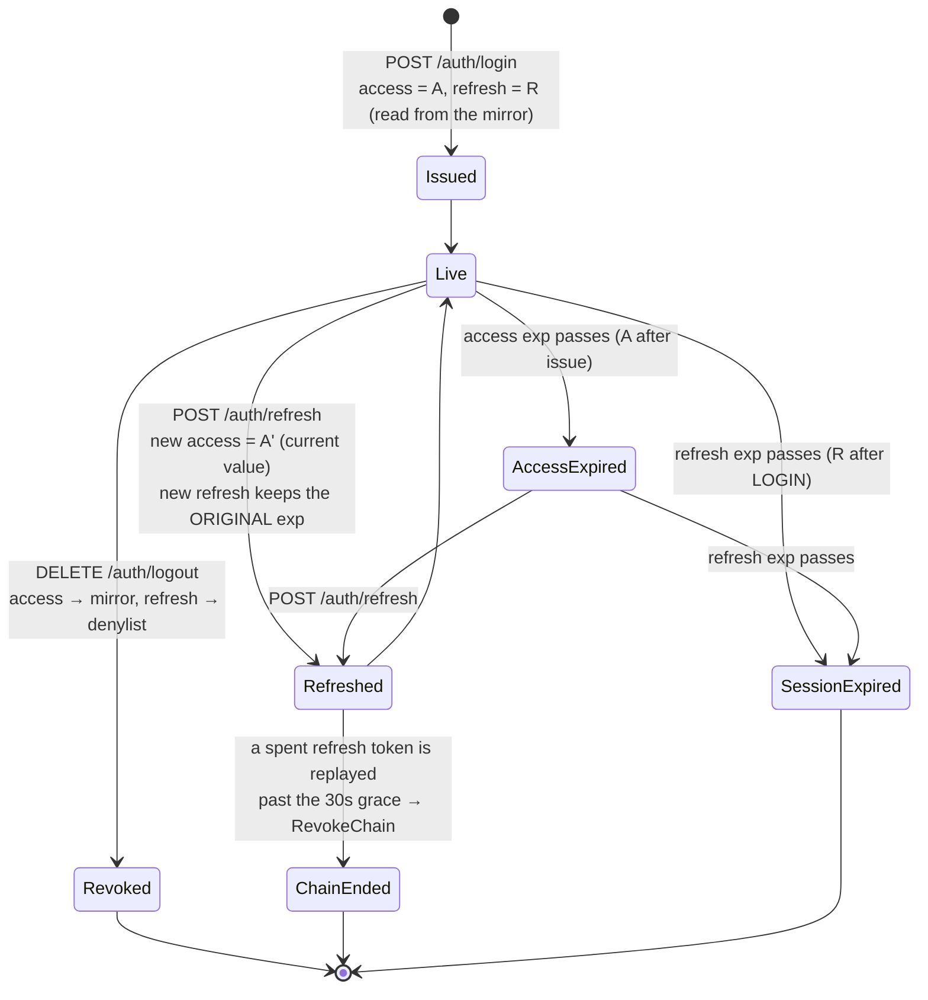
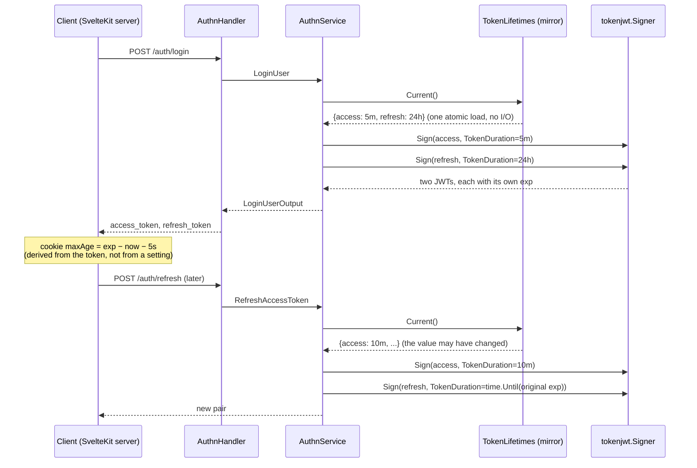
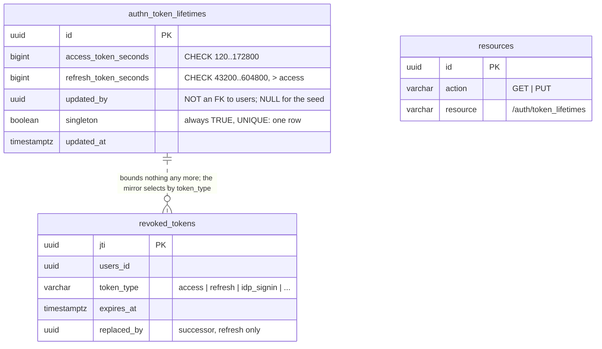

# Token lifetimes

How long an access token and a refresh token live, where that number comes
from, what happens when it changes, and what has to keep up with it.

The short version: the two lifetimes are **one row in the database**, seeded by
migration, read into memory on every replica, edited through
`PUT /auth/token_lifetimes`, and applied to the next token issued. They used
to be two startup flags. This document is about everything that follows from
moving them.

## The four token classes

| Class | Lifetime | Set by | Enforced where |
| --- | --- | --- | --- |
| **access** | `access_token_duration`, 2m–48h, default 5m | `authn_token_lifetimes` row | `exp` claim, checked by `tokenjwt.Signer.Verify`; revocation by the in-memory mirror |
| **refresh** | `refresh_token_duration`, 12h–168h, default 24h | same row; **applies at login only** — rotation carries the original expiry | `exp` claim; revocation by the `revoked_tokens` denylist |
| personal access | 1h–365d, chosen per token | the caller, at creation | `exp` claim; revoked by deleting the `pa_tokens` row |
| verification / password reset | `authn.user.verification.token.ttl`, `authn.user.reset.password.token.ttl` | startup flags | `exp` claim; single use |

Only the first two are this document's subject. Personal access tokens have
their own lifetime per token, and the two email tokens are still flags because
nothing about them needs to change while the service runs.

## A session, and the lifetime that bounds each transition



Two things in that diagram carry the whole design:

- **A' is read at refresh time.** A change to the access lifetime reaches every
  session on its next refresh, without anybody logging in again.
- **R is fixed at login.** Every link in a rotation chain expires when the
  first one would have. That rule predates this feature ("carry the expiry,
  never renew it" — an immortal session is a product decision), and it means
  the refresh lifetime applies to *new* sessions only.

## Issuance: where the value is read



`AuthnService` holds a `TokenLifetimesProvider`, not two durations. One read
serves both tokens at login so a change landing between the two signatures
cannot issue a mismatched pair. The frontend needs no change at all: its cookie
lifetimes are derived from the `exp` claim of the token it is handed.

## A change: PUT → row → mirror → the other replicas

```mermaid
sequenceDiagram
    participant A as Admin (frontend)
    participant H as TokenLifetimesHandler
    participant S as TokenLifetimesService
    participant R as repositorypg.TokenLifetimes
    participant M1 as Mirror (this replica)
    participant N as changenotifyvalkey.Notifier
    participant M2 as Mirror (another replica)

    A->>H: PUT /auth/token_lifetimes {access: "10m", refresh: "72h"}
    H->>H: parse durations; caller = sub of the verified token
    alt a duration does not parse
        H-->>A: 400 naming the field
    end
    H->>S: Update(input)
    S->>S: input.Validate(): bounds, refresh > access
    alt out of bounds or refresh ≤ access
        S-->>H: *domain.ValidationErrors
        H-->>A: 400 naming the field(s)
    end
    S->>R: Update — UPDATE … RETURNING
    alt store fault
        R-->>S: error
        S-->>H: error (nothing applied, nothing notified)
        H-->>A: 500
    end
    R-->>S: the stored row
    S->>M1: Reload()  — this replica first
    alt reload fails
        Note over S,M1: logged; the ticker retries within the interval
    end
    S->>N: Notify()  — payload is the replica id, never the value
    alt no cache / publish fails
        Note over S,N: logged; the ticker on every replica is the floor
    end
    N-->>M2: message on go-rest-api-service-template:authn:token_lifetimes
    M2->>R: Get()
    R-->>M2: the stored row (validated on the way in)
    S-->>H: the stored row
    H-->>A: 200 {values, bounds, defaults, updated_at, updated_by}
```

The order matters and is the same as the rate limiter's: **validate, write,
apply here, tell the others.** Only the first two can fail the call. A mirror
reload or a notify that fails after a successful write is logged and never
returned — reporting an error would tell the operator their change was not
saved when it was, and the reload ticker carries it either way.

## The pieces

```mermaid
flowchart LR
    subgraph driving["driving adapter (HTTP)"]
        TH[TokenLifetimesHandler<br/>GET / PUT /auth/token_lifetimes]
        AH[AuthnHandler<br/>login / refresh]
    end

    subgraph core["core (no infra imports)"]
        TS[TokenLifetimesService<br/>Get · Update · applyLocally]
        M[TokenLifetimes mirror<br/>Current · Reload · Run · Staleness]
        AS[AuthnService<br/>reads Current() at issuance]
        RP[(port repository.TokenLifetimes)]
        NP[(port changenotify.Notifier)]
    end

    subgraph driven["driven adapters"]
        PG[repositorypg.TokenLifetimesRepository<br/>authn_token_lifetimes, one row]
        VK[changenotifyvalkey.Notifier<br/>channel go-rest-api-service-template:authn:token_lifetimes]
    end

    TH --> TS
    AH --> AS
    AS -->|Current| M
    TS -->|Get / Update| RP
    TS -->|Reload after a write| M
    TS -->|Notify after a write| NP
    M -->|Get on load, tick, or signal| RP
    RP -.-> PG
    NP -.-> VK
    VK -->|Watch → Reload| M
    T((ticker<br/>authn.token.lifetimes.reload.interval)) --> M
```

- **`TokenLifetimes` (mirror)** — `internal/core/usecase/token_lifetimes_mirror.go`.
  One atomic pointer, replaced wholesale on reload. `Current()` panics before
  the first load, deliberately: the composition root loads synchronously and
  refuses to start on failure, so reaching an unloaded mirror is a wiring bug,
  and the alternative — zero durations — would sign tokens that expire as they
  are issued.
- **`TokenLifetimesService`** — `token_lifetimes.go`. GET reads the **row**,
  not the mirror, so it never disagrees with a write another replica just made.
- **`changenotifyvalkey.Notifier`** — the rate-limit notifier, moved to a
  neutral package and given a channel per mirrored thing. It shares one
  subscriber Valkey client with the rate-limit notifier; it must not share the
  cache's client, because a subscribed connection accepts nothing else.
- **The ticker is the floor.** Without a cache there is no signal, and a change
  takes up to `authn.token.lifetimes.reload.interval` (1m) to reach the other
  replicas. That is a supported deployment.

## What a change does to tokens already issued

```mermaid
gantt
    title An operator raises the access lifetime from 5m to 10m at T
    dateFormat X
    axisFormat %M:%S

    section Session started before T
    access token signed at T−3m, exp T+2m (5m, unchanged)        :done, a1, 0, 300
    refresh at T+2m: new access exp T+12m (10m, the new value)     :active, a2, 300, 900
    refresh token: exp unchanged, whatever login set               :crit, a3, 0, 1200

    section Session started after T
    login at T+1m: access 10m, refresh at the CURRENT refresh value :b1, 360, 960
```

The rules, in the order a support question arrives in:

1. **A token already issued keeps its `exp`.** The JWT is self-describing and the
   verifier reads the claim. A change never shortens or extends a live token;
   to end sessions early, revoke.
2. **The access lifetime applies at the next login *and* the next refresh.**
   A refresh mints a new access token, and it reads the mirror.
3. **The refresh lifetime applies at the next login only.** Rotation carries the
   expiry the session started with.
4. **The writing replica applies it before answering.** The operator who saves
   and immediately signs in again sees the new value.
5. **Other replicas apply it in under a second** with a cache, or within the
   reload interval without one.
6. **Revocation keeps working across a change** — see the next section, because
   it did not have to.

## Storage



**The initial values come from the migration.** `00016_authn_token_lifetimes.sql`
creates the table and inserts the one row with the shipped defaults, 5m and
24h — the same numbers the removed flags defaulted to, so an upgrade changes
nothing until an operator does. There is no Go fallback: the
`domain.DefaultAuthn*Duration` constants exist for the API's `defaults` field
and these docs, and `TestSeedTokenLifetimesMatchDomainDefaults` reads the
migration and fails if the two drift.

**Seconds, not `INTERVAL`**, for the same reason `rate_limit_windows.period_seconds`
is: the API speaks Go duration strings, Go holds a `time.Duration`, and an
integer column round-trips both without a codec.

**No `system` column.** The shared trigger refuses `UPDATE` on system rows, and
this row exists to be updated. The `singleton` column is what stops a second
row.

**`updated_by` is not a foreign key.** Deleting the admin who set a lifetime must
not touch the lifetime — the same reasoning as `revoked_tokens.users_id`.

## The API

### `GET /auth/token_lifetimes`

Answers four questions in one call, so the frontend hardcodes no number:

```json
{
  "access_token_duration":  "5m0s",
  "refresh_token_duration": "24h0m0s",
  "bounds": {
    "access_token_duration":  { "min": "2m0s",   "max": "48h0m0s"  },
    "refresh_token_duration": { "min": "12h0m0s", "max": "168h0m0s" }
  },
  "defaults": { "access_token_duration": "5m0s", "refresh_token_duration": "24h0m0s" },
  "updated_at": "2026-09-05T10:12:00Z",
  "updated_by": "019b…"   // absent for the seeded row
}
```

Codes: `200`, `401`, `403`, `429`, `500`. **No 404**: the row is seeded and the
service refuses to start without it, so a missing row at request time is a
fault. Not cached through `cache.Cache`: one primary-key read, and a cached GET
could show a value a PUT has just replaced.

### `PUT /auth/token_lifetimes`

```json
{ "access_token_duration": "10m", "refresh_token_duration": "72h" }
```

Validation, first failure wins per field and every field is reported: parses
as a duration → within bounds → `refresh > access` strictly. Then write, apply
locally, notify, and answer with the GET shape. `updated_by` is the subject of
the verified token, never anything in the body. Codes: `200`, `400`, `401`,
`403`, `429`, `500`.

"Reset to defaults" is a PUT of the `defaults` the GET returned. There is no
DELETE.

## The bounds, and why each number

| Bound | Value | Reason |
| --- | --- | --- |
| access min | 2m | above the frontend's 5s cookie buffer and the 10s revocation reload interval, with room; below it the machinery around a token cannot keep up |
| access max | 48h | past two days an access token is a session in all but name, and with revocation switched off it is the whole residual-access window |
| refresh min | 12h | below half a day a refresh token buys nothing over a long access token; the pair exists because one is short and the other is not |
| refresh max | 168h | a session may be renewed for a week; rotation carries the original expiry, so a longer ceiling is a decision about immortal sessions, not a knob |
| refresh > access | strict | an equal pair leaves no moment at which refreshing is both possible and useful |

The numbers live in one place each in Go (`domain.ValidAuthn*Duration`),
are repeated as `CHECK` constraints in the migration, and are returned by
every GET. The seed guard test ties the first two together; the API ties the
third to the frontend.

## Revocation had to change, and this is why

The revoked-access-token mirror used to find its rows by a **horizon**: "every
`revoked_tokens` row whose `expires_at` is within `now + access lifetime`."
That was exact only while the lifetime was a startup constant shorter than any
refresh token — the table takes a row per refresh rotation, and the short
window is what kept those out. With a runtime lifetime up to 48h it fails
twice:

- a lifetime **raised** after the mirror was built leaves a horizon shorter
  than the tokens it must cover, so a logout under the new lifetime is silently
  not honoured on other replicas — the one failure the mirror exists to prevent;
- a 24h access lifetime admits every rotation row, so "small by construction"
  becomes "rotations in the last day".

`00014_revoked_tokens.sql` carries `token_type` on the row; every
writer names what it is revoking, and the mirror selects
`WHERE token_type = 'access' AND expires_at > NOW()` — exactly its own rows,
whatever the lifetime is or becomes. A partial index serves that query.
Existing rows are backfilled: a row with a successor was a refresh token,
everything else is treated as access, which errs wide (an extra uuid in memory
until it expires) rather than narrow (a revoked token that keeps working).

## What can go wrong, and what each failure costs

| Failure | What happens | What you see |
| --- | --- | --- |
| row missing or unreadable at startup | the process refuses to start | startup error `could not load the token lifetimes`; there is no fallback value |
| reload fails later | the previous value is kept; tokens keep being issued | `authn_token_lifetimes_staleness_seconds` climbs; `AuthnTokenLifetimesStale` at 3× the interval |
| the row is edited by hand to something the validator refuses | treated as a failed reload, not installed | same staleness alert; the `CHECK` constraints should make this unreachable |
| no cache | ticker-only propagation | a change takes up to `authn.token.lifetimes.reload.interval` on other replicas |
| a change signal is lost | same as no cache, for that one change | nothing; the ticker carries it |
| the PUT's reload or notify fails | the write stands; logged | `WARN` naming the consequence; the ticker carries it |
| access lifetime raised past the revocation reload interval | nothing — the mirror selects by type now | `RevokedAccessTokenSetStalerThanTheTokenLifetime` compares staleness to the **live** `authn_access_token_lifetime_seconds` gauge |

## Metrics and alerts

| Metric | Meaning |
| --- | --- |
| `authn_token_lifetimes_staleness_seconds` | seconds since this replica last read the row; `-1` before the first load |
| `authn_access_token_lifetime_seconds`, `authn_refresh_token_lifetime_seconds` | the values this replica is issuing with |
| `authn_token_lifetimes_reload_failures_total` | failed reloads; the previous value is kept |

The revocation alert that used to carry `> 300` — the old flag default, copied
into a rule — now reads `revoked_access_tokens_staleness_seconds >
authn_access_token_lifetime_seconds`, so it follows a change without anyone
editing the rule. `alerts_test.yaml` pins that the same 200s of staleness is
quiet at a 5m lifetime and critical at a 2m one.

## What it used to do, and why that was wrong

- **Two startup flags**, `authn.access.token.duration` and
  `authn.refresh.token.duration`. Changing a lifetime was a redeploy, which is
  the wrong cost for a number an operator tunes in response to an incident.
- **No ordering check.** Access 7d with refresh 5m was accepted.
- **The minimum was exclusive in config and inclusive in the use case**, so a
  value on the boundary was refused by one and accepted by the other.
- **The revocation horizon was coupled to the lifetime**, invisibly, and would
  have failed silently the first time the lifetime moved.
- **The critical alert carried the lifetime as a literal.**

## Configuration

| Setting | Default | What it does |
| --- | --- | --- |
| `authn.token.lifetimes.reload.interval` | `1m` | how often each replica re-reads the row; the floor for propagation without a cache |

The lifetimes themselves are not settings. Read and change them through the
API, or from the frontend's Admin → Token lifetimes page.
