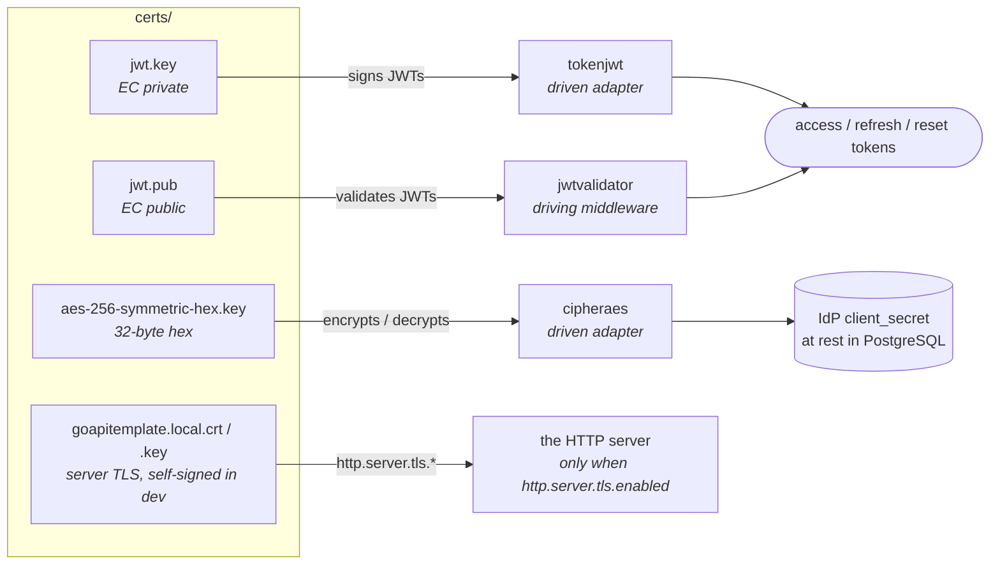

# Certificates

The service needs two kinds of key material, each with a distinct role. The
diagram maps every file you generate below to the component that uses it.



- The **EC key pair** (`jwt.key` / `jwt.pub`) signs and validates JWTs.
- The **HTTP server's TLS pair** is what `http.server.tls.cert.file` and
  `.key.file` name. `make dev-certs` self-signs one for the dev stack, which
  runs with `http.server.tls.enabled=false` but still opens the files while
  parsing the flags; production supplies a real one, see below.
- The **AES-256 symmetric key** encrypts the third-party credentials this
  service has to be able to *replay*: an
  identity provider's `client_secret`. Both are decrypted on use, which is why
  they are encrypted rather than hashed.

Certificates for the **outbound connections** are a separate concern with their
own walkthroughs — see [Valkey TLS](./valkey-tls.md) and
[PostgreSQL TLS](./postgres-tls.md).

## The quick way, for development

```bash
make dev-certs
```

One target creates everything below under `certs/` (git-ignored), and the TLS
CA and server certificate the development PostgreSQL and Valkey present under
`certs/dev/`. It runs `dev-env/scripts/generate-dev-keys.sh` for the keys and
`dev-env/scripts/generate-dev-certs.sh` for the TLS material, and it **never
overwrites** an existing file: a new `jwt.key` invalidates every token the
running service has issued, a new AES key makes every secret already encrypted
unreadable, and a new CA is not trusted by a service that already loaded the old
one. To rotate on purpose, delete the file and run the target again.
`make start-dev-env` depends on it, so a stack started that way always has its
material.

Everything after this heading is the manual route: what each file is, how to
generate it yourself, and what a production deployment does instead of reusing
development material.

## Asymmetric Private & Public Key Pair for JWT

This service use a `private and public key pair` to `sign and validate` JWT tokens.

### Requirements

- [OpenSSL 3.x](https://www.openssl.org/)

### EC P-256 key pair

Generate the private and public key pair:

```bash
# Create the directory to store the certificates
mkdir -p certs

# Generate the JWT Private Key
openssl ecparam -genkey -name prime256v1 -noout -out certs/jwt.key

# Generate the JWT Public Key
openssl ec -in certs/jwt.key -pubout -out certs/jwt.pub
```

## Symmetric Key for encryption and decryption of third-party credentials

This service uses a `symmetric key` to `encrypt and decrypt` the credentials it
holds **for other systems** and must be able to present again:

- an **IdP's `client_secret`**, decrypted on every OAuth exchange
  (`usecase/authn_idp.go`);
- an **identity provider's `client_secret`** (`usecase/idps.go`).

Encryption, not hashing, because both are replayed to a third party — a hash
could not be sent. That is the test for whether a secret belongs here.

**It does not encrypt this service's own tokens.** Personal access tokens are
ES256 JWTs whose `jti` identifies the credential: verifying one means
checking the signature and reading that row, so the token's own text is never
needed again and is no longer stored at all. Nothing this service issues is kept
at rest.

> **The key must be exactly 16, 24 or 32 bytes** — 32, 48 or 64 hex characters
> in the file. Anything else and the service refuses to start, naming the
> setting.
>
> It used to accept 3–255 bytes, which is a bound on a file *path* that had been
> borrowed and applied to the key, so a wrong-length key started cleanly and
> failed at first use with `crypto/aes: invalid key size N` — which, for the
> api_token, is a user's query rather than a configuration error.

### Requirements for AES-256 Key

- [OpenSSL 3.x](https://www.openssl.org/)

### AES-256 Key

Generate the symmetric key:

```bash
# Create the directory to store the certificates
mkdir -p certs

# Generate the AES-256 Key, hexadecimal format is important!
openssl rand -hex 32 | tr -d '\n' > certs/aes-256-symmetric-hex.key
```

## Self-Signed Certificates

This service could use self-signed certificates.

### Requirements for Self-Signed Certificates

- [OpenSSL 3.x](https://www.openssl.org/)

### Ed25519 Certificates

Generate the Certificate Authority (CA) key and certificate:

```bash
mkdir -p certs/newcerts
cd certs/

# Generate the CA Key Pair
# Reference: https://docs.openssl.org/3.4/man1/openssl-ecparam/
# to get -name parameter user -> openssl ecparam -list_curves
openssl ecparam -genkey -name secp256k1 -out ca.key

# Generate the CA Certificate configuration file
cat <<EOF > ca.cnf
[req]
prompt = no
default_bits = 2048
default_keyfile = ca.key
default_days = 3650
default_md = sha256
utf8 = yes
distinguished_name = dn
x509_extensions = v3_ca

[dn]
C = ES
ST = Barcelona
L = Barcelona
O = Peer to Peer and Business to Business SL
OU = goapitemplate.local
CN = *.goapitemplate.local
emailAddress = info@goapitemplate.local

[v3_ca]
subjectKeyIdentifier = hash
authorityKeyIdentifier = keyid:always,issuer
basicConstraints = critical, CA:true
keyUsage = critical, cRLSign, keyCertSign, digitalSignature, keyEncipherment
EOF

# Create the CA Certificate (10 years)
# NOTE: This will request a PEM pass phrase
openssl req -new -x509 -out ca.crt -config ca.cnf

# Check the CA Certificate
openssl x509 -in ca.crt -text -noout

# Generate the Intermediate CA Key Pair (Optional)
openssl ecparam -genkey -name secp256k1 -out intermediate_ca.key

# Generate the Intermediate CA Certificate configuration file (Optional)
cat <<EOF > intermediate_ca.cnf
[req]
prompt = no
default_bits = 2048
default_keyfile = intermediate_ca.key
default_days = 3650
default_md = sha256
distinguished_name = dn
x509_extensions = v3_ca

[dn]
C = ES
ST = Barcelona
L = Barcelona
O = Peer to Peer and Business to Business SL
OU = goapitemplate.local
CN = *.goapitemplate.local
emailAddress = intermediate@goapitemplate.local

[v3_ca]
subjectKeyIdentifier = hash
authorityKeyIdentifier = keyid:always,issuer
basicConstraints = critical, CA:true
keyUsage = critical, cRLSign, keyCertSign, digitalSignature, keyEncipherment
EOF

# Create the Intermediate CA Certificate (10 years) (Optional)
# NOTES:
# + This is to protect the CA private key and Certificate because this could be used to sign other certificates and validate them
# + This will request the CA pass phrase
openssl req -new -out intermediate_ca.csr -config intermediate_ca.cnf

# Check the Intermediate CA Certificate (Optional)
openssl req -in intermediate_ca.csr -noout -text

# Sign the Intermediate CA Certificate with the CA Certificate (Optional)
openssl x509 -req -in intermediate_ca.csr -CA ca.crt -CAkey ca.key -CAcreateserial -out intermediate_ca.crt -days 3650 -sha256

# Generate the infrastructure to Create Private Self-Signed CA Certificates
touch index.txt
echo 1000 > serial

# Generate Sign CA Certificate configuration file
cat <<EOF > sign.ca.cnf
[ ca ]
default_ca = CA_default

[ CA_default ]
new_certs_dir = ./newcerts
database = ./index.txt
serial = ./serial
RANDFILE = ./.rand
certificate = ./intermediate_ca.crt
private_key = ./intermediate_ca.key
default_days = 365
default_md = sha256
policy = policy_any
x509_extensions = v3_ca

[ policy_any ]
# optional, supplied or match
countryName = match
stateOrProvinceName = match
organizationName = match
organizationalUnitName = optional
commonName = supplied
emailAddress = optional

[ v3_ca ]
subjectKeyIdentifier = hash
authorityKeyIdentifier = keyid:always,issuer
basicConstraints = critical, CA:true
keyUsage = critical, cRLSign, keyCertSign, digitalSignature, keyEncipherment
EOF

# Generate base domain configuration file
cat <<EOF > req.goapitemplate.local.cnf
[ req ]
prompt = no
default_bits = 2048
default_keyfile = goapitemplate.local.key
encrypt_key = no
default_md = sha256
utf8 = yes
distinguished_name = dn
req_extensions = v3_req

[ dn ]
C = ES
ST = Barcelona
L = Barcelona
O = Peer to Peer and Business to Business SL
OU = goapitemplate.local
CN = *.goapitemplate.local
emailAddress = info@goapitemplate.local

[ v3_req ]
subjectKeyIdentifier = hash
keyUsage = critical, digitalSignature, keyEncipherment
basicConstraints = critical, CA:FALSE
extendedKeyUsage = critical, serverAuth, clientAuth
subjectAltName = @alt_names

[ alt_names ]
DNS.1 = localhost
DNS.2 = 0.0.0.0
DNS.3 = 127.0.0.1
DNS.4 = *.goapitemplate.local
DNS.5 = goapitemplate.local
EOF

# Generate the Domain Key Pair and Certificate Signing Request (CSR):
# Generate the Domain Key Pair
# openssl ecparam -genkey -name secp256k1 -out goapitemplate.local.key

# Generate the Domain Certificate Signing Request (CSR)
openssl req -new -out goapitemplate.local.csr -config req.goapitemplate.local.cnf

# Sign the Domain Certificate Signing Request (CSR) with the Intermediate CA Certificate
# NOTES:
# + This will request the Intermediate CA pass phrase
# + This will request validation of the Domain Certificate Signing Request (CSR)
# + This will request confirmation to sign the Domain Certificate Signing Request (CSR)
openssl ca -config sign.ca.cnf -extfile req.goapitemplate.local.cnf -extensions v3_req -in goapitemplate.local.csr -out goapitemplate.local.crt

# Check the Domain Certificate Signing Request (CSR)
openssl req -in goapitemplate.local.csr -noout -text

# Generate the public keys and certificates in PEM format
# NOTES:
# + The public keys are used to verify the signature of the certificates
# + The certificates are used to verify the public keys
# + This will request the pass phrase of the CA and Intermediate CA
openssl ec -in ca.key -pubout -out ca.pub
openssl ec -in intermediate_ca.key -pubout -out intermediate_ca.pub
openssl ec -in goapitemplate.local.key -pubout -out goapitemplate.local.pub

# Generate the public keys and certificates in DER format
openssl ec -in ca.key -pubout -outform DER -out ca.pub.der
openssl ec -in intermediate_ca.key -pubout -outform DER -out intermediate_ca.pub.der
openssl ec -in goapitemplate.local.key -pubout -outform DER -out goapitemplate.local.pub.der

# Generate PEM format certificates
openssl x509 -in ca.crt -outform PEM -out ca.pem
openssl x509 -in intermediate_ca.crt -outform PEM -out intermediate_ca.pem
openssl x509 -in goapitemplate.local.crt -outform PEM -out goapitemplate.local.pem
```
