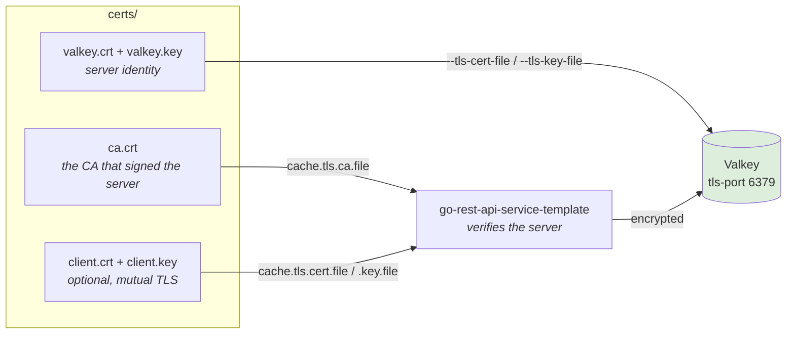

# Valkey TLS

How to generate the certificates for the cache connection, configure the Valkey
server to require TLS, and point the service at it.

Every command below was run end to end against `valkey/valkey:latest` before
being written down.

## Why this connection

The cache is not an anonymous byte store. `SelectByID` and `SelectByEmail` both
select `password_hash` and scan it into the `*domain.User` that gets cached, so
**bcrypt password hashes are written into Valkey** — under both the `user:<id>`
and `user:<email>` keys — and they stay there for the hard TTL, twelve hours by
default. The Valkey `AUTH` password travels on every connection handshake
alongside them.

Without TLS all of that is cleartext on the wire.



The service **verifies** the server by default. Encryption without verification
does not stop an interception that terminates TLS, so `cache.tls.ca.file` — or a
publicly trusted certificate — is what actually protects the connection.

## Requirements

- [OpenSSL 3.x](https://www.openssl.org/)
- A Valkey server built with TLS support (the official images are)

## Step 1 — Create a CA

The service trusts exactly one CA for the cache, so a small private CA is the
normal choice. `prime256v1` matches the curve used elsewhere in this repo.

```bash
mkdir -p certs
cd certs

# The CA private key. Keep this file: anything it signs is trusted by the service.
openssl ecparam -genkey -name prime256v1 -noout -out ca.key

# The CA certificate. 365 days here; pick a lifetime you will actually rotate on.
openssl req -x509 -new -key ca.key -sha256 -days 365 \
  -out ca.crt -subj "/CN=go-rest-api-template-cache-ca"
```

## Step 2 — Create the server certificate

**The Subject Alternative Name is mandatory.** A certificate with only a Common
Name is rejected by modern verification, including Go's — this is the single
most common reason a correctly generated certificate still fails to connect.

List every name and address clients will use to reach the server. Inside a
container network that is usually the service name; from the host it is
`localhost`.

```bash
# The server key and a signing request.
openssl ecparam -genkey -name prime256v1 -noout -out valkey.key
openssl req -new -key valkey.key -out valkey.csr -subj "/CN=valkey"

# The SAN extension. Add every name and IP the server is reached by.
cat > valkey.ext <<'EXT'
subjectAltName = DNS:valkey, DNS:localhost, IP:127.0.0.1
extendedKeyUsage = serverAuth
EXT

# Sign it with the CA.
openssl x509 -req -in valkey.csr -CA ca.crt -CAkey ca.key -CAcreateserial \
  -out valkey.crt -days 365 -sha256 -extfile valkey.ext

# Confirm the SAN made it in — if this prints nothing, verification will fail.
openssl x509 -in valkey.crt -noout -text | grep -A 1 "Subject Alternative Name"
```

## Step 3 — Configure the Valkey server

`--port 0` is what makes the server **TLS-only**. Without it Valkey keeps
listening in cleartext on 6379 and a misconfigured client silently uses it.

```bash
valkey-server \
  --tls-port 6379 \
  --port 0 \
  --tls-cert-file /certs/valkey.crt \
  --tls-key-file  /certs/valkey.key \
  --tls-ca-cert-file /certs/ca.crt \
  --tls-auth-clients no
```

`--tls-auth-clients no` accepts clients that present no certificate. Set it to
`yes` only when doing mutual TLS — see below.

The same as a container:

```bash
podman run -d --rm --name valkey-tls -p 6379:6379 \
  -v "$PWD/certs":/certs:ro \
  docker.io/valkey/valkey:latest \
  valkey-server --tls-port 6379 --port 0 \
    --tls-cert-file /certs/valkey.crt \
    --tls-key-file /certs/valkey.key \
    --tls-ca-cert-file /certs/ca.crt \
    --tls-auth-clients no
```

Two things bite here, both silently:

- **The certificate files must be readable by the container user.** A key
  generated with `0600` is unreadable inside the container and the server exits
  during startup. `chmod 644 valkey.crt ca.crt` and give the key the narrowest
  mode the server can still read.
- **On macOS, Podman only mounts your home directory into the VM.** A path
  under `/tmp` or `/private/tmp` fails with
  `statfs /private/tmp/...: no such file or directory`. Keep the certificates
  under `$HOME`, or add the mount when creating the machine — see the
  [root README](../../README.md#requirement).

## Step 4 — Configure the service

| Flag | Environment variable | Meaning |
| --- | --- | --- |
| `cache.tls.enabled` | `CACHE_TLS_ENABLED` | Encrypt the connection. Off by default |
| `cache.tls.ca.file` | `CACHE_TLS_CA_FILE` | CA that signed the server certificate. Empty means the host trust store |
| `cache.tls.cert.file` | `CACHE_TLS_CERT_FILE` | Client certificate, mutual TLS only |
| `cache.tls.key.file` | `CACHE_TLS_KEY_FILE` | Key for the client certificate |
| `cache.tls.insecure.skip.verify` | `CACHE_TLS_INSECURE_SKIP_VERIFY` | Do not verify the server. **Testing only** |

```bash
go-rest-api-service-template \
  --cache.enabled=true \
  --cache.server.addresses=valkey:6379 \
  --cache.tls.enabled=true \
  --cache.tls.ca.file=./certs/ca.crt
```

The connection negotiates **TLS 1.3 or better**; older versions are refused.

A server whose certificate is signed by a publicly trusted CA needs no
`cache.tls.ca.file` — leave it empty and the host trust store is used. A private
CA, which is the normal case, must be named explicitly.

### What the configuration refuses

These combinations fail at startup rather than at the first connection, because
each one looks secure and is not:

- TLS files configured while `cache.tls.enabled` is false — **the connection
  would still be cleartext.** This is the mistake worth catching: a CA file
  present in the config reads as "this link is encrypted".
- `cache.tls.cert.file` without `cache.tls.key.file`, or the reverse
- a CA file together with `cache.tls.insecure.skip.verify` — one of the two is a
  mistake
- any file that cannot be read

### When TLS is off

The service logs this once at startup:

```text
level=WARN msg="cache connection is not encrypted; cached password hashes and
the cache password cross the network in the clear"
enable_with="cache.tls.enabled=true" password_set=true
```

`password_set=true` means a cache password is also crossing the wire.

## Verify it works

Check the server first, from inside the container:

```bash
# Should answer PONG.
valkey-cli --tls --cacert /certs/ca.crt -p 6379 PING

# Should fail — proof the server is genuinely TLS-only.
valkey-cli -p 6379 PING
# Error: Connection reset by peer
```

Then confirm the service verifies rather than merely encrypts. Start it with a
deliberately wrong CA, or with none at all against a privately signed server —
it must refuse:

```text
tls: failed to verify certificate: x509: certificate signed by unknown authority
```

**If that connects, verification is not happening** and the encryption is not
protecting you from an active attacker.

## Mutual TLS

Only if the server requires clients to present a certificate.

```bash
# A client key and certificate, signed by the same CA.
openssl ecparam -genkey -name prime256v1 -noout -out client.key
openssl req -new -key client.key -out client.csr -subj "/CN=go-rest-api-service-template"

cat > client.ext <<'EXT'
extendedKeyUsage = clientAuth
EXT

openssl x509 -req -in client.csr -CA ca.crt -CAkey ca.key -CAcreateserial \
  -out client.crt -days 365 -sha256 -extfile client.ext
```

Start the server with `--tls-auth-clients yes`, then:

```bash
go-rest-api-service-template \
  --cache.tls.enabled=true \
  --cache.tls.ca.file=./certs/ca.crt \
  --cache.tls.cert.file=./certs/client.crt \
  --cache.tls.key.file=./certs/client.key
```

## The development environment

`make start-dev-env` generates a CA and server certificate into `certs/dev/` and
starts Valkey with **TLS on the standard port 6379**, so `run.sh` and
`.air.toml` reach it without overriding `cache.server.addresses`.

That detail is load-bearing. `cache.server.addresses` is a repeatable flag whose
`Set` **appends** rather than replaces, so passing it once yields
`["localhost:6379", "localhost:6380"]` — and valkey-go reads two addresses as a
cluster, then fails against a non-cluster server with
`This instance has cluster support disabled`. Putting TLS on the default port
sidesteps that entirely.

Cleartext stays available on **6380** for the integration suite, which talks to
Valkey directly to inspect keys and is a test harness rather than the service. A
production server should use `--port 0` to refuse cleartext outright.

Development runs with TLS deliberately: a path that only executes in production
is a path nobody has tested. That is the same failure mode that let the gob
encoder default reach production broken, because every development run
overrode it.

Certificates are regenerated only when missing or expired, so restarting the
environment does not invalidate the CA a running service already loaded.

## Troubleshooting

| Symptom | Cause |
| --- | --- |
| `x509: certificate signed by unknown authority` | `cache.tls.ca.file` is missing, or names a CA that did not sign the server certificate. This is verification working |
| `x509: cannot validate certificate for 127.0.0.1 because it doesn't contain any IP SANs` | The SAN in step 2 is missing or does not list the address used to connect |
| `Connection reset by peer` | Connecting without TLS to a TLS-only server, or with TLS to a cleartext one |
| `cache TLS CA file "..." contains no usable certificate` | The file is readable but is not PEM — often a DER file, or a key pasted where the certificate belongs |
| Server exits at startup | The container cannot read the key file. Check the mode and the mount |
| `statfs /private/tmp/...: no such file or directory` | Podman on macOS mounts only `$HOME`. Move the certificates |
| `TLS files are configured but cache.tls.enabled is false` | Exactly what it says — the link would still be cleartext |

## In production

- **Certificates expire.** Nothing here reloads them; the service reads the
  files at startup, so a rotation needs a restart. Track the expiry.
- **The CA key is the trust anchor.** Anything holding it can mint a certificate
  the service will trust for the cache. Do not ship it alongside the service.
- **`cache.tls.insecure.skip.verify` is for testing.** It encrypts and
  authenticates nothing, so it does not stop an interception — which is most of
  the threat this is here to address.
- TLS protects the connection, not the contents. Password hashes still sit in
  Valkey for the full TTL; keeping them out of the cache entirely is tracked
  separately.

## See also

- [PostgreSQL TLS](./postgres-tls.md) — the same for the database connection
- [Certificates](./certificates.md) — the JWT key pair and the AES key
- [Caching](../architecture/caching.md) — what is cached and for how long
