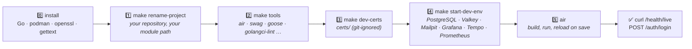
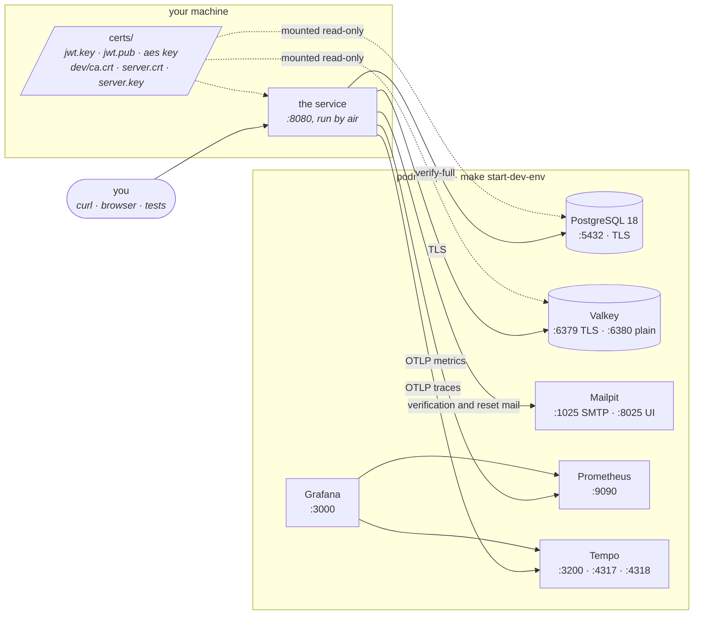

# 🧭 Getting started

From an empty machine to a logged-in request against your own copy of the
service. Every step ends with a check, so you know it worked before you move
on, and the last section lists what to do when one does not.

Ten minutes on a warm network. Most of it is podman pulling images.

Every command here is a Make target. **`make help`** lists all of them, grouped
and with a one-line description, and is the fastest way to find out what the
repository can do:

```bash
make help
```



## 0️⃣ Install the prerequisites

Five things you install yourself. Everything else is installed by a Make target
in step 2.

| Tool | Version | Why | macOS | Debian / Ubuntu |
| --- | --- | --- | --- | --- |
| **Go** | `1.27.1` or later, the `go` directive in `go.mod` | builds and runs the service; the `uuid` package comes from its standard library | `brew install go` | <https://go.dev/dl/> |
| **podman** | any recent | runs the development stack and builds the container image | `brew install podman` | `apt install podman` |
| **make** | GNU make 3.81 or later | every command in this guide is a Make target | ships with the Xcode command line tools | `apt install make` |
| **git** | any | `rename-project` reads your repository name from it | ships with the Xcode command line tools | `apt install git` |
| **OpenSSL 3 and envsubst** | 3.x; envsubst is part of gettext | `make dev-certs` and rendering the pod file | `brew install openssl gettext` | `apt install openssl gettext-base` |

Optional but useful: **[Podman Desktop](https://podman-desktop.io/)**
(`brew install --cask podman-desktop`) gives you the pod, its six containers
and their logs in a window, which beats `podman logs` when a container will not
start. `curl` and `python3` are used in the checks below and ship with both
operating systems.

On macOS podman runs its containers in a Linux VM that has to exist and be
running before anything else works (Podman Desktop does the same thing from its
first-run screen):

```bash
podman machine init      # once
podman machine start     # after every reboot
```

The default machine mounts your home directory into the VM. Everything the dev
stack writes lives under it (`$HOME/tmp/<project>` for data, the repository's
`certs/` for TLS material), so no extra mounts are needed as long as the
repository is cloned somewhere under `$HOME`. If it is not, see
[podman on Apple Silicon](./requirements.md#podman-on-apple-silicon).

**Check:**

```bash
go version          # go1.27.1 or later
podman info >/dev/null && echo podman ok
make --version | head -1
git --version
openssl version     # OpenSSL 3.x
command -v envsubst
```

## 1️⃣ Create your repository, then rename the project

On GitHub, **Use this template → Create a new repository**, clone it, and from
the clone:

```bash
make rename-project
```

It reads the owner and name from your `origin` remote (both
`git@github.com:owner/name.git` and `https://github.com/owner/name.git` work)
and rewrites, in this order:

| From | To | Where it matters |
| --- | --- | --- |
| `slashdevops/go-rest-api-service-template` | `owner/name` | the module path in `go.mod` and every import, the badges, the container image name |
| `go-rest-api-service-template` | `name` | the binary, the `cmd/` directory, the podman pod, the database name, the docs |
| `go_rest_api_service_template` | `name` with underscores | identifiers that cannot carry a dash |

It never touches `.git/`, `build/`, `dist/` or `certs/`, it only replaces the
full `owner/name` pair (the `github.com/slashdevops/*` libraries in `go.mod`
stay), and it is a no-op the second time. If there is no remote yet, name the
target by hand:

```bash
GIT_REPOSITORY_OWNER=acme GIT_REPOSITORY_NAME=my-api make rename-project
```

**Check:** the first line of `go.mod` names your repository, `go build ./...`
is clean, and `git diff --stat` shows the rename and nothing else. Commit it.

> Contributing to the template itself? Skip this step. The target detects
> that the project already has its own name and does nothing.

## 2️⃣ Install the Go tools

```bash
make tools
```

Every other tool this repository uses is a Go program, and the Makefile
installs it with `go install` into `$(go env GOPATH)/bin`:

| Tool | Installed by | Used for |
| --- | --- | --- |
| `air` | `make install-air` | live reload: rebuilds and restarts the service on every save |
| `swag` | `make install-swag` | generates `docs/api/swagger.json` from the handler annotations, on every `make build` |
| `swagger` (go-swagger) | `make install-go-swagger` | renders the API reference as markdown, on every `make build` |
| `goose` | `make install-goose` | the migration tool: `goose create` numbers a new migration, `goose down-to 0` verifies one |
| `golangci-lint` | `make install-golangci-lint` | `make lint`, the same gate CI runs |
| `govulncheck` | `make install-govulncheck` | `make vulncheck` |
| `go-test-coverage` | `make install-go-test-coverage` | `make test-coverage`, the coverage ratchet |
| `go-licenses` | `make install-go-licenses` | `make licenses-check` |
| `betteralign` | `make install-betteralign` | `make go-betteralign`, struct field alignment |
| `mockgen` | nothing to install: a `tool` directive in `go.mod`, run as `go tool mockgen` | regenerates `mocks/` on `make test` and `make build` |

You never need to run the `install-*` targets by hand. Every target that needs
a tool depends on its `install-*` target, and `make tools` runs all of them at
once. Each one installs only when the binary is missing **or was built by an
older Go than the one you are running**, so run `make tools` again after a Go
upgrade: a tool built by an older compiler cannot parse a newer standard
library, and one of them (`betteralign`) fails silently when that happens.

**Check:** the output ends with `All tools present and built with go1.27.x`,
and `$(go env GOPATH)/bin` is on your `PATH` (`command -v air`).

## 3️⃣ Generate the development key material

```bash
make dev-certs
```

The service will not start without three files, and none of them has a working
default. This target creates them, plus the TLS material the dev stack's
PostgreSQL and Valkey present:

| File | What it is | Used by |
| --- | --- | --- |
| `certs/jwt.key` | EC P-256 private key | signs every access, refresh and reset token |
| `certs/jwt.pub` | its public half | verifies them |
| `certs/aes-256-symmetric-hex.key` | 32 random bytes, hex encoded | encrypts identity-provider client secrets at rest |
| `certs/dev/ca.crt` | a one-year development CA | trusted by the service for both database connections |
| `certs/dev/server.crt`, `server.key` | the server certificate both containers present | PostgreSQL and Valkey |

`certs/` is git-ignored. The target is idempotent and **never overwrites**: a
new signing key would invalidate every token already issued, a new AES key
would make every secret already encrypted unreadable, and a new CA would not
be trusted by a service that has already loaded the old one. To rotate on
purpose, delete the file and run the target again; deleting only `jwt.pub`
re-derives it from the private key that is there.

Production generates its own material, following
[Certificates](./certificates/certificates.md). Never copy `certs/` anywhere.

**Check:** the target prints the two directory listings, and
`wc -c certs/aes-256-symmetric-hex.key` says `64`.

## 4️⃣ Start the development stack

```bash
make start-dev-env
```

One podman pod, named after the project, with everything the service talks to:



| Service | Port | Notes |
| --- | --- | --- |
| PostgreSQL | `5432` | user `username`, password `password`, database named after the project, TLS on |
| Valkey | `6379`, `6380` | TLS on `6379`; cleartext on `6380` for the integration suite only |
| Mailpit | `1025` SMTP, `8025` UI | every email the service sends lands here |
| Grafana | `3000` | dashboards and datasources provisioned from `dev-env/configuration/` |
| Prometheus | `9090` | OTLP receiver, alert rules loaded |
| Tempo | `3200`, `4317`, `4318` | traces |

Data lives under `$HOME/tmp/<project>/`. Three targets manage the pod:

| Target | Does | Keeps the data? |
| --- | --- | --- |
| `make start-dev-env` | stops what is running, generates missing certs, starts the pod | **no**, it recreates it |
| `make stop-dev-env` | stops the pod | yes |
| `make rm-dev-env` | stops the pod and deletes `$HOME/tmp/<project>` | no |

`start-dev-env` recreating the data is deliberate: migrations are tracked by
number, not by content, so an edited migration is only ever picked up by a
fresh database. It also means any user, project or rule you created by hand is
gone after it. Reach for `stop-dev-env` when you only want the containers
down.

**Check:**

```bash
podman ps --format '{{.Names}}\t{{.Status}}'   # six containers plus the infra one, all Up
```

## 5️⃣ Run the service

```bash
air
```

`air` builds the service (`make build`, which also regenerates the swagger
spec), starts it with the flags in `.air.toml`, and rebuilds on every save. The
first build takes a minute; later ones take seconds. To run once without file
watching, for example under a debugger, use `./run.sh`; it passes the same
flags, and a test fails if the two ever drift.

A healthy start logs, in this order:

```text
INFO running database migrations
INFO goose: successfully migrated database to version: 16
INFO database migrations completed successfully
WARN login throttle enabled  max_attempts=5 window=15m0s idle_after=30m0s
WARN CORS enabled  allowed_origins=*
WARN the rate limiter is keyed on the peer address; X-Forwarded-For and X-Real-IP are ignored
INFO starting http server  address=0.0.0.0:8080 tls=false
```

The three `WARN` lines are expected in development. Each one names a security
posture that is invisible from a request, and
[Running the service](./operations/running-the-service.md#read-the-startup-log--three-lines-decide-security-posture)
explains what each means for a deployment.

**Check:**

```bash
curl -s localhost:8080/api/v1/health/live    # {"message":"alive", ...}, HTTP 200
curl -s localhost:8080/api/v1/version        # the commit and branch the binary was built from
```

## ✅ Make your first authenticated request

The migrations seed one administrator for the development database:

| | |
| --- | --- |
| email | `admin@goapitemplate.local` |
| password | `ThisIsApassw0rd.,` |

### From the browser

1. Open Swagger UI at <http://0.0.0.0:8080/api/v1/swagger/index.html>. That is
   the address `air` binds (`http.server.address=0.0.0.0`); `localhost` works
   as well.
2. Expand **`POST /auth/login`**, press **Try it out**, paste the administrator's
   email and password into the request body, and **Execute**.
3. The `200` answer carries an `access_token`. Copy it.
4. Press **Authorize** at the top of the page and enter `Bearer <token>`.
5. Every other endpoint on the page now works: try **`GET /me`**, then
   **`GET /health/detailed`**.

The access token lives five minutes, the shipped default. When calls start
answering `401`, log in again, or call **`POST /auth/refresh`** with the
`refresh_token` from step 3.

### From the shell

```bash
TOKEN=$(curl -s -X POST localhost:8080/api/v1/auth/login \
  -H 'Content-Type: application/json' \
  -d '{"email":"admin@goapitemplate.local","password":"ThisIsApassw0rd.,"}' \
  | python3 -c 'import json,sys; print(json.load(sys.stdin)["access_token"])')

curl -s localhost:8080/api/v1/me -H "Authorization: Bearer $TOKEN"
curl -s localhost:8080/api/v1/health/detailed -H "Authorization: Bearer $TOKEN"
```

The login answer carries `access_token`, `refresh_token`, `token_type` and the
caller's permissions. The refresh token lives a day; `POST /auth/refresh` with
it returns a new pair, and the one you sent stops working. That is deliberate,
and [Authentication](./architecture/authentication.md) explains it.

Now open the rest of the stack:

| 🔗 Where | URL | Look for |
| --- | --- | --- |
| Swagger UI | <http://localhost:8080/api/v1/swagger/index.html> | every endpoint, with **Authorize** taking `Bearer <token>` |
| Mailpit | <http://localhost:8025> | register a user through `POST /auth/register`, and the verification email appears here |
| Grafana | <http://localhost:3000> | the six dashboards, already filling from the requests you just made |
| Prometheus | <http://localhost:9090/alerts> | the alert rules, all green |

## 🧪 Run the tests, and fill the dashboards

```bash
make test                                            # unit tests, race detector, coverage profile

cp tests/integration/integration.env.example tests/integration/integration.env   # once
go test -race -tags=integration ./tests/integration  # the API suite, against the stack and air above
```

The integration suite drives the running service over HTTP, so it needs steps
4 and 5 up. It reads its settings from `tests/integration/integration.env`.
Without a running stack it fails fast with one line saying which dependency it
could not reach.

It is also the quickest way to see the observability stack doing something.
Every test registers users, logs in, creates projects and products, exercises
the limits and sends mail, so a few passes leave behind a database with data in
it and a few thousand spans and metric samples:

```bash
go test -tags=integration ./tests/integration -count 3
```

Then look at:

| 🔗 Where | URL | Look for |
| --- | --- | --- |
| Grafana | <http://localhost:3000> | the six dashboards: request rates and latencies per handler, use-case and repository, the rate limiter, the cache |
| Prometheus | <http://localhost:9090/graph> | `sum by (handler) (handler_calls_total)`, `handler_duration_seconds_bucket`, and the alert rules under **Alerts**, all green |
| Tempo, through Grafana | <http://localhost:3000/explore> | pick the Tempo datasource and search for the span name `handler.Authn.loginUser`: one trace shows the handler, the use-case and every repository call under it |
| Mailpit | <http://localhost:8025> | the verification email of every user the suite registered |

`make test-integration` is the other way: it builds the service into a
container and runs the suite against a fresh stack, which is what CI-like runs
want and what a laptop with `air` already running does not.

## 🛑 Stopping, resetting, and living with `air`

`air` is the process you will start and stop the most, so it is worth knowing
what it does and does not do:

- **Start**: `air` in the repository root. It reads `.air.toml`, runs
  `make build`, and starts `./build/go-rest-api-service-template` with the
  flags in that file. It must be on your `PATH`: `make tools` installs it into
  `$(go env GOPATH)/bin`.
- **Reload**: on every saved `.go` file it rebuilds and restarts. A build error
  is printed and also written to `air-build-errors.log`; the previous binary
  keeps running until the build succeeds again.
- **Stop**: `Ctrl+C` in its terminal. It forwards the interrupt to the service,
  which shuts down cleanly. If something still answers on `:8080` afterwards, a
  binary started by hand is holding the port: `pkill -f go-rest-api-service-template`.
- **Restart the service only**: `Ctrl+C`, then `air` again. The stack keeps
  running; nothing in the database changes.
- **Run once, no watching**: `./run.sh`. Same flags, plain `go run`, useful under
  a debugger.

The stack has three levels of teardown, and the difference is the data:

| Command | Containers | Data under `$HOME/tmp/<project>` | Use it when |
| --- | --- | --- | --- |
| `make stop-dev-env` | stopped | kept | you are done for the day |
| `make start-dev-env` | recreated | **recreated** | you changed a migration, or want a clean database |
| `make rm-dev-env` | removed | **deleted** | you want it gone, or the stack is in a state you do not trust |

`make rm-dev-env && make start-dev-env` then `air` is the full reset: fresh
containers, an empty database migrated from the files as they are now, the
seeded administrator back, and nothing else. `certs/` survives all three; delete
a file there and run `make dev-certs` to rotate it.

## 🔁 The daily loop

- Save a file; `air` rebuilds and restarts.
- Changed a migration? goose does not checksum files, so an edited one is never
  re-applied. `make rm-dev-env && make start-dev-env` gives you a database
  built from the files as they are now.
- Looking for a command? `make help` lists every target with its description.
- Before a pull request, run what CI runs:

  ```bash
  make lint && make arch-test && make test && make build
  ```

  The full list, with the reasoning behind each gate, is the
  [post-change checklist](../CLAUDE.md#post-change-checklist).

- Something answers on `:8080` that does not match your code? A stale binary
  from an earlier run will happily serve. `curl -s localhost:8080/api/v1/version`
  reports the commit it was built from, and
  `pkill -f go-rest-api-service-template` stops it.
- Adding a migration? It takes the next number in the sequence, never a gap:
  `goose -dir database/migrations -s create <name> sql`. The rules are in
  [Database migrations](./architecture/database-migrations.md).

## 🩺 When a step fails

| You see | It means | Do this |
| --- | --- | --- |
| `No podman in PATH` or `No go in PATH` when running any `make` target | the Makefile checks its required tools before doing anything | install it; see step 0 |
| `envsubst not found in PATH` | the dev-env targets render the pod file with `envsubst`, which macOS does not ship | `brew install gettext` |
| `podman play kube` fails with `Cannot connect to Podman` | the podman machine is not running | `podman machine start` |
| `podman play kube` fails with `address already in use` | something else holds `5432`, `6379`, `3000`, `9090` or `8025` | `lsof -i :5432` and stop it, or a previous pod: `make stop-dev-env` |
| the postgres container exits with `private key file has group or world access` | `certs/dev/server.key` is not `0600` | `rm -rf certs/dev && make dev-certs` |
| `invalid value "./certs/jwt.key" for flag -authn.private.key.file: … no such file` | step 3 was skipped | `make dev-certs` |
| `PublicKey is not the public half of PrivateKey` | `jwt.pub` does not belong to `jwt.key` | `rm certs/jwt.pub && make dev-certs` |
| `Failed to initialize application: database ping error: … connection refused` | the stack is not up | `podman ps`; `make start-dev-env` |
| `failed to initialize cache client: EOF` | Valkey requires TLS and the service is not using it | check `-cache.tls.enabled=true` and `-cache.tls.ca.file=./certs/dev/ca.crt` are among the flags; `.air.toml` has both |
| `goose: … missing migration` at startup | the database was built from newer files than the ones on this branch | `make rm-dev-env && make start-dev-env` |
| `429` on `/auth/login` | the login throttle: five failed attempts per account per fifteen minutes | wait, or restart the service; the budget is in memory |

Every startup failure the service can produce, with the exact text, is in
[Running the service](./operations/running-the-service.md).

## 🧭 Where next

- [Architecture](./architecture/README.md): the hexagon, the flow of a request,
  the hard rules and the test that enforces them.
- [Adding an entity](./architecture/adding-an-entity.md): copy `products`, the
  worked example, into your own resource.
- [Development guidelines](../CLAUDE.md): every convention in the repository
  and, more usefully, the reason behind each one.
- [API reference](./api/markdown.md): generated from the swagger annotations.
