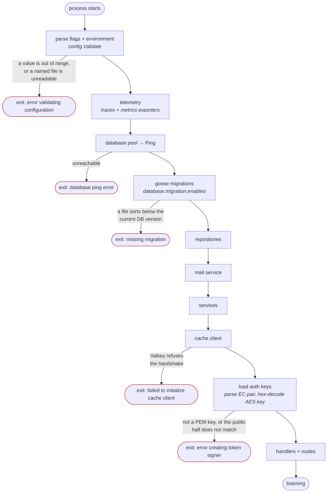

# Running the service

Everything that has to exist before `go-rest-api-service-template` will start, in the order
the service asks for it, with the real error each missing piece produces.

Every failure quoted below was produced by running the built binary with that
one thing wrong. They are what you will actually see, not a paraphrase.

> Generating the key material is covered in its own documents and is **not**
> repeated here. This page says *what* the service needs, *which setting points
> at it*, and *how it fails*; those pages say how to create it:
>
> - [JWT signing pair and the AES key](../certificates/certificates.md)
> - [PostgreSQL TLS](../certificates/postgres-tls.md)
> - [Valkey TLS](../certificates/valkey-tls.md)

## The short version

| # | Prerequisite | Points at it | Required? |
| - | ------------ | ------------ | --------- |
| 1 | **EC private key** (prime256v1 PEM) — signs every token | `authn.private.key.file` | **yes** |
| 2 | **EC public key** — the public half of #1 | `authn.public.key.file` | **yes** |
| 3 | **AES key** — 64 hex characters (32 bytes), encrypts IdP client secrets at rest | `authn.symmetric.key.file` | **yes** |
| 4 | **PostgreSQL** reachable, with the `vector` extension available | `database.*` | **yes** |
| 5 | **An SMTP server or mail API** — verification and recovery mail | `mail.smtp.*` / `mail.api.*` | **yes** |
| 6 | **Valkey** reachable — unless you turn the cache off | `cache.*` | default on |
| 7 | **TLS material** for the Postgres and Valkey connections | `database.ssl.*`, `cache.tls.*` | off by default |

Nothing here has a safe default that can be left alone: **all three key files
have defaults that do not exist** (`jwt.key`, `jwt.pub`,
`aes-256-symmetric.key` relative to the working directory), and the mail
settings default to empty, which fails validation.

For development, `make dev-certs` creates #1, #2 and #3 under `certs/`, plus
the CA for #7, and `.air.toml` and `run.sh` already point at those paths. A
deployment generates its own; see [Certificates](../certificates/certificates.md).

## The smallest command line that starts

Against a stock `make start-dev-env` stack, with cache and TLS off:

```bash
./build/go-rest-api-service-template \
  -authn.private.key.file=./certs/jwt.key \
  -authn.public.key.file=./certs/jwt.pub \
  -authn.symmetric.key.file=./certs/aes-256-symmetric-hex.key \
  -mail.smtp.host=localhost \
  -mail.smtp.port=1025 \
  -mail.smtp.username=welcome@goapitemplate.local \
  -mail.smtp.password=secret \
  -cache.enabled=false
```

Every other setting has a working default: Postgres at
`localhost:5432/go-rest-api-service-template` as `username`/`password`, the HTTP server on
`:8080` without TLS, migrations on, the IP rate limiter on at 100 req/s.

**Every setting also has an environment variable**, listed next to the flag in
`--help`. `authn.private.key.file` is `AUTHN_PRIVATE_KEY_FILE`,
`database.address` is `DATABASE_ADDRESS`, and so on. The flag wins when both are
set. Two regression tests keep the three in step —
`TestEveryConfigFieldHasAFlag` and `TestEveryConfigFieldIsReadFromTheEnvironment`
— because a setting that exists in one form and not the other looks like a
missing feature and takes down a deployment that tries to use it.

`./run.sh` in the repo root is the full development invocation, cache and TLS
included; `.air.toml` runs the same set under live reload.

## What happens at startup, and where it can stop



The order matters when more than one thing is wrong: **configuration validation
runs before anything is opened**, and **the database is reached before the keys
are parsed**. A deployment with both an unreachable database and a corrupt
signing key reports only the database — fix that, restart, and the key error is
next.

## Failure modes, measured

### Key material

| What is wrong | What you see |
| ------------- | ------------ |
| The file named by `authn.private.key.file` does not exist | `invalid value "…/jwt.key" for flag -authn.private.key.file: open …: no such file or directory`, followed by the full usage dump. This one is caught by the flag parser, before the program runs |
| The file exists but is not a PEM key | `Failed to initialize application: error creating token signer: invalid privateKey: PrivateKey is not a PEM-encoded EC key: invalid key: Key must be a PEM encoded PKCS1 or PKCS8 key` |
| The public key is not the public half of the private key | `Failed to initialize application: error creating token signer: invalid publicKey: PublicKey is not the public half of PrivateKey; tokens signed by this service would not verify against it` |
| The AES key is not valid hex | `Failed to initialize application: error decoding symmetric key: encoding/hex: invalid byte: U+007A 'z'` |
| The AES key is valid hex but the wrong length | `Failed to initialize application: error creating cipher adapter: invalid symmetricKey: symmetric key is 4 bytes; AES requires exactly 16, 24 or 32 (authn.symmetric.key.file holds the key hex-encoded, so those are 32, 48 or 64 hex characters)` |

#### The AES key length used to be a startup gotcha

It is checked now, but the shape of the old bug is worth keeping.

`cipheraes.New` accepted anything between 3 and 255 bytes. Those numbers are not
a loose version of the AES rule, they are a bound on the **path of the key
file**, borrowed from the config package and applied to the key. AES takes
exactly 16, 24 or 32 bytes, which the constructor's own doc comment said and its
check did not enforce.

So a wrong-length key started the service cleanly and failed at **first use**,
which is not a rare path: the key encrypts an
IdP's client secret, and decrypts the API token on **every query that reaches a
hosted provider**. A truncated `aes-256-symmetric-hex.key` looked like a healthy
deployment right up until someone ran a search, and then surfaced as
`crypto/aes: invalid key size 4` on the IdP path — the thing the deployment exists
to do.

It is a startup failure now, naming the setting and the length it wanted. The
check is still worth running before a deploy, because it costs nothing:

```bash
wc -c certs/aes-256-symmetric-hex.key   # 64
```

### Database

| What is wrong | What you see |
| ------------- | ------------ |
| Postgres unreachable | ``Failed to initialize application: database ping error: failed to connect to `user=… database=…`: … connection refused`` |
| `database.ssl.mode=verify-full` and the root cert is missing | `Failed to initialize application: error validating configuration: SSL file cannot be read: stat …: no such file or directory (field: 'database.ssl.root.cert.file', …)` |
| A migration file sorts below the current DB version | goose reports a missing migration and startup fails. See [database-migrations.md](../architecture/database-migrations.md) |

**Migrations run automatically on every start** (`database.migration.enabled`
defaults to `true`), so the first successful start against an empty database
also creates the schema and the seed rows:

```text
INFO running database migrations
INFO goose: successfully migrated database to version: 16
INFO database migrations completed successfully
```

### Cache

| What is wrong | What you see |
| ------------- | ------------ |
| Valkey unreachable, or it requires TLS and `cache.tls.enabled=false` | `Failed to initialize application: failed to initialize cache client: EOF` |
| `cache.tls.enabled=true` and the CA file is missing | `Failed to initialize application: error validating configuration: TLS file cannot be read: stat …: no such file or directory (field: 'cache.tls.ca.file', …)` |

The bare `EOF` is Valkey closing a connection that opened without TLS. It reads
like a network fault and is almost always a missing `-cache.tls.enabled=true`.

**`cache.enabled=false` is a fully supported mode** — the service runs without
Valkey at all, reads fall through to the database, and nothing degrades except
latency. It is the fastest way to take the cache out of the picture while
diagnosing something else.

### Mail

| What is wrong | What you see |
| ------------- | ------------ |
| Neither an SMTP host nor an API URL | `Failed to initialize application: error validating configuration: Either SMTP host or API URL must be set (field: mail.smtp.host or mail.api.url)` |
| SMTP host set, username empty | `Failed to initialize application: error validating configuration: SMTP username must be set (field: mail.smtp.username)` |

Mail is **not optional**: account verification and password recovery both send,
and the service refuses to start without somewhere to send to. `make
start-dev-env` runs Mailpit on `localhost:1025` with a web UI on `:8025`.

## Read the startup log — three lines decide security posture

None of these are visible from a request, and each fails in a direction you
cannot see from the outside.

```text
WARN database connection is not encrypted; credentials, password hashes and
     data crosses the network in the clear
     ssl_mode=disable enable_with="database.ssl.mode=verify-full"

WARN cache connection is not encrypted; cached password hashes and the cache
     password cross the network in the clear
     enable_with="cache.tls.enabled=true" password_set=false

WARN the rate limiter is keyed on the peer address; X-Forwarded-For and
     X-Real-IP are ignored
     why="http.server.trusted.proxies is empty"
     note="set it to the proxies in front of this service, or every client
           behind one shares a single bucket"
```

- The first two are the shipped defaults. `database.ssl.mode` defaults to
  `disable` and `cache.tls.enabled` to `false`, so a deployment that never sets
  them is sending bcrypt hashes over the wire in cleartext. Both TLS documents
  are linked at the top of this page.
- The third is a **security boundary, not a nag**. Forwarding headers are
  honoured only when the peer is a configured trusted proxy — otherwise a caller
  who rotates `X-Forwarded-For` draws a fresh rate-limit budget on every
  request, and the limiter does not weaken, it disappears. Behind a proxy, set
  `http.server.trusted.proxies` to that proxy's addresses or CIDRs. In front of
  no proxy, leave it empty and this warning is correct.

A successful start ends with:

```text
INFO application initialization completed
INFO starting http server  address=0.0.0.0:8080 tls=false
```

## Verifying a start

```bash
curl -s localhost:8080/api/v1/health/live      # 200, always, if the process is up
curl -s localhost:8080/api/v1/health/detailed  # 200 healthy · 206 degraded · 503 dependency down
```

`/health/detailed` is the one that reflects Postgres and Valkey, and its status
code carries the verdict. Which endpoint belongs on which probe, and why
liveness must check nothing, is in
[health-probes.md](../architecture/health-probes.md).

## Before a production start

- [ ] Signing pair generated for **this** deployment, not copied from another —
      `iss` and `aud` are validated, so a token minted elsewhere with the same
      key is refused, and changing `authn.issuer` invalidates every token
      already issued.
- [ ] `aes-256-symmetric-hex.key` is exactly 64 hex characters. The service now
      refuses to start otherwise, so this is a check you get for free.
- [ ] `database.ssl.mode=verify-full` with a root cert. `require` encrypts to
      whoever answered; `prefer` silently downgrades to cleartext and reports
      nothing.
- [ ] `cache.tls.enabled=true` with a CA, **and** a cache password set.
- [ ] `http.server.trusted.proxies` set to the proxies in front of the service,
      or deliberately empty.
- [ ] `http.server.tls.enabled=true` with a certificate and key, unless
      something in front terminates TLS.
- [ ] The access-token lifetime left short. It is a runtime setting now —
      `GET`/`PUT /auth/token_lifetimes`, seeded at 5m. With
      `authn.access.token.revocation.enabled` off it is the whole residual-access
      window after a logout; with it on, the default, it still bounds what a
      leaked token is worth.
- [ ] Liveness pointed at `/health/live` and readiness at `/health/detailed`.

## Rotating the signing key without downtime

`authn.additional.public.key.files` takes a comma-separated list of PEM files
whose keys may **verify** but never sign. The rotation is three deploys:

1. Add the new public key to `authn.additional.public.key.files`, keeping the
   old pair signing. Every replica can now verify both.
2. Move the new pair to `authn.private.key.file` / `authn.public.key.file`, and
   move the **old** public key into the additional list. New tokens are signed
   by the new key; tokens already out there still verify.
3. Once every token signed by the old key has expired, drop it from the list.

Skipping step 1 refuses every token in flight at the moment of the deploy.

## Related

- [Certificates and keys](../certificates/certificates.md) — generating the JWT pair and the AES key
- [PostgreSQL TLS](../certificates/postgres-tls.md) — generating the CA, configuring the server, choosing an SSL mode
- [Valkey TLS](../certificates/valkey-tls.md) — the same for the cache, and why that connection carries password hashes
- [Health endpoints and probes](../architecture/health-probes.md) — which endpoint each probe belongs on
- [HTTP server timeouts](../architecture/http-server-timeouts.md) — which bound covers which span of a request, and why two are deliberately off
- [Authentication](../architecture/authentication.md) — token classes, lifetimes, revocation, rotation
- [Database migrations](../architecture/database-migrations.md) — ordering rules and why editing an applied migration fails silently
- [Caching](../architecture/caching.md) — the fail-open guarantee and what is cached
