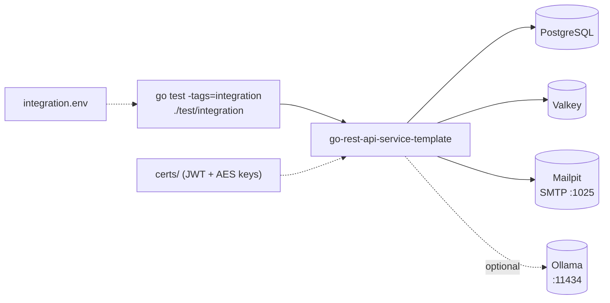

# integration

This folder contains a set of tests.

The integration suite (build tag `integration`) runs the service against real
backing containers and exercises the HTTP API end to end. Ollama-dependent
subtests auto-skip when no Ollama is reachable.



## Requirements

- The `certs` folder and certificates in the root project folder, the README.md file in the root project folder explains how to generate the certificates.
- The `integration.env` file in the `test/integration` folder, this file contains the environment variables used to run the integration tests

```bash
MAIL_SMTP_HOST=localhost
MAIL_SMTP_PORT=1025
MAIL_SMTP_USERNAME=welcome@goapitemplate.local
MAIL_SMTP_PASSWORD=new_secure_password
# mailpit accepts plaintext on :1025, so opt out of the secure-by-default TLS requirement
MAIL_SMTP_REQUIRE_TLS=false
DB_USERNAME=username
DB_PASSWORD=password

```

## How to run integration tests

The `Makefile` in the root project folder contains a targets to prepare and run the integration tests.

Build the integration tests image:

```bash
make container-build-integration-test
```

Start the integration tests environment:

```bash
make start-integration-test
```

Run the integration tests:

This target will execute the previous target if the integration tests environment is not running.

```bash
make test-integration
```

## Run test manually

You can run the integration tests manually using the following command:

```bash
go test -v -race -tags=integration ./test/integration
```

Run certain test manually:

```bash
go test -v -race -tags=integration ./test/integration -run 'TestUser*'
```

## Ollama-dependent integration tests

Some integration subtests call a local Ollama API. These tests now auto-skip when
Ollama is not reachable, so regular `-tags=integration` runs do not fail on machines
without a running Ollama instance.

- Default Ollama probe URL: `http://localhost:11434/api/tags`
- Optional override env var: `OLLAMA_TAGS_URL`

Examples:

```bash
# default probe URL
go test -v -race -tags=integration ./test/integration -run TestGenerateConfigGenerate
```

```bash
# custom probe URL
OLLAMA_TAGS_URL=http://localhost:11434/api/tags go test -v -race -tags=integration ./test/integration -run TestGenerateConfigGenerate
```
